# Initial UI - uploadthing setup - server creation API

- [Initial UI - uploadthing setup - server creation API](#initial-ui---uploadthing-setup---server-creation-api)
  - [Initial UI](#initial-ui)
  - [Uploadthing](#uploadthing)
  - [Server Creation API](#server-creation-api)

## Initial UI

`/src/lib/uploadthing.ts`

```TS
import { generateComponents } from "@uploadthing/react";

import type { OurFileRouter } from "@/app/api/uploadthing/core";

export const {
  UploadButton,
  UploadDropzone,
  Uploader
} = generateComponents<OurFileRouter>();
```

`/src/components/files/file-upload.tsx`

```TSX
"use client";

import Image from "next/image";
import { FileIcon, X } from "lucide-react";

import { UploadDropzone } from "@/lib/uploadthing";

import "@uploadthing/react/styles.css";

interface FileUploadProps {
  onChange: (url?: string) => void;
  value: string;
  endpoint: "messageFile" | "serverImage";
}

export const FileUpload = ({ onChange, value, endpoint }: FileUploadProps) => {
  const fileType = value?.split(".").pop();

  if (value && fileType !== "pdf") {
    return (
      <div className="relative h-20 w-20">
        <Image
          fill
          src={value}
          alt="Upload"
          className="rounded-full"
          sizes="(max-width: 768px) 100vw, (max-width: 1200px) 50vw, 33vw"
        />
        <button
          onClick={() => onChange("")}
          className="bg-rose-500 text-white p-1 rounded-full absolute top-0 right-0 shadow-sm"
          type="button"
        >
          <X className="h-4 w-4" />
        </button>
      </div>
    );
  }

  if (value && fileType === "pdf") {
    return (
      <div className="relative flex items-center p-2 mt-2 rounded-md bg-background/10">
        <FileIcon className="h-10 w-10 fill-indigo-200 stroke-indigo-400" />
        <a
          href={value}
          target="_blank"
          rel="noopener noreferrer"
          className="ml-2 text-sm text-indigo-500 dark:text-indigo-400 hover:underline"
        >
          {value}
        </a>
        <button
          onClick={() => onChange("")}
          className="bg-rose-500 text-white p-1 rounded-full absolute -top-2 -right-2 shadow-sm"
          type="button"
        >
          <X className="h-4 w-4" />
        </button>
      </div>
    );
  }

  return (
    <UploadDropzone
      endpoint={endpoint}
      onClientUploadComplete={(res) => {
        onChange(res?.[0].url);
      }}
      onUploadError={(error: Error) => {
        console.log(error);
      }}
    />
  );
};
```

`/src/components/modals/initial-modal.tsx`

```TSX
"use client";

import * as z from "zod";
import axios from "axios";
import { useForm } from "react-hook-form";
import { useRouter } from "next/navigation";
import { useEffect, useState } from "react";
import { zodResolver } from "@hookform/resolvers/zod";

import {
  Dialog,
  DialogContent,
  DialogDescription,
  DialogFooter,
  DialogHeader,
  DialogTitle,
} from "@/components/ui/dialog";
import {
  Form,
  FormControl,
  FormField,
  FormItem,
  FormLabel,
  FormMessage,
} from "@/components/ui/form";
import { Input } from "@/components/ui/input";
import { Button } from "@/components/ui/button";

import { FileUpload } from "@/components/files/file-upload";

const formSchema = z.object({
  name: z.string().min(1, {
    message: "Server name is required.",
  }),
  imageUrl: z.string().min(1, {
    message: "Server image is required.",
  }),
});

export const InitialModal = () => {
  const [isMounted, setIsMounted] = useState(false);

  const router = useRouter();

  useEffect(() => {
    setIsMounted(true);
  }, []);

  const form = useForm({
    resolver: zodResolver(formSchema),
    defaultValues: {
      name: "",
      imageUrl: "",
    },
  });

  const isLoading = form.formState.isSubmitting;

  const onSubmit = async (values: z.infer<typeof formSchema>) => {
    try {
      await axios.post("/api/servers", values);

      form.reset();
      router.refresh();
      window.location.reload();
    } catch (error) {
      console.log(error);
    }
  };

  if (!isMounted) {
    return null;
  }

  return (
    <Dialog open>
      <DialogContent className="bg-white text-black p-0 overflow-hidden">
        <DialogHeader className="pt-8 px-6">
          <DialogTitle className="text-2xl text-center font-bold">
            Customize your server
          </DialogTitle>
          <DialogDescription className="text-center text-zinc-500">
            Give your server a personality with a name and an image. You can
            always change it later.
          </DialogDescription>
        </DialogHeader>
        <Form {...form}>
          <form onSubmit={form.handleSubmit(onSubmit)} className="space-y-8">
            <div className="space-y-8 px-6">
              <div className="flex items-center justify-center text-center">
                <FormField
                  control={form.control}
                  name="imageUrl"
                  render={({ field }) => (
                    <FormItem>
                      <FormControl>
                        <FileUpload
                          endpoint="serverImage"
                          value={field.value}
                          onChange={field.onChange}
                        />
                      </FormControl>
                    </FormItem>
                  )}
                />
              </div>

              <FormField
                control={form.control}
                name="name"
                render={({ field }) => (
                  <FormItem>
                    <FormLabel className="uppercase text-xs font-bold text-zinc-500 dark:text-secondary/70">
                      Server name
                    </FormLabel>
                    <FormControl>
                      <Input
                        disabled={isLoading}
                        className="bg-zinc-300/50 border-0 focus-visible:ring-0 text-black focus-visible:ring-offset-0"
                        placeholder="Enter server name"
                        {...field}
                      />
                    </FormControl>
                    <FormMessage />
                  </FormItem>
                )}
              />
            </div>
            <DialogFooter className="bg-gray-100 px-6 py-4">
              <Button variant="primary" disabled={isLoading}>
                Create
              </Button>
            </DialogFooter>
          </form>
        </Form>
      </DialogContent>
    </Dialog>
  );
};
```

`/src/app/(setup)/page.tsx`

```TSX
import { use } from "react";
import { redirect } from "next/navigation";
import { UserButton } from "@clerk/nextjs";

import { db } from "@/lib/db";
import { initialProfile } from "@/lib/initial-profile";

import { ModeToggle } from "@/components/toggles/mode-toggle";

import InitialModal from "@/components/modals/initial-modal";

const SetupPage = () => {
  const profile = use(initialProfile());

  const server = use(
    db.server.findFirst({
      where: {
        members: {
          some: {
            profileId: profile.id,
          },
        },
      },
    })
  );

  if (server) {
    return redirect(`/servers/${server.id}`);
  }

  return (
    <div>
      <UserButton />
      <ModeToggle />
      <InitialModal />
    </div>
  );
};

export default SetupPage;
```

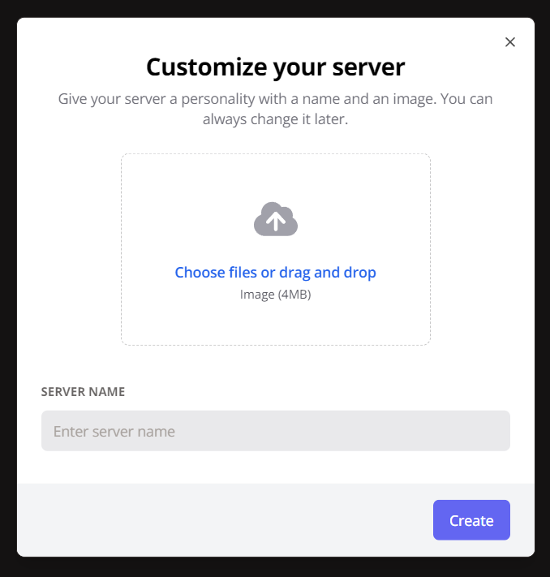

## Uploadthing

- https://uploadthing.com/
- https://uploadthing.com/dashboard/ag2h42vbkm/api-keys
- https://docs.uploadthing.com/

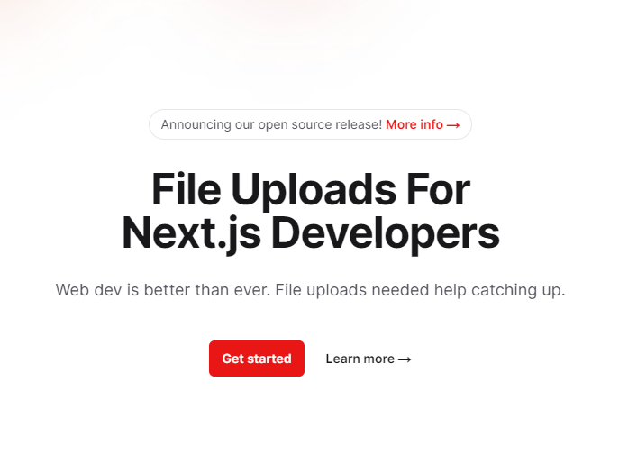

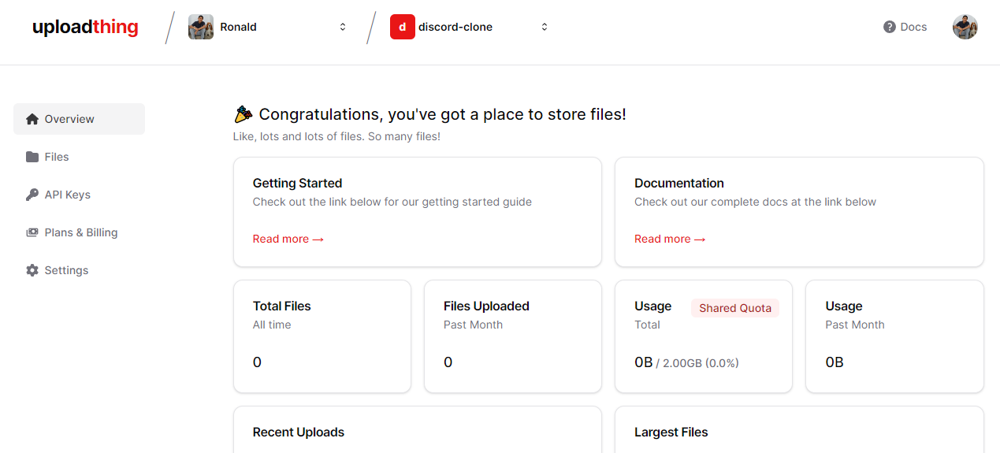

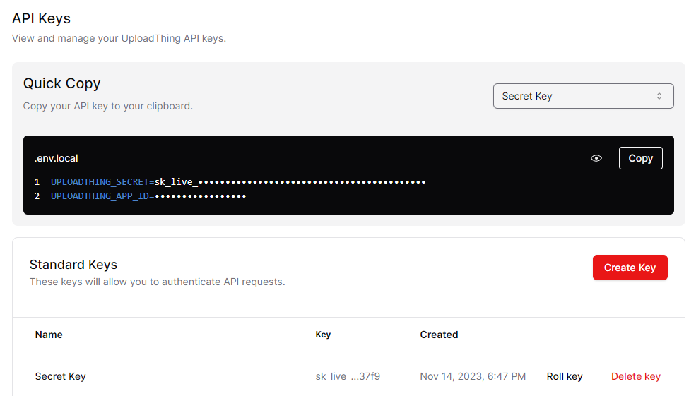

https://docs.uploadthing.com/

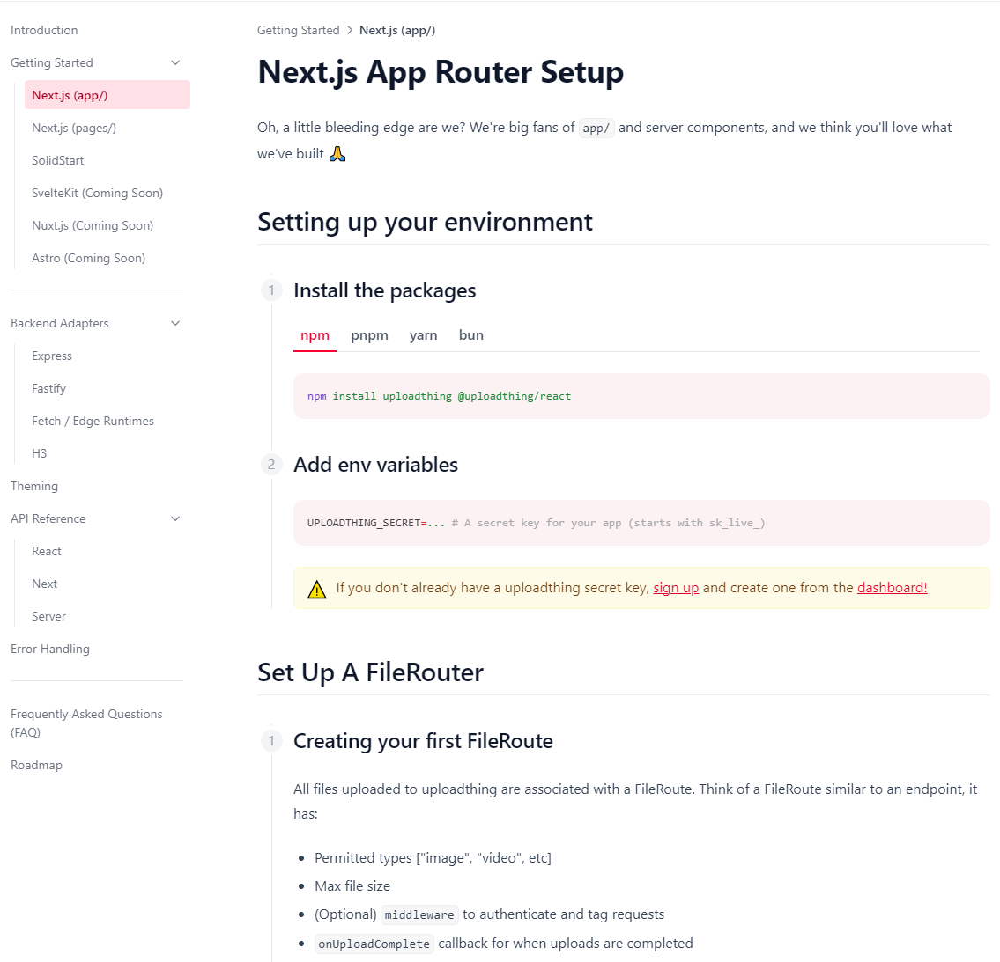

```BASH
npm install uploadthing @uploadthing/react

npm install @uploadthing/react --force
```

`/src/app/api/uploadthing/core.ts`

```TS
import { auth } from "@clerk/nextjs";
import { createUploadthing, type FileRouter } from "uploadthing/next";

const f = createUploadthing();

const handleAuth = () => {
  const { userId } = auth();

  if (!userId) throw new Error("Unauthorized");

  return { userId: userId };
};

export const ourFileRouter = {
  serverImage: f({ image: { maxFileSize: "4MB", maxFileCount: 1 } })
    .middleware(() => handleAuth())
    .onUploadComplete(() => {}),
  messageFile: f(["image", "pdf"])
    .middleware(() => handleAuth())
    .onUploadComplete(() => {}),
} satisfies FileRouter;

export type OurFileRouter = typeof ourFileRouter;
```

`/src/app/api/uploadthing/route.ts`

```TS
import { createNextRouteHandler } from "uploadthing/next";

import { ourFileRouter } from "./core";

// Export routes for Next App Router
export const { GET, POST } = createNextRouteHandler({
  router: ourFileRouter,
});
```

`/src/lib/uploadthing.ts`

```TS
import { generateComponents } from "@uploadthing/react";

import type { OurFileRouter } from "@/app/api/uploadthing/core";

export const {
  UploadButton,
  UploadDropzone,
  Uploader
} = generateComponents<OurFileRouter>();
```

https://uploadthing.com/dashboard/ag2h42vbkm/files

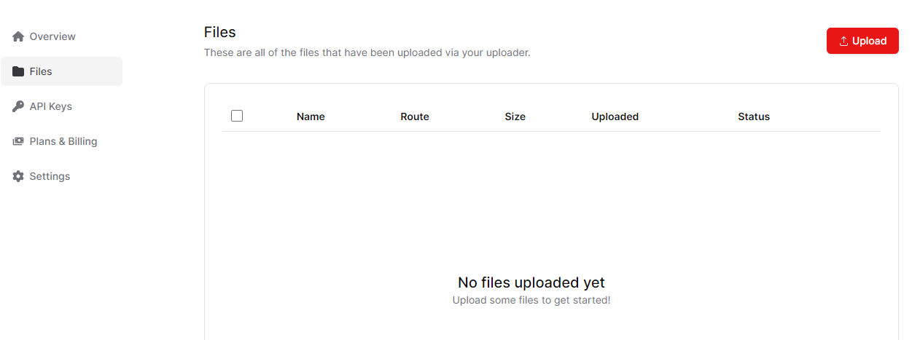

http://localhost:3000/


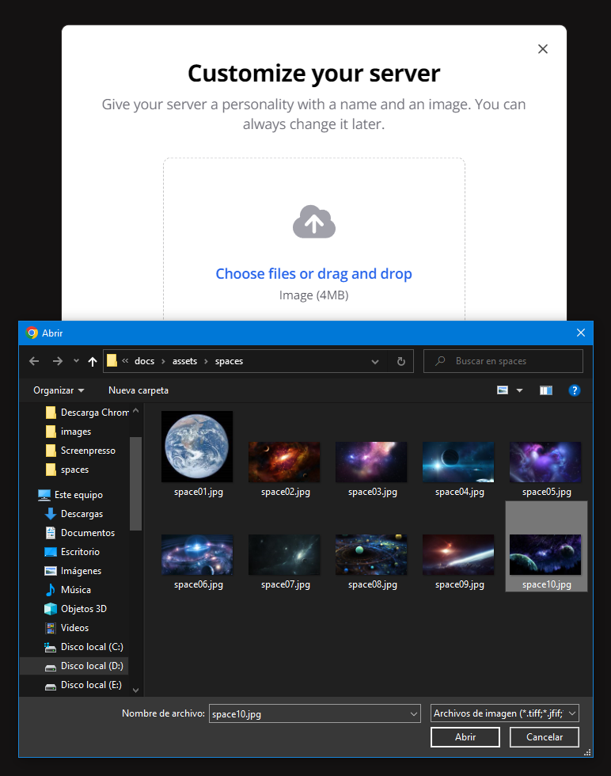

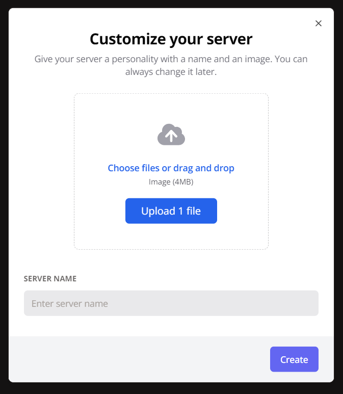

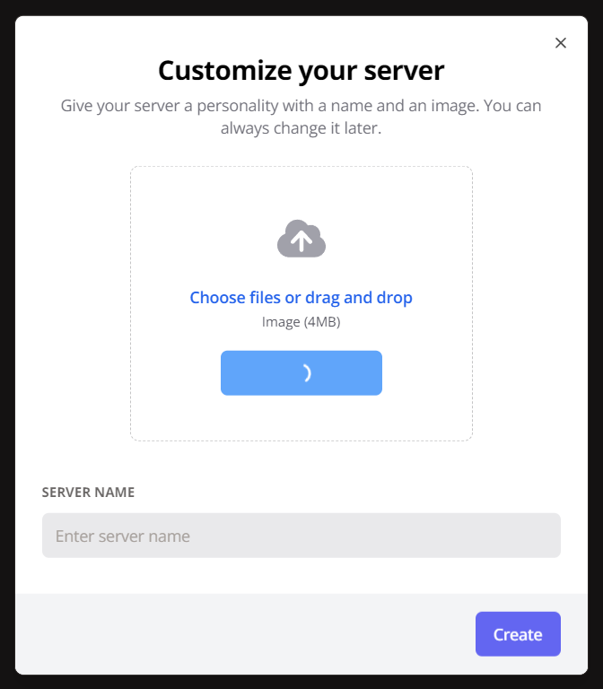

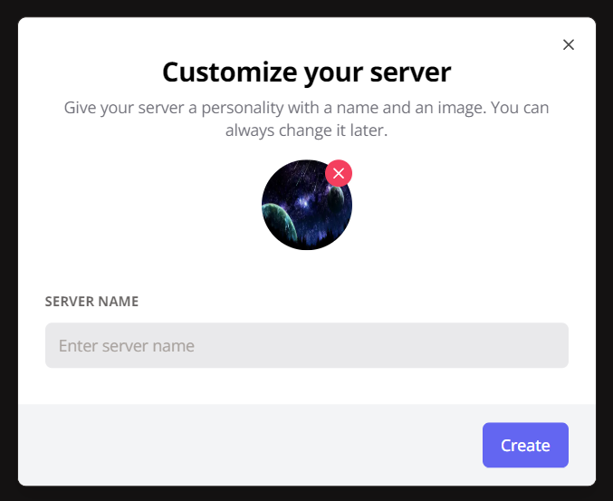

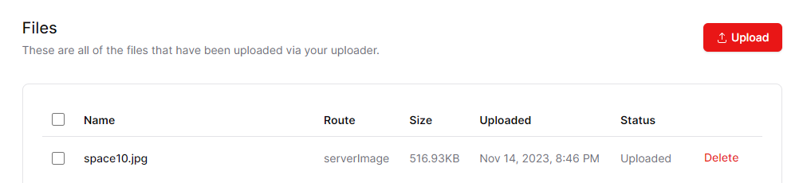

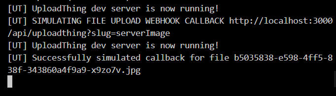

## Server Creation API

`/src/app/api/servers/route.ts`

```TS
import { v4 as uuidv4 } from "uuid";
import { NextResponse } from "next/server";
import { MemberRole } from "@prisma/client";

import { db } from "@/lib/db";
import { currentProfile } from "@/lib/current-profile";

export async function POST(req: Request) {
  try {
    const { name, imageUrl } = await req.json();
    const profile = await currentProfile();

    if (!profile) {
      return new NextResponse("Unauthorized", { status: 401 });
    }

    const server = await db.server.create({
      data: {
        profileId: profile.id,
        name,
        imageUrl,
        inviteCode: uuidv4(),
        channels: {
          create: [{ name: "general", profileId: profile.id }],
        },
        members: {
          create: [{ profileId: profile.id, role: MemberRole.ADMIN }],
        },
      },
    });

    return NextResponse.json(server);
  } catch (error) {
    console.log("[SERVERS_POST]", error);
    return new NextResponse("Internal Error", { status: 500 });
  }
}
```

http://localhost:3000/

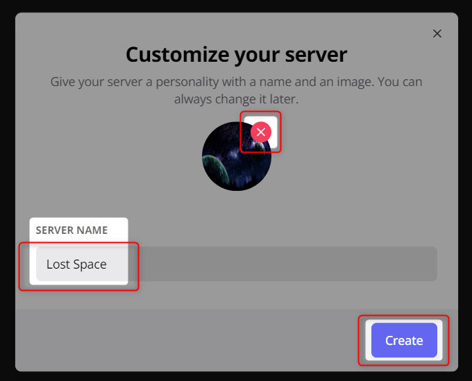

http://localhost:3000/servers/6df06297-f0ff-4cb9-b1fe-eb91881e9216

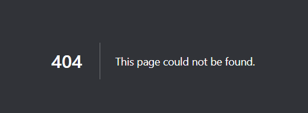

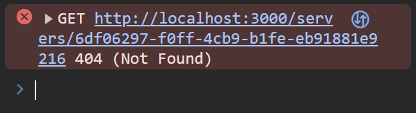

http://localhost:5555/

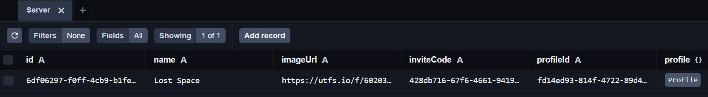

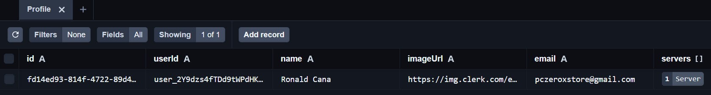


http://localhost:3000/ to http://localhost:3000/servers/6df06297-f0ff-4cb9-b1fe-eb91881e9216


---
