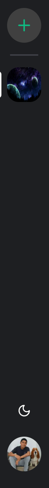
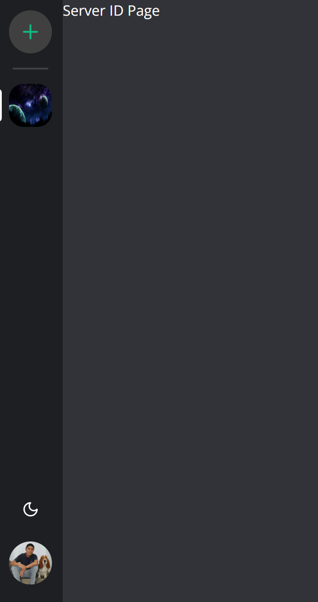
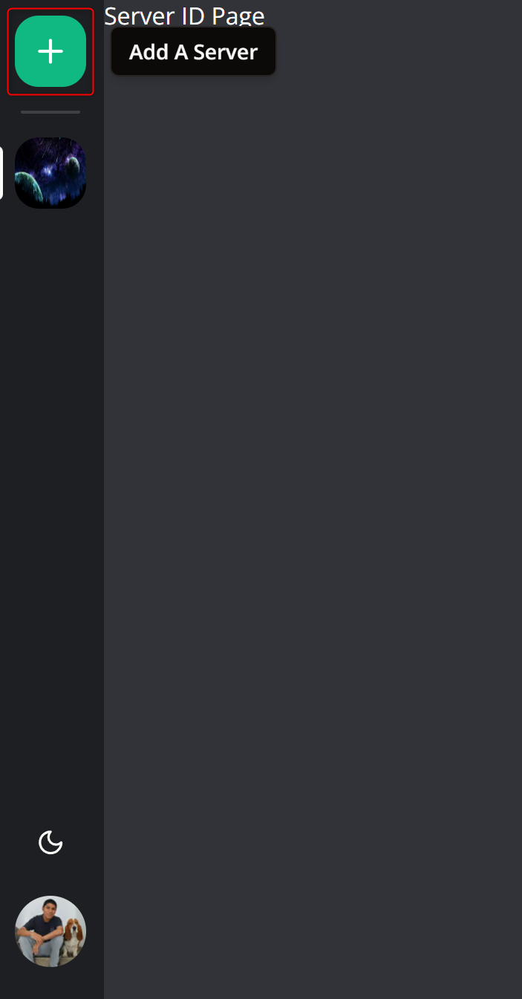
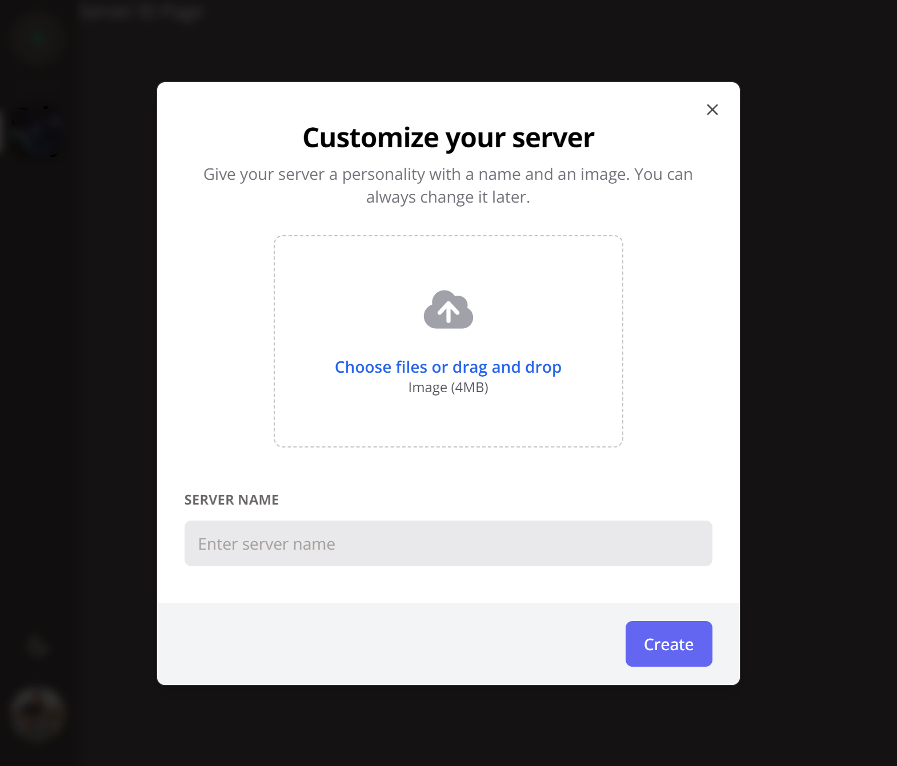
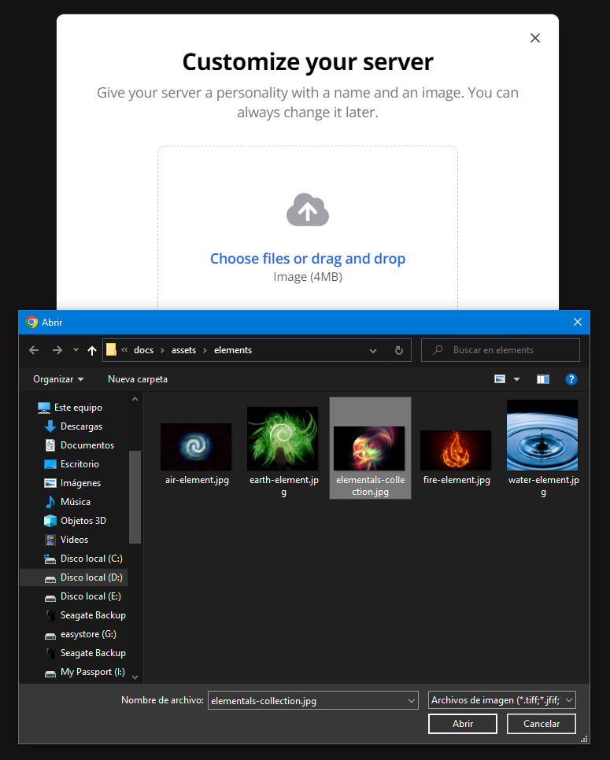
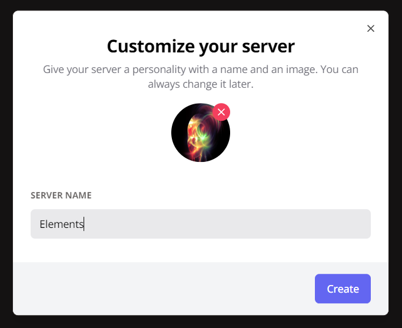
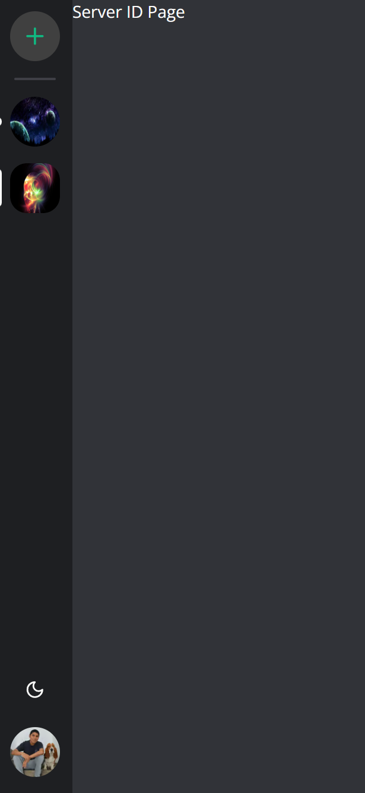
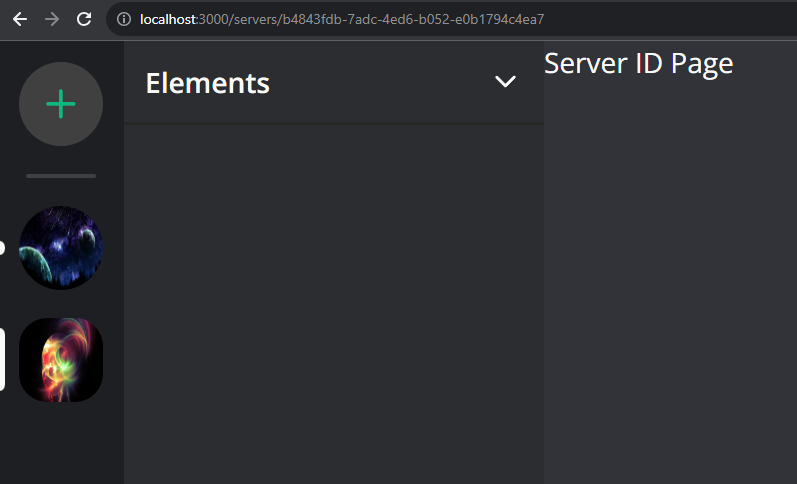
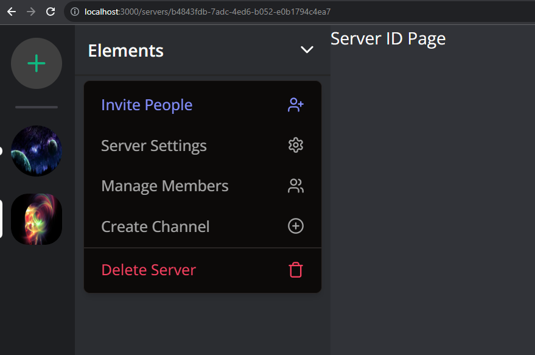

# 4 - Navigation sidebar - Create server modal - Server sidebar

- [4 - Navigation sidebar - Create server modal - Server sidebar](#4---navigation-sidebar---create-server-modal---server-sidebar)
  - [Tooltip](#tooltip)
  - [Hooks](#hooks)
  - [Zustand](#zustand)
  - [Modals](#modals)
  - [Navigation](#navigation)
  - [MainLayout](#mainlayout)
  - [Server Id Page](#server-id-page)
  - [Server Id Layout](#server-id-layout)

## Tooltip

`/src/components/tooltip/action-tooltip.tsx`

```TSX
"use client";

import {
  Tooltip,
  TooltipContent,
  TooltipProvider,
  TooltipTrigger,
} from "@/components/ui/tooltip";

interface ActionTooltipProps {
  label: string;
  children: React.ReactNode;
  side?: "top" | "right" | "bottom" | "left";
  align?: "start" | "center" | "end";
}

export const ActionTooltip = ({
  label,
  children,
  side,
  align,
}: ActionTooltipProps) => {
  return (
    <TooltipProvider>
      <Tooltip delayDuration={50}>
        <TooltipTrigger asChild>{children}</TooltipTrigger>
        <TooltipContent side={side} align={align}>
          <p className="font-semibold text-sm capitalize">
            {label.toLowerCase()}
          </p>
        </TooltipContent>
      </Tooltip>
    </TooltipProvider>
  );
};
```

## Hooks

`/src/hooks/use-modal-store.ts`

```TSX
import { create } from "zustand";
import { Channel, ChannelType, Server } from "@prisma/client";

export type ModalType =
  | "createServer"
  | "invite"
  | "editServer"
  | "members"
  | "createChannel"
  | "leaveServer"
  | "deleteServer"
  | "deleteChannel"
  | "editChannel"
  | "messageFile"
  | "deleteMessage";

interface ModalData {
  server?: Server;
  channel?: Channel;
  channelType?: ChannelType;
  apiUrl?: string;
  query?: Record<string, any>;
}

interface ModalStore {
  type: ModalType | null;
  data: ModalData;
  isOpen: boolean;
  onOpen: (type: ModalType, data?: ModalData) => void;
  onClose: () => void;
}

export const useModal = create<ModalStore>((set) => ({
  type: null,
  data: {},
  isOpen: false,
  onOpen: (type, data = {}) => set({ isOpen: true, type, data }),
  onClose: () => set({ type: null, isOpen: false }),
}));
```

## Zustand

```BASH
npm install zustand
```

## Modals

`/src/components/modals/create-server-modal.tsx`

```TSX
"use client";

import axios from "axios";
import * as z from "zod";
import { useForm } from "react-hook-form";
import { useRouter } from "next/navigation";
import { zodResolver } from "@hookform/resolvers/zod";

import { useModal } from "@/hooks/use-modal-store";

import {
  Dialog,
  DialogContent,
  DialogDescription,
  DialogFooter,
  DialogHeader,
  DialogTitle,
} from "@/components/ui/dialog";
import {
  Form,
  FormControl,
  FormField,
  FormItem,
  FormLabel,
  FormMessage,
} from "@/components/ui/form";
import { Input } from "@/components/ui/input";
import { Button } from "@/components/ui/button";

import { FileUpload } from "@/components/files/file-upload";

const formSchema = z.object({
  name: z.string().min(1, {
    message: "Server name is required.",
  }),
  imageUrl: z.string().min(1, {
    message: "Server image is required.",
  }),
});

export const CreateServerModal = () => {
  const { isOpen, onClose, type } = useModal();
  const router = useRouter();

  const isModalOpen = isOpen && type === "createServer";

  const form = useForm({
    resolver: zodResolver(formSchema),
    defaultValues: {
      name: "",
      imageUrl: "",
    },
  });

  const isLoading = form.formState.isSubmitting;

  const onSubmit = async (values: z.infer<typeof formSchema>) => {
    try {
      await axios.post("/api/servers", values);

      form.reset();
      router.refresh();
      onClose();
    } catch (error) {
      console.log(error);
    }
  };

  const handleClose = () => {
    form.reset();
    onClose();
  };

  return (
    <Dialog open={isModalOpen} onOpenChange={handleClose}>
      <DialogContent className="bg-white text-black p-0 overflow-hidden">
        <DialogHeader className="pt-8 px-6">
          <DialogTitle className="text-2xl text-center font-bold">
            Customize your server
          </DialogTitle>
          <DialogDescription className="text-center text-zinc-500">
            Give your server a personality with a name and an image. You can
            always change it later.
          </DialogDescription>
        </DialogHeader>
        <Form {...form}>
          <form onSubmit={form.handleSubmit(onSubmit)} className="space-y-8">
            <div className="space-y-8 px-6">
              <div className="flex items-center justify-center text-center">
                <FormField
                  control={form.control}
                  name="imageUrl"
                  render={({ field }) => (
                    <FormItem>
                      <FormControl>
                        <FileUpload
                          endpoint="serverImage"
                          value={field.value}
                          onChange={field.onChange}
                        />
                      </FormControl>
                    </FormItem>
                  )}
                />
              </div>

              <FormField
                control={form.control}
                name="name"
                render={({ field }) => (
                  <FormItem>
                    <FormLabel className="uppercase text-xs font-bold text-zinc-500 dark:text-secondary/70">
                      Server name
                    </FormLabel>
                    <FormControl>
                      <Input
                        disabled={isLoading}
                        className="bg-zinc-300/50 border-0 focus-visible:ring-0 text-black focus-visible:ring-offset-0"
                        placeholder="Enter server name"
                        {...field}
                      />
                    </FormControl>
                    <FormMessage />
                  </FormItem>
                )}
              />
            </div>
            <DialogFooter className="bg-gray-100 px-6 py-4">
              <Button variant="primary" disabled={isLoading}>
                Create
              </Button>
            </DialogFooter>
          </form>
        </Form>
      </DialogContent>
    </Dialog>
  );
};
```

## Navigation

`/src/components/navigation/navigation-action.tsx`

```TSX
"use client";

import { Plus } from "lucide-react";

import { useModal } from "@/hooks/use-modal-store";

import { ActionTooltip } from "@/components/tooltip/action-tooltip";

export const NavigationAction = () => {
  const { onOpen } = useModal();

  return (
    <div>
      <ActionTooltip side="right" align="center" label="Add a server">
        <button
          onClick={() => onOpen("createServer")}
          className="group flex items-center"
        >
          <div className="flex mx-3 h-[48px] w-[48px] rounded-[24px] group-hover:rounded-[16px] transition-all overflow-hidden items-center justify-center bg-background dark:bg-neutral-700 group-hover:bg-emerald-500">
            <Plus
              className="group-hover:text-white transition text-emerald-500"
              size={25}
            />
          </div>
        </button>
      </ActionTooltip>
    </div>
  );
};
```

`/src/components/navigation/navigation-item.tsx`

```TSX
"use client";

import Image from "next/image";
import { useParams, useRouter } from "next/navigation";

import { cn } from "@/lib/utils";

import { ActionTooltip } from "@/components/tooltip/action-tooltip";

interface NavigationItemProps {
  id: string;
  imageUrl: string;
  name: string;
}

export const NavigationItem = ({ id, imageUrl, name }: NavigationItemProps) => {
  const params = useParams();
  const router = useRouter();

  const onClick = () => {
    router.push(`/servers/${id}`);
  };

  return (
    <ActionTooltip side="right" align="center" label={name}>
      <button onClick={onClick} className="group relative flex items-center">
        <div
          className={cn(
            "absolute left-0 bg-primary rounded-r-full transition-all w-[4px]",
            params?.serverId !== id && "group-hover:h-[20px]",
            params?.serverId === id ? "h-[36px]" : "h-[8px]"
          )}
        />
        <div
          className={cn(
            "relative group flex mx-3 h-[48px] w-[48px] rounded-[24px] group-hover:rounded-[16px] transition-all overflow-hidden",
            params?.serverId === id &&
              "bg-primary/10 text-primary rounded-[16px]"
          )}
        >
          <Image
            fill
            src={imageUrl}
            alt="Channel"
            sizes="(max-width: 768px) 100vw, (max-width: 1200px) 50vw, 33vw"
          />
        </div>
      </button>
    </ActionTooltip>
  );
};
```

`/src/components/navigation/navigation-sidebar.tsx`

```TSX
import { redirect } from "next/navigation";
import { UserButton } from "@clerk/nextjs";

import { db } from "@/lib/db";
import { currentProfile } from "@/lib/current-profile";

import { Separator } from "@/components//ui/separator";
import { ScrollArea } from "@/components//ui/scroll-area";

import { ModeToggle } from "@/components/toggles/mode-toggle";

import { NavigationItem } from "@/components/navigation/navigation-item";
import { NavigationAction } from "@/components/navigation/navigation-action";

export const NavigationSidebar = async () => {
  const profile = await currentProfile();

  if (!profile) {
    return redirect("/");
  }

  const servers = await db.server.findMany({
    where: {
      members: {
        some: {
          profileId: profile.id,
        },
      },
    },
  });

  return (
    <div className="space-y-4 flex flex-col items-center h-full text-primary w-full dark:bg-[#1E1F22] bg-[#E3E5E8] py-3">
      <NavigationAction />
      <Separator className="h-[2px] bg-zinc-300 dark:bg-zinc-700 rounded-md w-10 mx-auto" />
      <ScrollArea className="flex-1 w-full">
        {servers.map((server) => (
          <div key={server.id} className="mb-4">
            <NavigationItem
              id={server.id}
              name={server.name}
              imageUrl={server.imageUrl}
            />
          </div>
        ))}
      </ScrollArea>
      <div className="pb-3 mt-auto flex items-center flex-col gap-y-4">
        <ModeToggle />
        <UserButton
          afterSignOutUrl="/"
          appearance={{
            elements: {
              avatarBox: "h-[48px] w-[48px]",
            },
          }}
        />
      </div>
    </div>
  );
};
```

## MainLayout

`/src/app/(main)/layout.tsx`

```TSX
import { NavigationSidebar } from "@/components/navigation/navigation-sidebar";

const MainLayout = async ({ children }: { children: React.ReactNode }) => {
  return (
    <div className="h-full">
      <div className="hidden md:flex h-full w-[72px] z-30 flex-col fixed inset-y-0">
        <NavigationSidebar />
      </div>
      <main className="md:pl-[72px] h-full">{children}</main>
    </div>
  );
};

export default MainLayout;
```

## Server Id Page

`/src/app/(main)/(routes)/servers/[serverId]/page.tsx`

```TSX
import { use } from "react";

import { currentProfile } from "@/lib/current-profile";

interface ServerIdPageProps {
  params: {
    serverId: string;
  };
}

const ServerIdPage = ({ params }: ServerIdPageProps) => {
  const profile = use(currentProfile());
  console.log("profile:", profile);

  return (
    <div>
      <p>Server ID Page</p>
    </div>
  );
};

export default ServerIdPage;
```

http://localhost:3000/servers/6df06297-f0ff-4cb9-b1fe-eb91881e9216





`/src/providers/modal-provider.tsx`

```TSX
"use client";

import { useEffect, useState } from "react";

import { CreateServerModal } from "@/components/modals/create-server-modal";

export const ModalProvider = () => {
  const [isMounted, setIsMounted] = useState(false);

  useEffect(() => {
    setIsMounted(true);
  }, []);

  if (!isMounted) {
    return null;
  }

  return (
    <>
      <CreateServerModal />
    </>
  );
};
```

`/src/app/layout.tsx`

```TSX
import "@/styles/globals.css";

import { cn } from "@/lib/utils";
import type { Metadata } from "next";
import { Open_Sans } from "next/font/google";
import { ClerkProvider } from "@clerk/nextjs";

import { ModalProvider } from "@/providers/modal-provider";

import dynamic from "next/dynamic";
const ThemeProvider = dynamic(() => import("@/providers/theme-provider"), {
  ssr: false,
});

const font = Open_Sans({ subsets: ["latin"] });

export const metadata: Metadata = {
  title: "Team Chat Application",
  description: "Generated by create next app",
};

const RootLayout = ({ children }: { children: React.ReactNode }) => {
  return (
    <ClerkProvider>
      <html lang="en">
        <body className={cn(font.className, "bg-white dark:bg-[#313338]")}>
          <ThemeProvider
            attribute="class"
            defaultTheme="system"
            enableSystem
            storageKey="discord-theme"
          >
            <ModalProvider />
            {children}
          </ThemeProvider>
        </body>
      </html>
    </ClerkProvider>
  );
};

export default RootLayout;
```

http://localhost:3000/servers/6df06297-f0ff-4cb9-b1fe-eb91881e9216









http://localhost:3000/servers/b4843fdb-7adc-4ed6-b052-e0b1794c4ea7



## Server Id Layout

`/src/typings/types/server-with-members-with-profiles.type.ts`

```TSX
import { Member, Profile, Server } from "@prisma/client";

export type ServerWithMembersWithProfiles = Server & {
  members: (Member & { profile: Profile })[];
};
```

`/src/components/server/server-header.tsx`

```TSX
"use client";

import { MemberRole } from "@prisma/client";

import {
  ChevronDown,
  LogOut,
  PlusCircle,
  Settings,
  Trash,
  UserPlus,
  Users,
} from "lucide-react";

import {
  DropdownMenu,
  DropdownMenuContent,
  DropdownMenuItem,
  DropdownMenuSeparator,
  DropdownMenuTrigger,
} from "@/components/ui/dropdown-menu";

import { ServerWithMembersWithProfiles } from "@/typings/types/server-with-members-with-profiles.type";

interface ServerHeaderProps {
  server: ServerWithMembersWithProfiles;
  role?: MemberRole;
}

export const ServerHeader = ({ server, role }: ServerHeaderProps) => {
  const isAdmin = role === MemberRole.ADMIN;
  const isModerator = isAdmin || role === MemberRole.MODERATOR;

  return (
    <DropdownMenu>
      <DropdownMenuTrigger className="focus:outline-none" asChild>
        <button className="w-full text-md font-semibold px-3 flex items-center h-12 border-neutral-200 dark:border-neutral-800 border-b-2 hover:bg-zinc-700/10 dark:hover:bg-zinc-700/50 transition">
          {server.name}
          <ChevronDown className="h-5 w-5 ml-auto" />
        </button>
      </DropdownMenuTrigger>
      <DropdownMenuContent className="w-56 text-xs font-medium text-black dark:text-neutral-400 space-y-[2px]">
        {isModerator && (
          <DropdownMenuItem
            className="text-indigo-600 dark:text-indigo-400 px-3 py-2 text-sm cursor-pointer"
          >
            Invite People
            <UserPlus className="h-4 w-4 ml-auto" />
          </DropdownMenuItem>
        )}
        {isAdmin && (
          <DropdownMenuItem
            className="px-3 py-2 text-sm cursor-pointer"
          >
            Server Settings
            <Settings className="h-4 w-4 ml-auto" />
          </DropdownMenuItem>
        )}
        {isAdmin && (
          <DropdownMenuItem
            className="px-3 py-2 text-sm cursor-pointer"
          >
            Manage Members
            <Users className="h-4 w-4 ml-auto" />
          </DropdownMenuItem>
        )}
        {isModerator && (
          <DropdownMenuItem
            className="px-3 py-2 text-sm cursor-pointer"
          >
            Create Channel
            <PlusCircle className="h-4 w-4 ml-auto" />
          </DropdownMenuItem>
        )}
        {isModerator && <DropdownMenuSeparator />}
        {isAdmin && (
          <DropdownMenuItem
            className="text-rose-500 px-3 py-2 text-sm cursor-pointer"
          >
            Delete Server
            <Trash className="h-4 w-4 ml-auto" />
          </DropdownMenuItem>
        )}
        {!isAdmin && (
          <DropdownMenuItem
            className="text-rose-500 px-3 py-2 text-sm cursor-pointer"
          >
            Leave Server
            <LogOut className="h-4 w-4 ml-auto" />
          </DropdownMenuItem>
        )}
      </DropdownMenuContent>
    </DropdownMenu>
  );
};
```

`/src/components/server/server-sidebar.tsx`

```TSX
import { use } from "react";
import { redirect } from "next/navigation";
import { ChannelType } from "@prisma/client";

import { db } from "@/lib/db";
import { currentProfile } from "@/lib/current-profile";

import { ServerHeader } from "./server-header";

interface ServerSidebarProps {
  serverId: string;
}

export const ServerSidebar = ({ serverId }: ServerSidebarProps) => {
  const profile = use(currentProfile());

  if (!profile) {
    return redirect("/");
  }

  const server = use(
    db.server.findUnique({
      where: {
        id: serverId,
      },
      include: {
        channels: {
          orderBy: {
            createdAt: "asc",
          },
        },
        members: {
          include: {
            profile: true,
          },
          orderBy: {
            role: "asc",
          },
        },
      },
    })
  );

  const textChannels = server?.channels.filter(
    (channel) => channel.type === ChannelType.TEXT
  );
  const audioChannels = server?.channels.filter(
    (channel) => channel.type === ChannelType.AUDIO
  );
  const videoChannels = server?.channels.filter(
    (channel) => channel.type === ChannelType.VIDEO
  );
  const members = server?.members.filter(
    (member) => member.profileId !== profile.id
  );

  if (!server) {
    return redirect("/");
  }

  const role = server.members.find(
    (member) => member.profileId === profile.id
  )?.role;

  return (
    <div className="flex flex-col h-full text-primary w-full dark:bg-[#2B2D31] bg-[#F2F3F5]">
      <ServerHeader server={server} role={role} />
    </div>
  );
};
```

`/src/app/(main)/(routes)/servers/[serverId]/layout.tsx`

```TSX
import { use } from "react";
import { redirect } from "next/navigation";
import { redirectToSignIn } from "@clerk/nextjs";

import { db } from "@/lib/db";
import { currentProfile } from "@/lib/current-profile";

import { ServerSidebar } from "@/components/server/server-sidebar";

const ServerIdLayout = ({
  children,
  params,
}: {
  children: React.ReactNode;
  params: { serverId: string };
}) => {
  const profile = use(currentProfile());

  if (!profile) {
    return redirectToSignIn();
  }

  const server = use(
    db.server.findUnique({
      where: {
        id: params.serverId,
        members: {
          some: {
            profileId: profile.id,
          },
        },
      },
    })
  );

  if (!server) {
    return redirect("/");
  }

  return (
    <div className="h-full">
      <div className="hidden md:flex h-full w-60 z-20 flex-col fixed inset-y-0">
        <ServerSidebar serverId={params.serverId} />
      </div>
      <main className="h-full md:pl-60">{children}</main>
    </div>
  );
};

export default ServerIdLayout;
```

http://localhost:3000/servers/b4843fdb-7adc-4ed6-b052-e0b1794c4ea7





---
