# 5 - Invitations - Server settings

- [5 - Invitations - Server settings](#5---invitations---server-settings)
  - [Invitations](#invitations)
  - [Server settings](#server-settings)

## Invitations

`/src/hooks/use-modal-store.ts`

```TSX
import { create } from "zustand";
import { Channel, ChannelType, Server } from "@prisma/client";

export type ModalType =
  | "createServer"
  | "invite"
  | "editServer"
  | "members"
  | "createChannel"
  | "leaveServer"
  | "deleteServer"
  | "deleteChannel"
  | "editChannel"
  | "messageFile"
  | "deleteMessage";

interface ModalData {
  server?: Server;
  channel?: Channel;
  channelType?: ChannelType;
  apiUrl?: string;
  query?: Record<string, any>;
}

interface ModalStore {
  type: ModalType | null;
  data: ModalData;
  isOpen: boolean;
  onOpen: (type: ModalType, data?: ModalData) => void;
  onClose: () => void;
}

export const useModal = create<ModalStore>((set) => ({
  type: null,
  data: {},
  isOpen: false,
  onOpen: (type, data = {}) => set({ isOpen: true, type, data }),
  onClose: () => set({ type: null, isOpen: false }),
}));
```

`/src/hooks/use-origin.ts`

```TSX
import { useEffect, useState } from "react";

export const useOrigin = () => {
  const [mounted, setMounted] = useState(false);

  useEffect(() => {
    setMounted(true);
  }, []);

  const origin =
    typeof window !== "undefined" && window.location.origin
      ? window.location.origin
      : "";

  if (!mounted) {
    return "";
  }

  return origin;
};
```

`/src/app/api/servers/[serverId]/invite-code/route.ts`

```TSX
import { v4 as uuidv4 } from "uuid";
import { NextResponse } from "next/server";

import { db } from "@/lib/db";
import { currentProfile } from "@/lib/current-profile";

export async function PATCH(
  req: Request,
  { params }: { params: { serverId: string } }
) {
  try {
    const profile = await currentProfile();

    if (!profile) {
      return new NextResponse("Unauthorized", { status: 401 });
    }

    if (!params.serverId) {
      return new NextResponse("Server ID Missing", { status: 400 });
    }

    const server = await db.server.update({
      where: {
        id: params.serverId,
        profileId: profile.id,
      },
      data: {
        inviteCode: uuidv4(),
      },
    });

    return NextResponse.json(server);
  } catch (error) {
    console.log("[SERVER_ID]", error);
    return new NextResponse("Internal Error", { status: 500 });
  }
}
```

`/src/components/modals/invite-modal.tsx`

```TSX
"use client";

import axios from "axios";
import { useState } from "react";
import { Check, Copy, RefreshCw } from "lucide-react";

import { useOrigin } from "@/hooks/use-origin";
import { useModal } from "@/hooks/use-modal-store";

import {
  Dialog,
  DialogContent,
  DialogHeader,
  DialogTitle,
} from "@/components/ui/dialog";
import { Label } from "@/components/ui/label";
import { Input } from "@/components/ui/input";
import { Button } from "@/components/ui/button";

export const InviteModal = () => {
  const { onOpen, isOpen, onClose, type, data } = useModal();
  const origin = useOrigin();

  const isModalOpen = isOpen && type === "invite";
  const { server } = data;

  const [copied, setCopied] = useState(false);
  const [isLoading, setIsLoading] = useState(false);

  const inviteUrl = `${origin}/invite/${server?.inviteCode}`;

  const onCopy = () => {
    navigator.clipboard.writeText(inviteUrl);
    setCopied(true);

    setTimeout(() => {
      setCopied(false);
    }, 1000);
  };

  const onNew = async () => {
    try {
      setIsLoading(true);
      const response = await axios.patch(
        `/api/servers/${server?.id}/invite-code`
      );

      onOpen("invite", { server: response.data });
    } catch (error) {
      console.log(error);
    } finally {
      setIsLoading(false);
    }
  };

  return (
    <Dialog open={isModalOpen} onOpenChange={onClose}>
      <DialogContent className="bg-white text-black p-0 overflow-hidden">
        <DialogHeader className="pt-8 px-6">
          <DialogTitle className="text-2xl text-center font-bold">
            Invite Friends
          </DialogTitle>
        </DialogHeader>
        <div className="p-6">
          <Label className="uppercase text-xs font-bold text-zinc-500 dark:text-secondary/70">
            Server invite link
          </Label>
          <div className="flex items-center mt-2 gap-x-2">
            <Input
              disabled={isLoading}
              className="bg-zinc-300/50 border-0 focus-visible:ring-0 text-black focus-visible:ring-offset-0"
              onChange={() => {}}
              value={inviteUrl}
            />
            <Button disabled={isLoading} onClick={onCopy} size="icon">
              {copied ? (
                <Check className="w-4 h-4" />
              ) : (
                <Copy className="w-4 h-4" />
              )}
            </Button>
          </div>
          <Button
            onClick={onNew}
            disabled={isLoading}
            variant="link"
            size="sm"
            className="text-xs text-zinc-500 mt-4"
          >
            Generate a new link
            <RefreshCw className="w-4 h-4 ml-2" />
          </Button>
        </div>
      </DialogContent>
    </Dialog>
  );
};
```

http://localhost:5555/

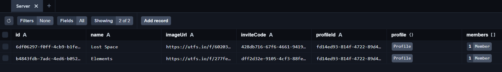

http://localhost:3000/servers/6df06297-f0ff-4cb9-b1fe-eb91881e9216

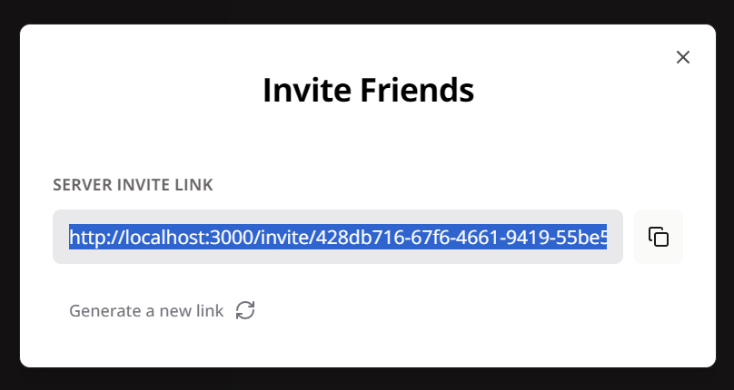

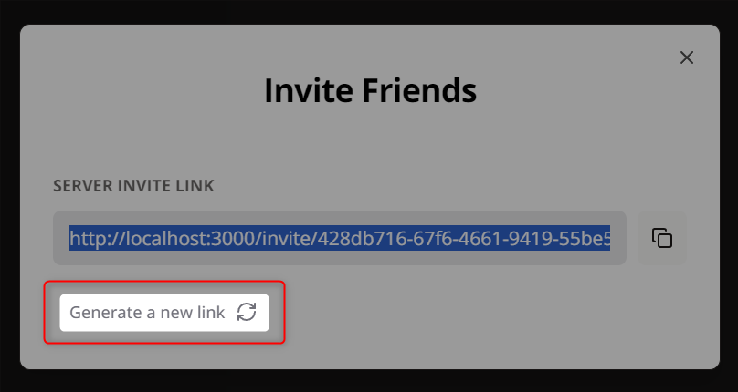

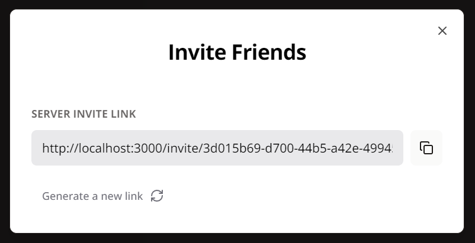

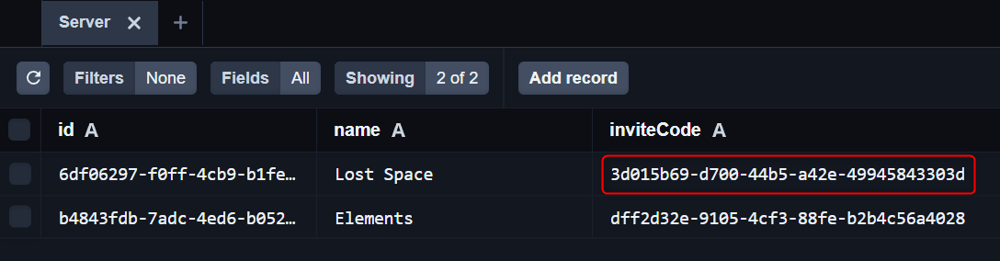

http://localhost:3000/servers/6df06297-f0ff-4cb9-b1fe-eb91881e9216

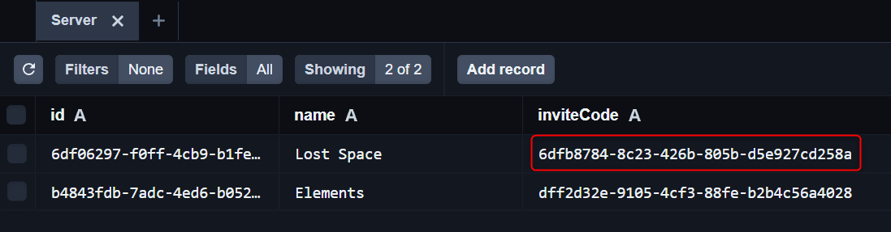

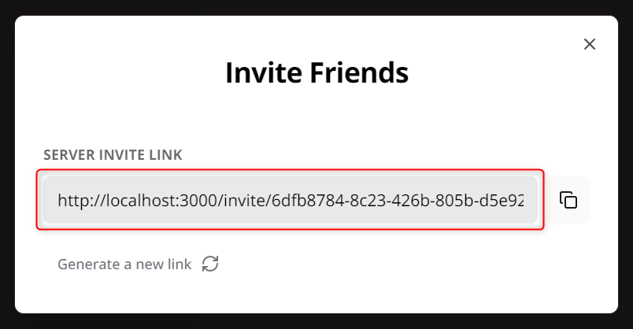

`/src/app/(invite)/(routes)/invite/[inviteCode]/page.tsx`

```TSX
import { redirect } from "next/navigation";
import { redirectToSignIn } from "@clerk/nextjs";

import { db } from "@/lib/db";
import { currentProfile } from "@/lib/current-profile";
import { use } from "react";

interface InviteCodePageProps {
  params: {
    inviteCode: string;
  };
}

const InviteCodePage = ({ params }: InviteCodePageProps) => {
  const profile = use(currentProfile());

  if (!profile) {
    return redirectToSignIn();
  }

  if (!params.inviteCode) {
    return redirect("/");
  }

  const existingServer = use(
    db.server.findFirst({
      where: {
        inviteCode: params.inviteCode,
        members: {
          some: {
            profileId: profile.id,
          },
        },
      },
    })
  );

  if (existingServer) {
    return redirect(`/servers/${existingServer.id}`);
  }

  const server = use(
    db.server.update({
      where: {
        inviteCode: params.inviteCode,
      },
      data: {
        members: {
          create: [
            {
              profileId: profile.id,
            },
          ],
        },
      },
    })
  );

  if (server) {
    return redirect(`/servers/${server.id}`);
  }

  return null;
};

export default InviteCodePage;
```

`/prisma/schema.prisma`

```PRISMA
model Server {
  id         String @id @default(uuid())
  name       String
  imageUrl   String @db.Text
  inviteCode String @unique

  profileId String
  profile   Profile @relation(fields: [profileId], references: [id], onDelete: Cascade)

  members  Member[]
  channels Channel[]

  createdAt DateTime @default(now())
  updatedAt DateTime @updatedAt

  @@index([profileId])
}
```

```BASH
npx prisma generate
```

```BASH
npx prisma db push
```

```BASH
npx prisma migrate reset
```

```BASH
npx prisma generate
```

```BASH
npx prisma db push
```

http://localhost:3000/invite/20a16a31-fe23-4b7c-8f2e-08a6568da0e5

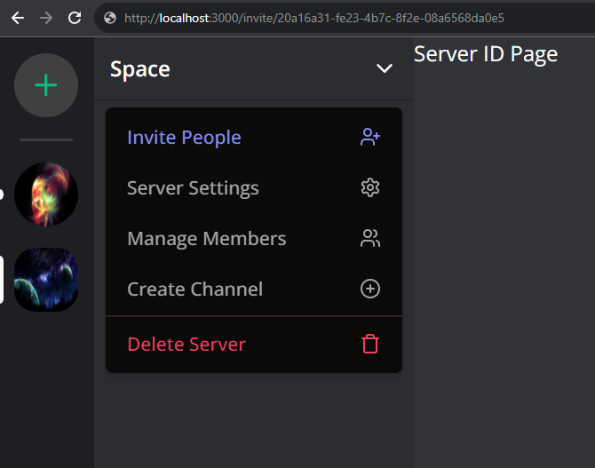

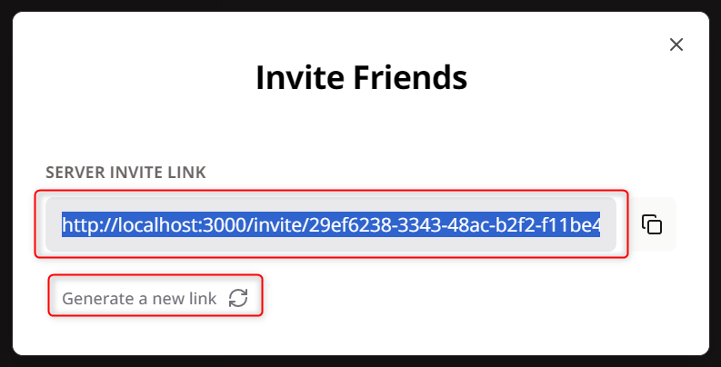

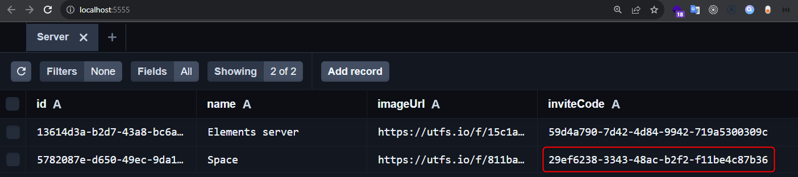

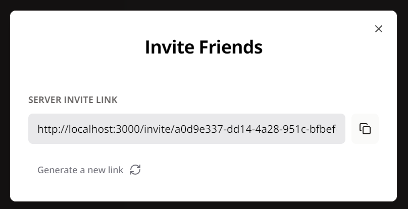

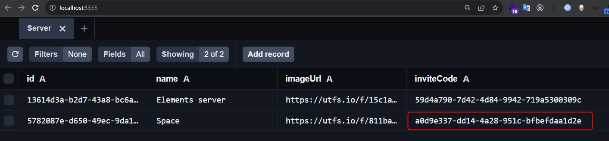

http://localhost:3000/invite/a0d9e337-dd14-4a28-951c-bfbefdaa1d2e to http://localhost:3000/servers/5782087e-d650-49ec-9da1-d4d46064fafa

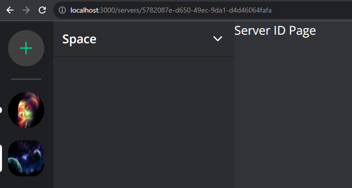

http://localhost:3000/invite/a0d9e337-dd14-4a28-951c-bfbefdaa1d2e to http://localhost:3000/sign-in?redirect_url=http%3A%2F%2Flocalhost%3A3000%2Finvite%2Fa0d9e337-dd14-4a28-951c-bfbefdaa1d2e

New incognito tab

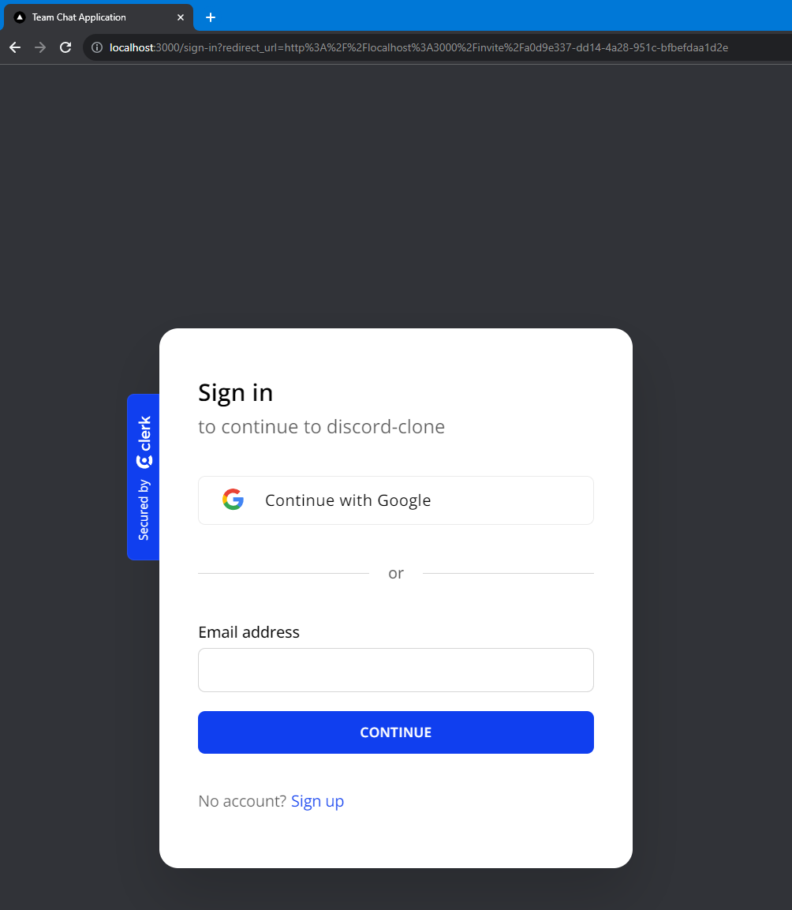

## Server settings

`/src/app/api/servers/[serverId]/route.ts`

```TS
import { NextResponse } from "next/server";

import { db } from "@/lib/db";
import { currentProfile } from "@/lib/current-profile";

export async function PATCH(
  req: Request,
  { params }: { params: { serverId: string } }
) {
  try {
    const profile = await currentProfile();
    const { name, imageUrl } = await req.json();

    if (!profile) {
      return new NextResponse("Unauthorized", { status: 401 });
    }

    const server = await db.server.update({
      where: {
        id: params.serverId,
        profileId: profile.id,
      },
      data: {
        name,
        imageUrl,
      },
    });

    return NextResponse.json(server);
  } catch (error) {
    console.log("[SERVER_ID_PATCH]", error);
    return new NextResponse("Internal Error", { status: 500 });
  }
}
```

`/src/components/modals/edit-server-modal.tsx`

```TSX
"use client";

import * as z from "zod";
import axios from "axios";
import { useEffect } from "react";
import { useForm } from "react-hook-form";
import { useRouter } from "next/navigation";
import { zodResolver } from "@hookform/resolvers/zod";

import { useModal } from "@/hooks/use-modal-store";

import {
  Dialog,
  DialogContent,
  DialogDescription,
  DialogFooter,
  DialogHeader,
  DialogTitle,
} from "@/components/ui/dialog";
import {
  Form,
  FormControl,
  FormField,
  FormItem,
  FormLabel,
  FormMessage,
} from "@/components/ui/form";
import { Input } from "@/components/ui/input";
import { Button } from "@/components/ui/button";

import { FileUpload } from "@/components/files/file-upload";

const formSchema = z.object({
  name: z.string().min(1, {
    message: "Server name is required.",
  }),
  imageUrl: z.string().min(1, {
    message: "Server image is required.",
  }),
});

export const EditServerModal = () => {
  const { isOpen, onClose, type, data } = useModal();
  const router = useRouter();

  const isModalOpen = isOpen && type === "editServer";
  const { server } = data;

  const form = useForm({
    resolver: zodResolver(formSchema),
    defaultValues: {
      name: "",
      imageUrl: "",
    },
  });

  useEffect(() => {
    if (server) {
      form.setValue("name", server.name);
      form.setValue("imageUrl", server.imageUrl);
    }
  }, [server, form]);

  const isLoading = form.formState.isSubmitting;

  const onSubmit = async (values: z.infer<typeof formSchema>) => {
    try {
      await axios.patch(`/api/servers/${server?.id}`, values);

      form.reset();
      router.refresh();
      onClose();
    } catch (error) {
      console.log(error);
    }
  };

  const handleClose = () => {
    onClose();
  };

  return (
    <Dialog open={isModalOpen} onOpenChange={handleClose}>
      <DialogContent className="bg-white text-black p-0 overflow-hidden">
        <DialogHeader className="pt-8 px-6">
          <DialogTitle className="text-2xl text-center font-bold">
            Customize your server
          </DialogTitle>
          <DialogDescription className="text-center text-zinc-500">
            Give your server a personality with a name and an image. You can
            always change it later.
          </DialogDescription>
        </DialogHeader>
        <Form {...form}>
          <form onSubmit={form.handleSubmit(onSubmit)} className="space-y-8">
            <div className="space-y-8 px-6">
              <div className="flex items-center justify-center text-center">
                <FormField
                  control={form.control}
                  name="imageUrl"
                  render={({ field }) => (
                    <FormItem>
                      <FormControl>
                        <FileUpload
                          endpoint="serverImage"
                          value={field.value}
                          onChange={field.onChange}
                        />
                      </FormControl>
                    </FormItem>
                  )}
                />
              </div>

              <FormField
                control={form.control}
                name="name"
                render={({ field }) => (
                  <FormItem>
                    <FormLabel className="uppercase text-xs font-bold text-zinc-500 dark:text-secondary/70">
                      Server name
                    </FormLabel>
                    <FormControl>
                      <Input
                        disabled={isLoading}
                        className="bg-zinc-300/50 border-0 focus-visible:ring-0 text-black focus-visible:ring-offset-0"
                        placeholder="Enter server name"
                        {...field}
                      />
                    </FormControl>
                    <FormMessage />
                  </FormItem>
                )}
              />
            </div>
            <DialogFooter className="bg-gray-100 px-6 py-4">
              <Button variant="primary" disabled={isLoading}>
                Save
              </Button>
            </DialogFooter>
          </form>
        </Form>
      </DialogContent>
    </Dialog>
  );
};
```

`/src/providers/modal-provider.tsx`

```TSX
"use client";

import { useEffect, useState } from "react";

import { InviteModal } from "@/components/modals/invite-modal";
import { EditServerModal } from "@/components/modals/edit-server-modal";
import { CreateServerModal } from "@/components/modals/create-server-modal";

export const ModalProvider = () => {
  const [isMounted, setIsMounted] = useState(false);

  useEffect(() => {
    setIsMounted(true);
  }, []);

  if (!isMounted) {
    return null;
  }

  return (
    <>
      <CreateServerModal />
      <InviteModal />
      <EditServerModal />
    </>
  );
};
```

`/src/components/server/server-header.tsx`

```TSX
export const ServerHeader = ({ server, role }: ServerHeaderProps) => {
  const { onOpen } = useModal();

  const isAdmin = role === MemberRole.ADMIN;
  const isModerator = isAdmin || role === MemberRole.MODERATOR;

  return (
    <DropdownMenu>
      ...
      ...
      ...
      <DropdownMenuContent className="w-56 text-xs font-medium text-black dark:text-neutral-400 space-y-[2px]">
        ...
        ...
        ...
        {isAdmin && (
          <DropdownMenuItem
            onClick={() => onOpen("editServer", { server })}
            className="px-3 py-2 text-sm cursor-pointer"
          >
            Server Settings
            <Settings className="h-4 w-4 ml-auto" />
          </DropdownMenuItem>
        )}
        ...
        ...
        ...
      </DropdownMenuContent>
    </DropdownMenu>
  )
}
```

http://localhost:3000/servers/13614d3a-b2d7-43a8-bc6a-e883299f6ed4

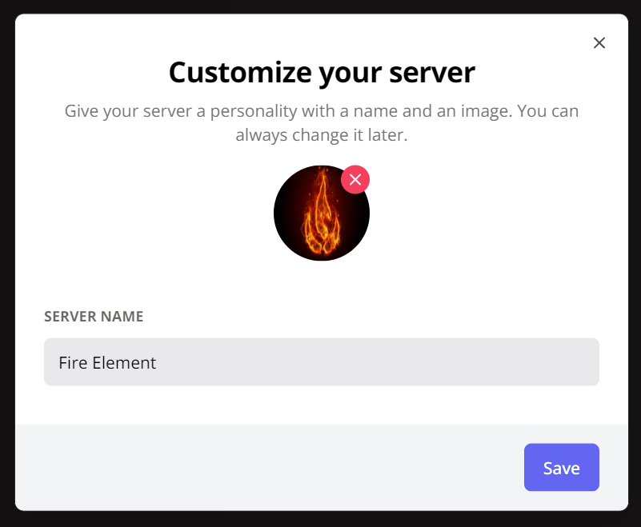

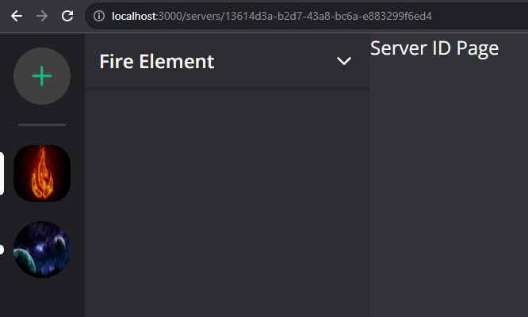

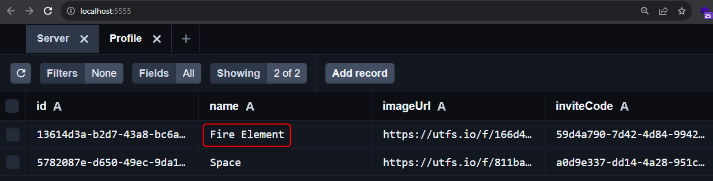

---
