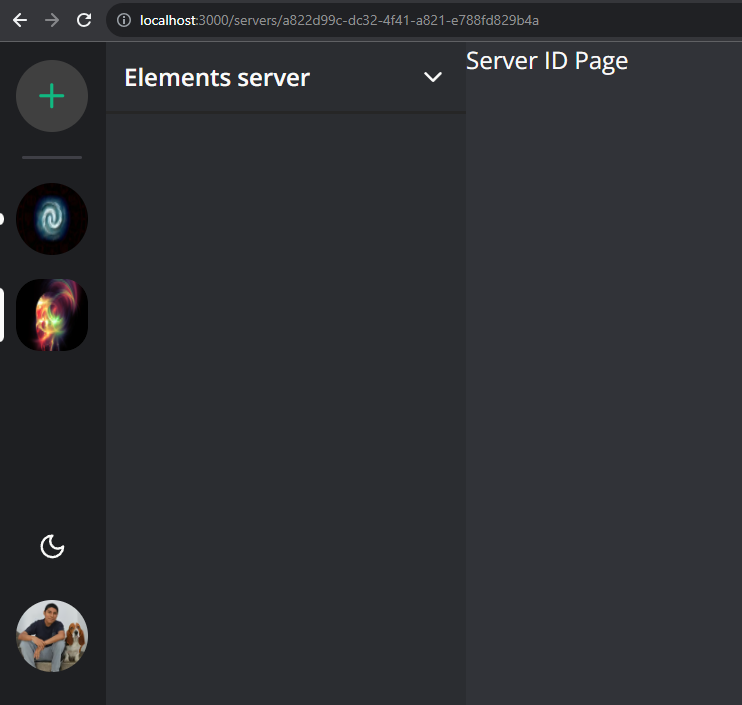
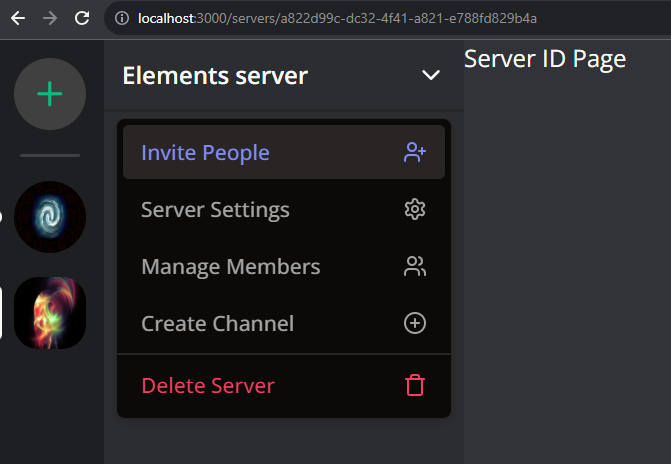
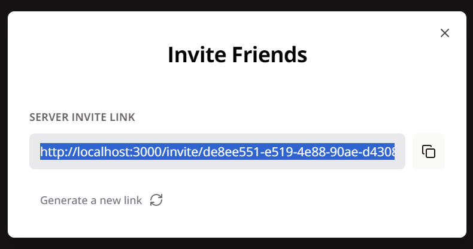
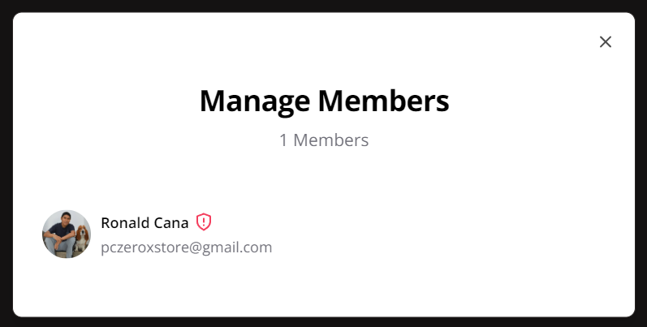
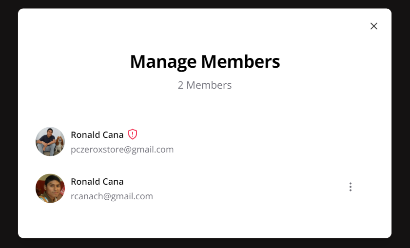
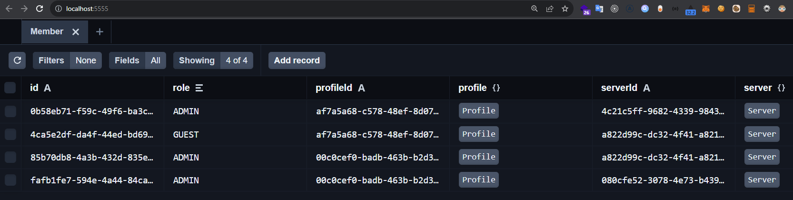
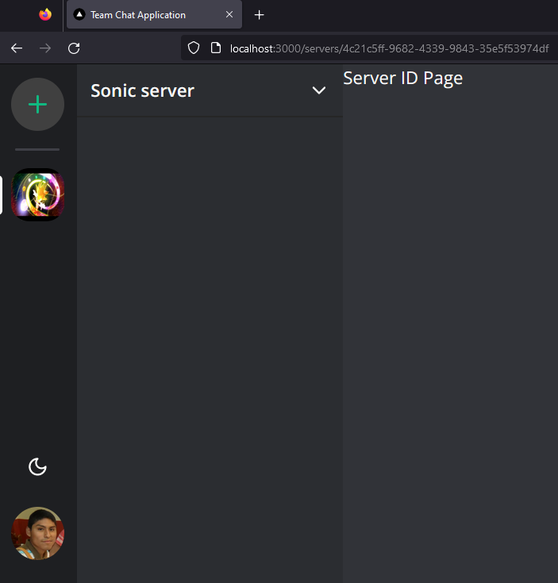
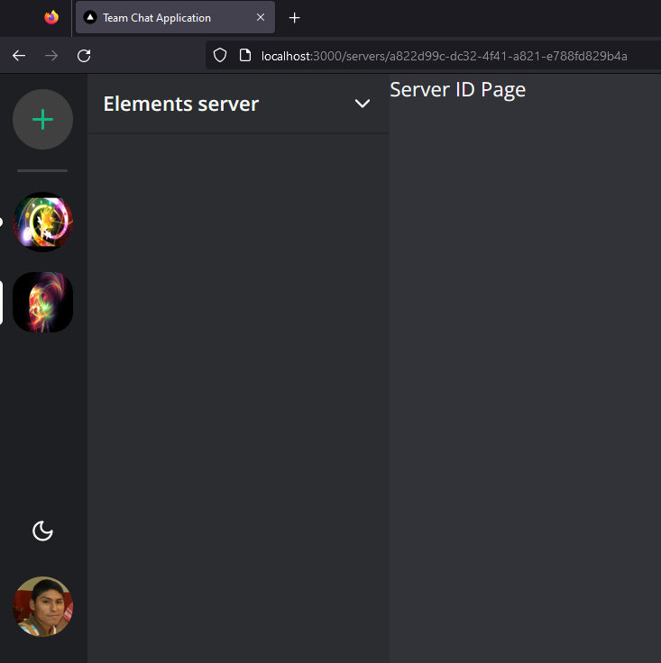
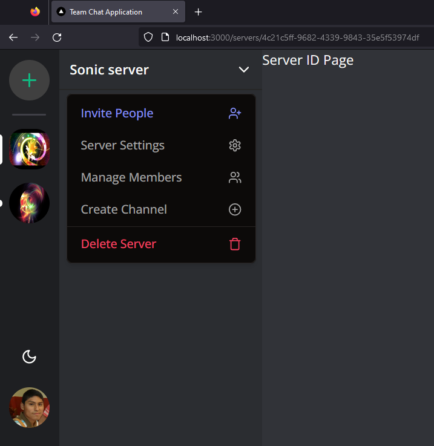

# 6 - Manage members

```BASH
npx shadcn-ui@latest add avatar
```

`/src/components/user/user-avatar.tsx`

```TSX
import { cn } from "@/lib/utils";

import { Avatar, AvatarImage } from "@/components/ui/avatar";

interface UserAvatarProps {
  src?: string;
  className?: string;
}

export const UserAvatar = ({ src, className }: UserAvatarProps) => {
  return (
    <Avatar className={cn("h-7 w-7 md:h-10 md:w-10", className)}>
      <AvatarImage src={src} />
    </Avatar>
  );
};
```

`/src/components/modals/members-modal.tsx`

```TSX
"use client";

import {
  Check,
  Gavel,
  Loader2,
  MoreVertical,
  Shield,
  ShieldAlert,
  ShieldCheck,
  ShieldQuestion,
} from "lucide-react";
import axios from "axios";
import qs from "query-string";
import { useState } from "react";
import { MemberRole } from "@prisma/client";
import { useRouter } from "next/navigation";

import { useModal } from "@/hooks/use-modal-store";

import {
  Dialog,
  DialogContent,
  DialogDescription,
  DialogHeader,
  DialogTitle,
} from "@/components/ui/dialog";
import {
  DropdownMenu,
  DropdownMenuContent,
  DropdownMenuItem,
  DropdownMenuPortal,
  DropdownMenuSeparator,
  DropdownMenuSub,
  DropdownMenuSubContent,
  DropdownMenuTrigger,
  DropdownMenuSubTrigger,
} from "@/components/ui/dropdown-menu";
import { ScrollArea } from "@/components/ui/scroll-area";

import { UserAvatar } from "@/components/user/user-avatar";

import { ServerWithMembersWithProfiles } from "@/typings/types/server-with-members-with-profiles.type";

const roleIconMap = {
  GUEST: null,
  MODERATOR: <ShieldCheck className="h-4 w-4 ml-2 text-indigo-500" />,
  ADMIN: <ShieldAlert className="h-4 w-4 text-rose-500" />,
};

export const MembersModal = () => {
  const router = useRouter();
  const { onOpen, isOpen, onClose, type, data } = useModal();
  const [loadingId, setLoadingId] = useState("");

  const isModalOpen = isOpen && type === "members";
  const { server } = data as { server: ServerWithMembersWithProfiles };

  const onKick = async (memberId: string) => {
    try {
      setLoadingId(memberId);
      const url = qs.stringifyUrl({
        url: `/api/members/${memberId}`,
        query: {
          serverId: server?.id,
        },
      });

      const response = await axios.delete(url);

      router.refresh();
      onOpen("members", { server: response.data });
    } catch (error) {
      console.log(error);
    } finally {
      setLoadingId("");
    }
  };

  const onRoleChange = async (memberId: string, role: MemberRole) => {
    try {
      setLoadingId(memberId);
      const url = qs.stringifyUrl({
        url: `/api/members/${memberId}`,
        query: {
          serverId: server?.id,
        },
      });

      const response = await axios.patch(url, { role });

      router.refresh();
      onOpen("members", { server: response.data });
    } catch (error) {
      console.log(error);
    } finally {
      setLoadingId("");
    }
  };

  return (
    <Dialog open={isModalOpen} onOpenChange={onClose}>
      <DialogContent className="bg-white text-black overflow-hidden">
        <DialogHeader className="pt-8 px-6">
          <DialogTitle className="text-2xl text-center font-bold">
            Manage Members
          </DialogTitle>
          <DialogDescription className="text-center text-zinc-500">
            {server?.members?.length} Members
          </DialogDescription>
        </DialogHeader>
        <ScrollArea className="mt-8 max-h-[420px] pr-6">
          {server?.members?.map((member) => (
            <div key={member.id} className="flex items-center gap-x-2 mb-6">
              <UserAvatar src={member.profile.imageUrl} />
              <div className="flex flex-col gap-y-1">
                <div className="text-xs font-semibold flex items-center gap-x-1">
                  {member.profile.name}
                  {roleIconMap[member.role]}
                </div>
                <p className="text-xs text-zinc-500">{member.profile.email}</p>
              </div>
              {server.profileId !== member.profileId &&
                loadingId !== member.id && (
                  <div className="ml-auto">
                    <DropdownMenu>
                      <DropdownMenuTrigger>
                        <MoreVertical className="h-4 w-4 text-zinc-500" />
                      </DropdownMenuTrigger>
                      <DropdownMenuContent side="left">
                        <DropdownMenuSub>
                          <DropdownMenuSubTrigger className="flex items-center">
                            <ShieldQuestion className="w-4 h-4 mr-2" />
                            <span>Role</span>
                          </DropdownMenuSubTrigger>
                          <DropdownMenuPortal>
                            <DropdownMenuSubContent>
                              <DropdownMenuItem
                                onClick={() => onRoleChange(member.id, "GUEST")}
                              >
                                <Shield className="h-4 w-4 mr-2" />
                                Guest
                                {member.role === "GUEST" && (
                                  <Check className="h-4 w-4 ml-auto" />
                                )}
                              </DropdownMenuItem>
                              <DropdownMenuItem
                                onClick={() =>
                                  onRoleChange(member.id, "MODERATOR")
                                }
                              >
                                <ShieldCheck className="h-4 w-4 mr-2" />
                                Moderator
                                {member.role === "MODERATOR" && (
                                  <Check className="h-4 w-4 ml-auto" />
                                )}
                              </DropdownMenuItem>
                            </DropdownMenuSubContent>
                          </DropdownMenuPortal>
                        </DropdownMenuSub>
                        <DropdownMenuSeparator />
                        <DropdownMenuItem onClick={() => onKick(member.id)}>
                          <Gavel className="h-4 w-4 mr-2" />
                          Kick
                        </DropdownMenuItem>
                      </DropdownMenuContent>
                    </DropdownMenu>
                  </div>
                )}
              {loadingId === member.id && (
                <Loader2 className="animate-spin text-zinc-500 ml-auto w-4 h-4" />
              )}
            </div>
          ))}
        </ScrollArea>
      </DialogContent>
    </Dialog>
  );
};
```

`/src/components/server/server-header.tsx`

```TSX
export const ServerHeader = ({ server, role }: ServerHeaderProps) => {
  const { onOpen } = useModal();

  const isAdmin = role === MemberRole.ADMIN;
  const isModerator = isAdmin || role === MemberRole.MODERATOR;

  return (
    <DropdownMenu>
      ...
      ...
      ...
      <DropdownMenuContent className="w-56 text-xs font-medium text-black dark:text-neutral-400 space-y-[2px]">
        ...
        ...
        ...
        {isAdmin && (
          <DropdownMenuItem
            onClick={() => onOpen("members", { server })}
            className="px-3 py-2 text-sm cursor-pointer"
          >
            Manage Members
            <Settings className="h-4 w-4 ml-auto" />
          </DropdownMenuItem>
        )}
        ...
        ...
        ...
      </DropdownMenuContent>
    </DropdownMenu>
  )
}
```

`/src/app/(invite)/(routes)/invite/[inviteCode]/page.tsx`

```TSX
import { redirect } from "next/navigation";
import { redirectToSignIn } from "@clerk/nextjs";

import { db } from "@/lib/db";
import { currentProfile } from "@/lib/current-profile";

interface InviteCodePageProps {
  params: {
    inviteCode: string;
  };
}

const InviteCodePage = async ({ params }: InviteCodePageProps) => {
  const profile = await currentProfile();

  if (!profile) {
    return redirectToSignIn();
  }

  if (!params.inviteCode) {
    return redirect("/");
  }

  const existingServer = await db.server.findFirst({
    where: {
      inviteCode: params.inviteCode,
      members: {
        some: {
          profileId: profile.id,
        },
      },
    },
  });

  if (existingServer) {
    return redirect(`/servers/${existingServer.id}`);
  }

  const server = await db.server.update({
    where: {
      inviteCode: params.inviteCode,
    },
    data: {
      members: {
        create: [
          {
            profileId: profile.id,
          },
        ],
      },
    },
  });

  if (server) {
    return redirect(`/servers/${server.id}`);
  }

  return null;
};

export default InviteCodePage;
```

`/src/providers/modal-provider.tsx`

```TSX
"use client";

import { useEffect, useState } from "react";

import { InviteModal } from "@/components/modals/invite-modal";
import { MembersModal } from "@/components/modals/members-modal";
import { EditServerModal } from "@/components/modals/edit-server-modal";
import { CreateServerModal } from "@/components/modals/create-server-modal";

export const ModalProvider = () => {
  const [isMounted, setIsMounted] = useState(false);

  useEffect(() => {
    setIsMounted(true);
  }, []);

  if (!isMounted) {
    return null;
  }

  return (
    <>
      <CreateServerModal />
      <InviteModal />
      <EditServerModal />
      <MembersModal />
    </>
  );
};
```

http://localhost:3000/servers/a822d99c-dc32-4f41-a821-e788fd829b4a













http://localhost:3000/servers/4c21c5ff-9682-4339-9843-35e5f53974df



http://localhost:3000/servers/a822d99c-dc32-4f41-a821-e788fd829b4a





**OBSERVACIÓN**

Se renderiza 2 veces, por lo cual no es recomendable utilizar `use` de React, sino es para usar en los `Hooks` personalizados

`/src/app/(invite)/(routes)/invite/[inviteCode]/page.tsx`

```TSX
import { use } from "react";
import { redirect } from "next/navigation";
import { redirectToSignIn } from "@clerk/nextjs";

import { db } from "@/lib/db";
import { currentProfile } from "@/lib/current-profile";

interface InviteCodePageProps {
  params: {
    inviteCode: string;
  };
}

const InviteCodePage = ({ params }: InviteCodePageProps) => {
  const profile = use(currentProfile());

  if (!profile) {
    return redirectToSignIn();
  }

  if (!params.inviteCode) {
    return redirect("/");
  }

  const existingServer = use(
    db.server.findFirst({
      where: {
        inviteCode: params.inviteCode,
        members: {
          some: {
            profileId: profile.id,
          },
        },
      },
    })
  );

  if (existingServer) {
    return redirect(`/servers/${existingServer.id}`);
  }

  const server = use(
    db.server.update({
      where: {
        inviteCode: params.inviteCode,
      },
      data: {
        members: {
          create: [
            {
              profileId: profile.id,
            },
          ],
        },
      },
    })
  );

  if (server) {
    return redirect(`/servers/${server.id}`);
  }

  return null;
};

export default InviteCodePage;
```

---
