# 7 - Channel creation - Delete and leave server modal

- [7 - Channel creation - Delete and leave server modal](#7---channel-creation---delete-and-leave-server-modal)
  - [Channel creation](#channel-creation)
  - [Leave server modal](#leave-server-modal)
  - [Delete server modal](#delete-server-modal)

## Channel creation

`/src/hooks/use-modal-store.ts`

```TS
import { create } from "zustand";
import { Channel, ChannelType, Server } from "@prisma/client";

export type ModalType =
  | "createServer"
  | "invite"
  | "editServer"
  | "members"
  | "createChannel";

interface ModalData {
  server?: Server;
  channel?: Channel;
  channelType?: ChannelType;
  apiUrl?: string;
  query?: Record<string, any>;
}

interface ModalStore {
  type: ModalType | null;
  data: ModalData;
  isOpen: boolean;
  onOpen: (type: ModalType, data?: ModalData) => void;
  onClose: () => void;
}

export const useModal = create<ModalStore>((set) => ({
  type: null,
  data: {},
  isOpen: false,
  onOpen: (type, data = {}) => set({ isOpen: true, type, data }),
  onClose: () => set({ type: null, isOpen: false }),
}));
```

`/src/components/modals/create-channel-modal.tsx`

```TSX
"use client";

import * as z from "zod";
import axios from "axios";
import qs from "query-string";
import { useEffect } from "react";
import { useForm } from "react-hook-form";
import { ChannelType } from "@prisma/client";
import { zodResolver } from "@hookform/resolvers/zod";
import { useParams, useRouter } from "next/navigation";

import { useModal } from "@/hooks/use-modal-store";

import {
  Dialog,
  DialogContent,
  DialogFooter,
  DialogHeader,
  DialogTitle,
} from "@/components/ui/dialog";
import {
  Form,
  FormControl,
  FormField,
  FormItem,
  FormLabel,
  FormMessage,
} from "@/components/ui/form";
import {
  Select,
  SelectContent,
  SelectItem,
  SelectTrigger,
  SelectValue,
} from "@/components/ui/select";
import { Input } from "@/components/ui/input";
import { Button } from "@/components/ui/button";

const formSchema = z.object({
  name: z
    .string()
    .min(1, {
      message: "Channel name is required.",
    })
    .refine((name) => name !== "general", {
      message: "Channel name cannot be 'general'",
    }),
  type: z.nativeEnum(ChannelType),
});

export const CreateChannelModal = () => {
  const { isOpen, onClose, type, data } = useModal();
  const router = useRouter();
  const params = useParams();

  const isModalOpen = isOpen && type === "createChannel";
  const { channelType } = data;

  const form = useForm({
    resolver: zodResolver(formSchema),
    defaultValues: {
      name: "",
      type: channelType ?? ChannelType.TEXT,
    },
  });

  useEffect(() => {
    if (channelType) {
      form.setValue("type", channelType);
    } else {
      form.setValue("type", ChannelType.TEXT);
    }
  }, [channelType, form]);

  const isLoading = form.formState.isSubmitting;

  const onSubmit = async (values: z.infer<typeof formSchema>) => {
    try {
      const url = qs.stringifyUrl({
        url: "/api/channels",
        query: {
          serverId: params?.serverId,
        },
      });
      await axios.post(url, values);

      form.reset();
      router.refresh();
      onClose();
    } catch (error) {
      console.log(error);
    }
  };

  const handleClose = () => {
    form.reset();
    onClose();
  };

  return (
    <Dialog open={isModalOpen} onOpenChange={handleClose}>
      <DialogContent className="bg-white text-black p-0 overflow-hidden">
        <DialogHeader className="pt-8 px-6">
          <DialogTitle className="text-2xl text-center font-bold">
            Create Channel
          </DialogTitle>
        </DialogHeader>
        <Form {...form}>
          <form onSubmit={form.handleSubmit(onSubmit)} className="space-y-8">
            <div className="space-y-8 px-6">
              <FormField
                control={form.control}
                name="name"
                render={({ field }) => (
                  <FormItem>
                    <FormLabel className="uppercase text-xs font-bold text-zinc-500 dark:text-secondary/70">
                      Channel name
                    </FormLabel>
                    <FormControl>
                      <Input
                        disabled={isLoading}
                        className="bg-zinc-300/50 border-0 focus-visible:ring-0 text-black focus-visible:ring-offset-0"
                        placeholder="Enter channel name"
                        {...field}
                      />
                    </FormControl>
                    <FormMessage />
                  </FormItem>
                )}
              />
              <FormField
                control={form.control}
                name="type"
                render={({ field }) => (
                  <FormItem>
                    <FormLabel>Channel Type</FormLabel>
                    <Select
                      disabled={isLoading}
                      onValueChange={field.onChange}
                      defaultValue={field.value}
                    >
                      <FormControl>
                        <SelectTrigger className="bg-zinc-300/50 border-0 focus:ring-0 text-black ring-offset-0 focus:ring-offset-0 capitalize outline-none">
                          <SelectValue placeholder="Select a channel type" />
                        </SelectTrigger>
                      </FormControl>
                      <SelectContent>
                        {Object.values(ChannelType).map((type) => (
                          <SelectItem
                            key={type}
                            value={type}
                            className="capitalize"
                          >
                            {type.toLowerCase()}
                          </SelectItem>
                        ))}
                      </SelectContent>
                    </Select>
                    <FormMessage />
                  </FormItem>
                )}
              />
            </div>
            <DialogFooter className="bg-gray-100 px-6 py-4">
              <Button variant="primary" disabled={isLoading}>
                Create
              </Button>
            </DialogFooter>
          </form>
        </Form>
      </DialogContent>
    </Dialog>
  );
};
```

`/src/components/server/server-header.tsx`

```TSX
export const ServerHeader = ({ server, role }: ServerHeaderProps) => {
  const { onOpen } = useModal();

  const isAdmin = role === MemberRole.ADMIN;
  const isModerator = isAdmin || role === MemberRole.MODERATOR;

  return (
    <DropdownMenu>
      ...
      ...
      ...
      <DropdownMenuContent className="w-56 text-xs font-medium text-black dark:text-neutral-400 space-y-[2px]">
        ...
        ...
        ...
        {isModerator && (
          <DropdownMenuItem
            onClick={() => onOpen("createChannel")}
            className="px-3 py-2 text-sm cursor-pointer"
          >
            Create Channel
            <PlusCircle className="h-4 w-4 ml-auto" />
          </DropdownMenuItem>
        )}
        ...
        ...
        ...
      </DropdownMenuContent>
    </DropdownMenu>
  )
}
```

`/src/providers/modal-provider.tsx`

```TSX
"use client";

import { useEffect, useState } from "react";

import { InviteModal } from "@/components/modals/invite-modal";
import { MembersModal } from "@/components/modals/members-modal";
import { EditServerModal } from "@/components/modals/edit-server-modal";
import { CreateServerModal } from "@/components/modals/create-server-modal";
import { CreateChannelModal } from "@/components/modals/create-channel-modal";

export const ModalProvider = () => {
  const [isMounted, setIsMounted] = useState(false);

  useEffect(() => {
    setIsMounted(true);
  }, []);

  if (!isMounted) {
    return null;
  }

  return (
    <>
      <CreateServerModal />
      <InviteModal />
      <EditServerModal />
      <MembersModal />
      <CreateChannelModal />
    </>
  );
};¿
```

http://localhost:3000/servers/a822d99c-dc32-4f41-a821-e788fd829b4a

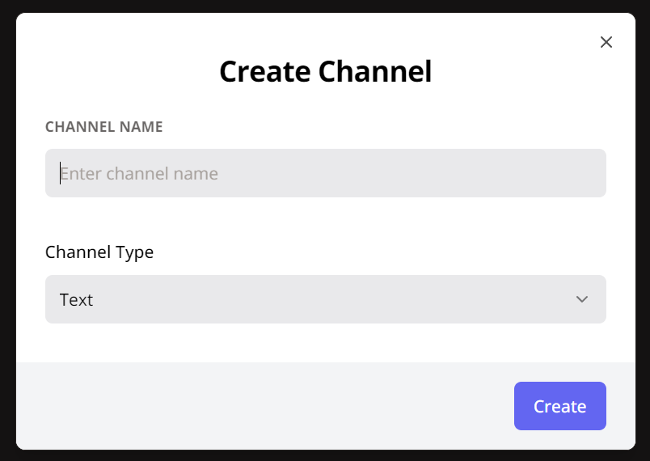

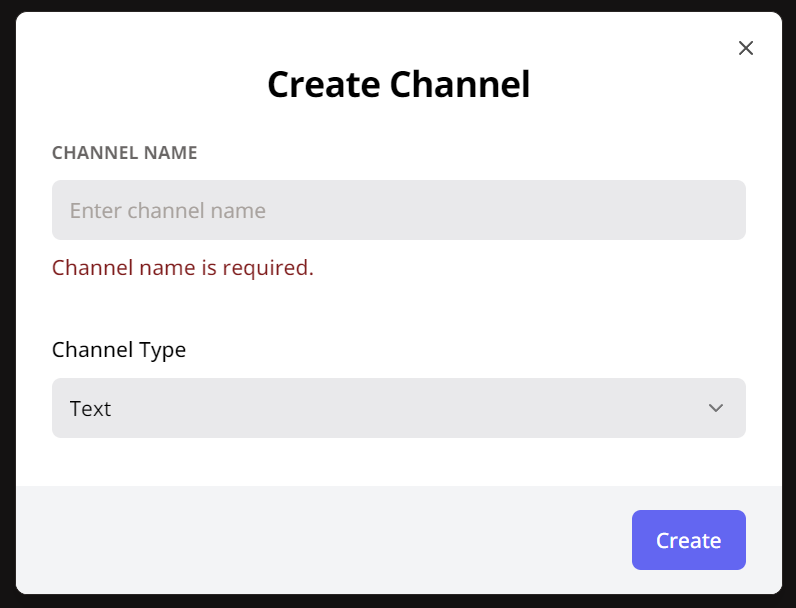

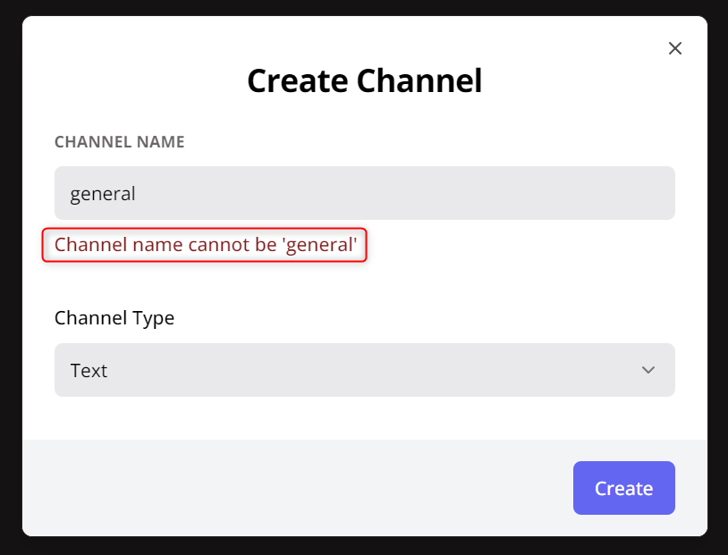

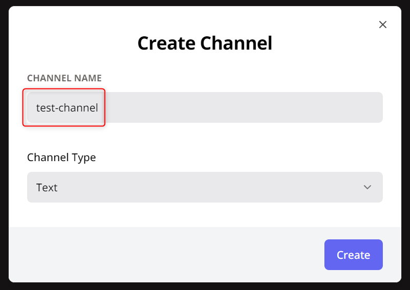

http://localhost:5555/

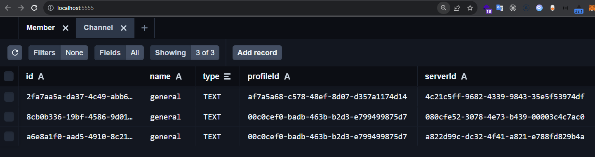

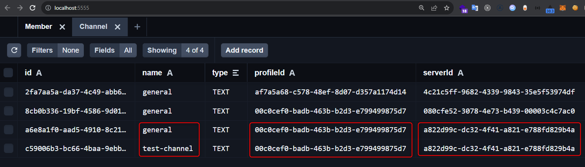

## Leave server modal

`/src/app/api/servers/[serverId]/leave/route.ts`

```TSX
import { NextResponse } from "next/server";

import { currentProfile } from "@/lib/current-profile";
import { db } from "@/lib/db";

export async function PATCH(
  req: Request,
  { params }: { params: { serverId: string } }
) {
  try {
    const profile = await currentProfile();

    if (!profile) {
      return new NextResponse("Unauthorized", { status: 401 });
    }

    if (!params.serverId) {
      return new NextResponse("Server ID missing", { status: 400 });
    }

    const server = await db.server.update({
      where: {
        id: params.serverId,
        profileId: {
          not: profile.id
        },
        members: {
          some: {
            profileId: profile.id
          }
        }
      },
      data: {
        members: {
          deleteMany: {
            profileId: profile.id
          }
        }
      }
    });

    return NextResponse.json(server);
  } catch (error) {
    console.log("[SERVER_ID_LEAVE]", error);
    return new NextResponse("Internal Error", { status: 500 });
  }
}
```

`/src/components/modals/leave-server-modal.tsx`

```TSX
"use client";

import axios from "axios";
import { useState } from "react";
import { useRouter } from "next/navigation";

import { useModal } from "@/hooks/use-modal-store";

import {
  Dialog,
  DialogContent,
  DialogDescription,
  DialogFooter,
  DialogHeader,
  DialogTitle,
} from "@/components/ui/dialog";
import { Button } from "@/components/ui/button";

export const LeaveServerModal = () => {
  const { isOpen, onClose, type, data } = useModal();
  const router = useRouter();

  const isModalOpen = isOpen && type === "leaveServer";
  const { server } = data;

  const [isLoading, setIsLoading] = useState(false);

  const onClick = async () => {
    try {
      setIsLoading(true);

      await axios.patch(`/api/servers/${server?.id}/leave`);

      onClose();
      router.refresh();
      router.push("/");
    } catch (error) {
      console.log(error);
    } finally {
      setIsLoading(false);
    }
  };

  return (
    <Dialog open={isModalOpen} onOpenChange={onClose}>
      <DialogContent className="bg-white text-black p-0 overflow-hidden">
        <DialogHeader className="pt-8 px-6">
          <DialogTitle className="text-2xl text-center font-bold">
            Leave Server
          </DialogTitle>
          <DialogDescription className="text-center text-zinc-500">
            Are you sure you want to leave{" "}
            <span className="font-semibold text-indigo-500">
              {server?.name}
            </span>
            ?
          </DialogDescription>
        </DialogHeader>
        <DialogFooter className="bg-gray-100 px-6 py-4">
          <div className="flex items-center justify-between w-full">
            <Button disabled={isLoading} onClick={onClose} variant="ghost">
              Cancel
            </Button>
            <Button disabled={isLoading} variant="primary" onClick={onClick}>
              Confirm
            </Button>
          </div>
        </DialogFooter>
      </DialogContent>
    </Dialog>
  );
};
```

`/src/providers/modal-provider.tsx`

```TSX
"use client";

import { useEffect, useState } from "react";

import { InviteModal } from "@/components/modals/invite-modal";
import { MembersModal } from "@/components/modals/members-modal";
import { EditServerModal } from "@/components/modals/edit-server-modal";
import { LeaveServerModal } from "@/components/modals/leave-server-modal";
import { CreateServerModal } from "@/components/modals/create-server-modal";
import { CreateChannelModal } from "@/components/modals/create-channel-modal";

export const ModalProvider = () => {
  const [isMounted, setIsMounted] = useState(false);

  useEffect(() => {
    setIsMounted(true);
  }, []);

  if (!isMounted) {
    return null;
  }

  return (
    <>
      <CreateServerModal />
      <InviteModal />
      <EditServerModal />
      <MembersModal />
      <CreateChannelModal />
      <LeaveServerModal />
    </>
  );
};
```

`/src/components/server/server-header.tsx`

```TSX
export const ServerHeader = ({ server, role }: ServerHeaderProps) => {
  const { onOpen } = useModal();

  const isAdmin = role === MemberRole.ADMIN;
  const isModerator = isAdmin || role === MemberRole.MODERATOR;

  return (
    <DropdownMenu>
      ...
      ...
      ...
      <DropdownMenuContent className="w-56 text-xs font-medium text-black dark:text-neutral-400 space-y-[2px]">
        ...
        ...
        ...
        {!isAdmin && (
          <DropdownMenuItem
            onClick={() => onOpen("leaveServer", { server })}
            className="px-3 py-2 text-sm cursor-pointer"
          >
            Leave Server
            <Settings className="h-4 w-4 ml-auto" />
          </DropdownMenuItem>
        )}
        ...
        ...
        ...
      </DropdownMenuContent>
    </DropdownMenu>
  )
}
```

http://localhost:3000/servers/a822d99c-dc32-4f41-a821-e788fd829b4a

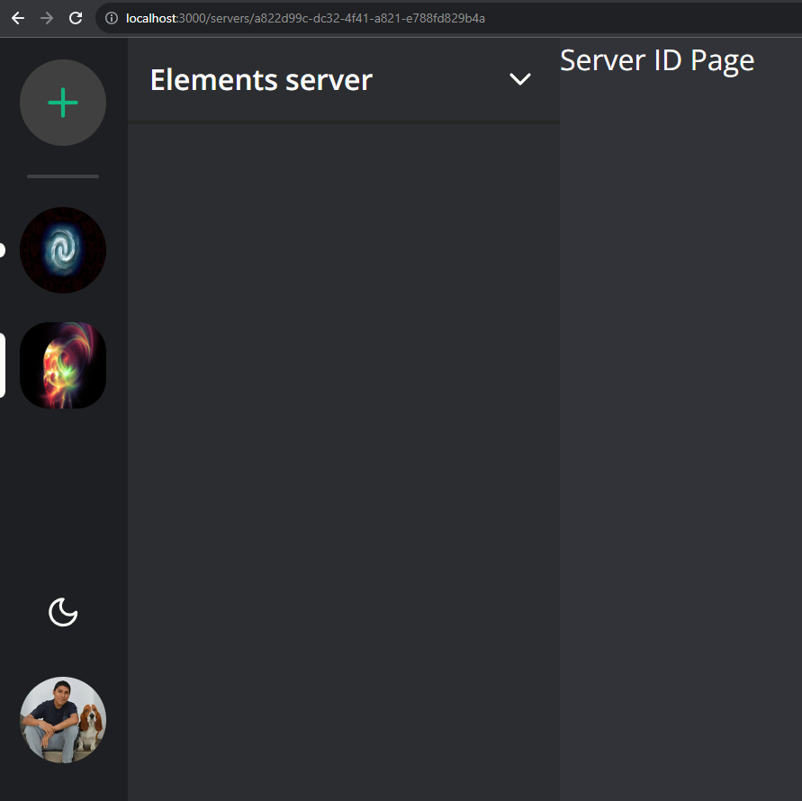

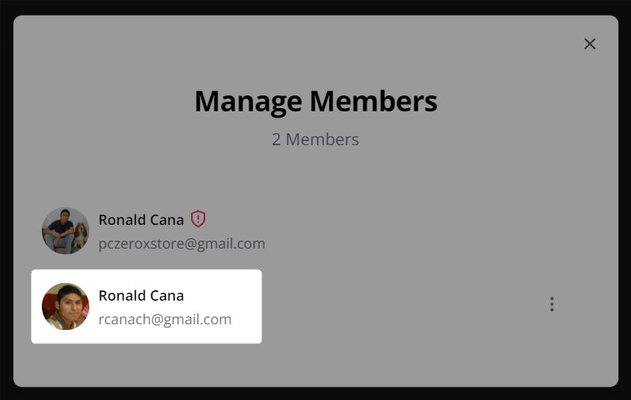

http://localhost:3000/servers/a822d99c-dc32-4f41-a821-e788fd829b4a

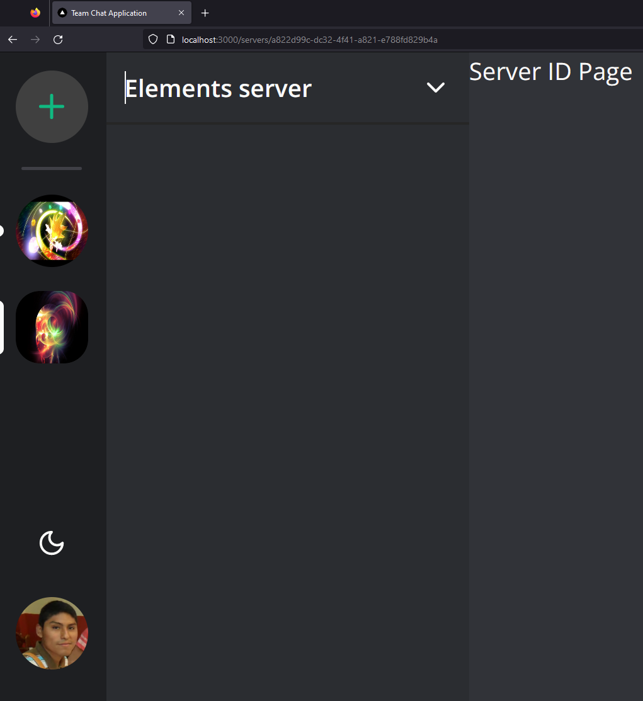

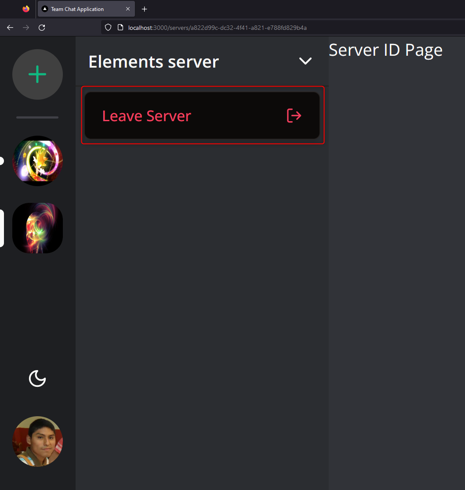

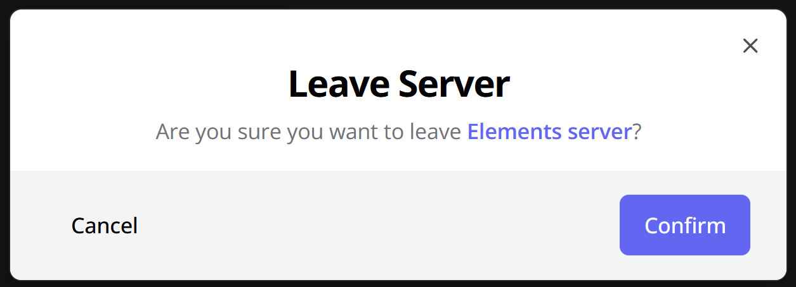

http://localhost:3000/servers/4c21c5ff-9682-4339-9843-35e5f53974df

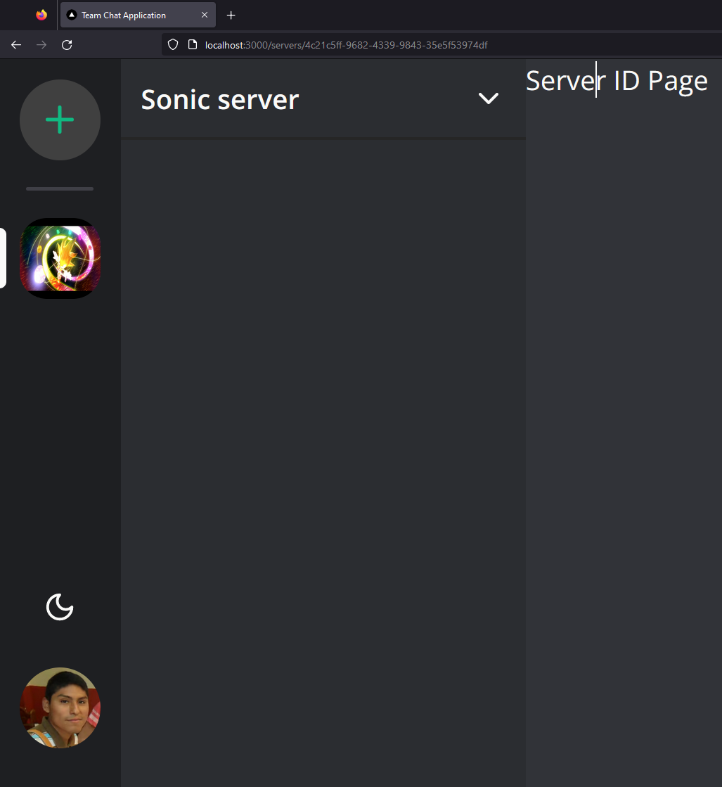

http://localhost:3000/servers/a822d99c-dc32-4f41-a821-e788fd829b4a

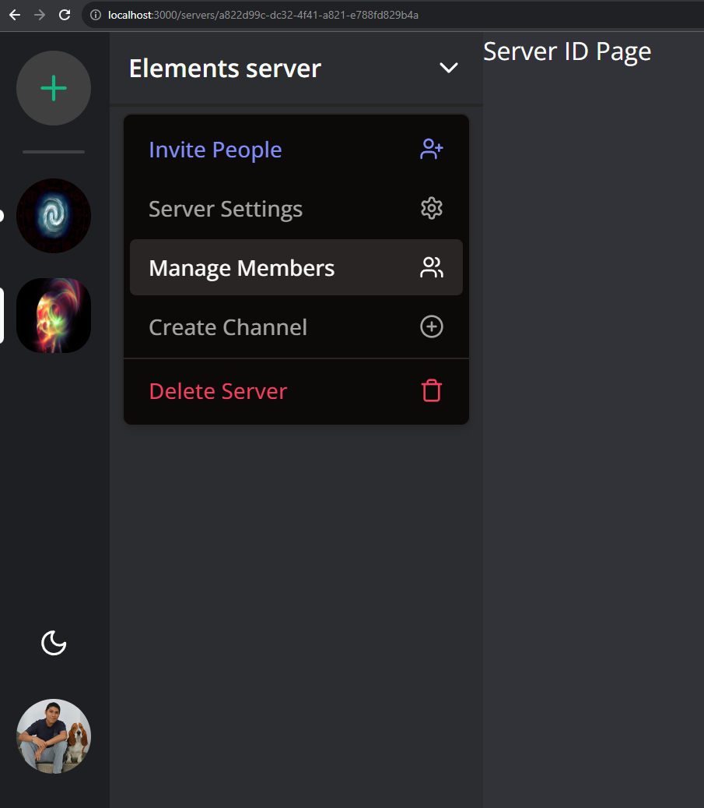

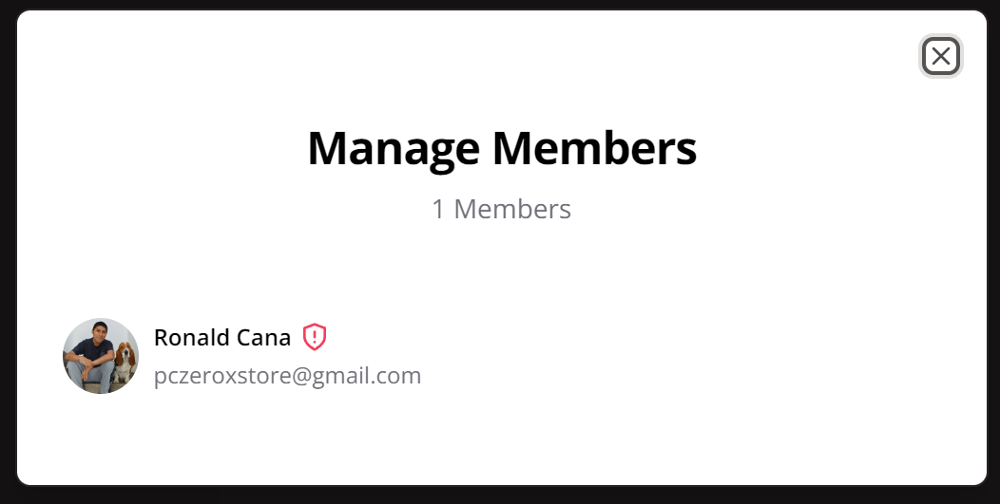

## Delete server modal

`/src/app/api/servers/[serverId]/route.ts`

```TSX
import { NextResponse } from "next/server";

import { db } from "@/lib/db";
import { currentProfile } from "@/lib/current-profile";

export async function DELETE(
  req: Request,
  { params }: { params: { serverId: string } }
) {
  try {
    const profile = await currentProfile();

    if (!profile) {
      return new NextResponse("Unauthorized", { status: 401 });
    }

    const server = await db.server.delete({
      where: {
        id: params.serverId,
        profileId: profile.id,
      },
    });

    return NextResponse.json(server);
  } catch (error) {
    console.log("[SERVER_ID_DELETE]", error);
    return new NextResponse("Internal Error", { status: 500 });
  }
}

export async function PATCH(
  req: Request,
  { params }: { params: { serverId: string } }
) {
  ...
  ...
  ...
}
```

`/src/components/modals/delete-server-modal.tsx`

```TSX
"use client";

import axios from "axios";
import { useState } from "react";
import { useRouter } from "next/navigation";

import { useModal } from "@/hooks/use-modal-store";

import {
  Dialog,
  DialogContent,
  DialogDescription,
  DialogFooter,
  DialogHeader,
  DialogTitle,
} from "@/components/ui/dialog";
import { Button } from "@/components/ui/button";

export const DeleteServerModal = () => {
  const { isOpen, onClose, type, data } = useModal();
  const router = useRouter();

  const isModalOpen = isOpen && type === "deleteServer";
  const { server } = data;

  const [isLoading, setIsLoading] = useState(false);

  const onClick = async () => {
    try {
      setIsLoading(true);

      await axios.delete(`/api/servers/${server?.id}`);

      onClose();
      router.refresh();
      router.push("/");
    } catch (error) {
      console.log(error);
    } finally {
      setIsLoading(false);
    }
  };

  return (
    <Dialog open={isModalOpen} onOpenChange={onClose}>
      <DialogContent className="bg-white text-black p-0 overflow-hidden">
        <DialogHeader className="pt-8 px-6">
          <DialogTitle className="text-2xl text-center font-bold">
            Delete Server
          </DialogTitle>
          <DialogDescription className="text-center text-zinc-500">
            Are you sure you want to do this? <br />
            <span className="text-indigo-500 font-semibold">
              {server?.name}
            </span>{" "}
            will be permanently deleted.
          </DialogDescription>
        </DialogHeader>
        <DialogFooter className="bg-gray-100 px-6 py-4">
          <div className="flex items-center justify-between w-full">
            <Button disabled={isLoading} onClick={onClose} variant="ghost">
              Cancel
            </Button>
            <Button disabled={isLoading} variant="primary" onClick={onClick}>
              Confirm
            </Button>
          </div>
        </DialogFooter>
      </DialogContent>
    </Dialog>
  );
};
```

`/src/providers/modal-provider.tsx`

```TSX
"use client";

import { useEffect, useState } from "react";

import { InviteModal } from "@/components/modals/invite-modal";
import { MembersModal } from "@/components/modals/members-modal";

import { EditServerModal } from "@/components/modals/edit-server-modal";
import { LeaveServerModal } from "@/components/modals/leave-server-modal";
import { CreateServerModal } from "@/components/modals/create-server-modal";
import { DeleteServerModal } from "@/components/modals/delete-server-modal";
import { CreateChannelModal } from "@/components/modals/create-channel-modal";

export const ModalProvider = () => {
  const [isMounted, setIsMounted] = useState(false);

  useEffect(() => {
    setIsMounted(true);
  }, []);

  if (!isMounted) {
    return null;
  }

  return (
    <>
      <CreateServerModal />
      <InviteModal />
      <EditServerModal />
      <MembersModal />
      <CreateChannelModal />
      <LeaveServerModal />
      <DeleteServerModal />
    </>
  );
};
```

`/src/components/server/server-header.tsx`

```TSX
export const ServerHeader = ({ server, role }: ServerHeaderProps) => {
  const { onOpen } = useModal();

  const isAdmin = role === MemberRole.ADMIN;
  const isModerator = isAdmin || role === MemberRole.MODERATOR;

  return (
    <DropdownMenu>
      ...
      ...
      ...
      <DropdownMenuContent className="w-56 text-xs font-medium text-black dark:text-neutral-400 space-y-[2px]">
        ...
        ...
        ...
        {isAdmin && (
          <DropdownMenuItem
            onClick={() => onOpen("deleteServer", { server })}
            className="px-3 py-2 text-sm cursor-pointer"
          >
            Delete Server
            <Settings className="h-4 w-4 ml-auto" />
          </DropdownMenuItem>
        )}
        ...
        ...
        ...
      </DropdownMenuContent>
    </DropdownMenu>
  )
}
```

http://localhost:3000/servers/a822d99c-dc32-4f41-a821-e788fd829b4a

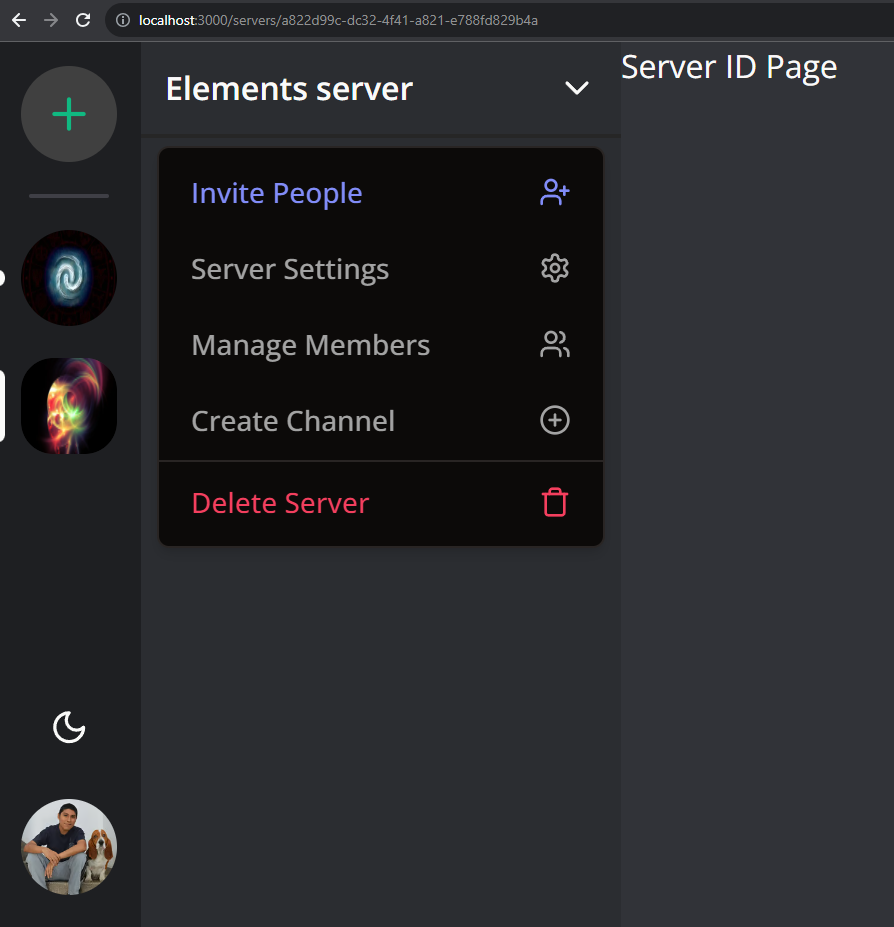

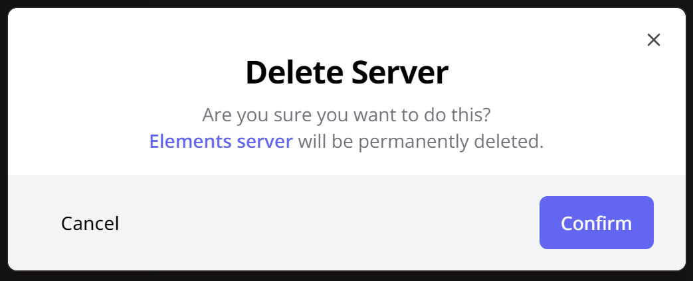

http://localhost:3000/servers/080cfe52-3078-4e73-b439-00003c4c7ac0

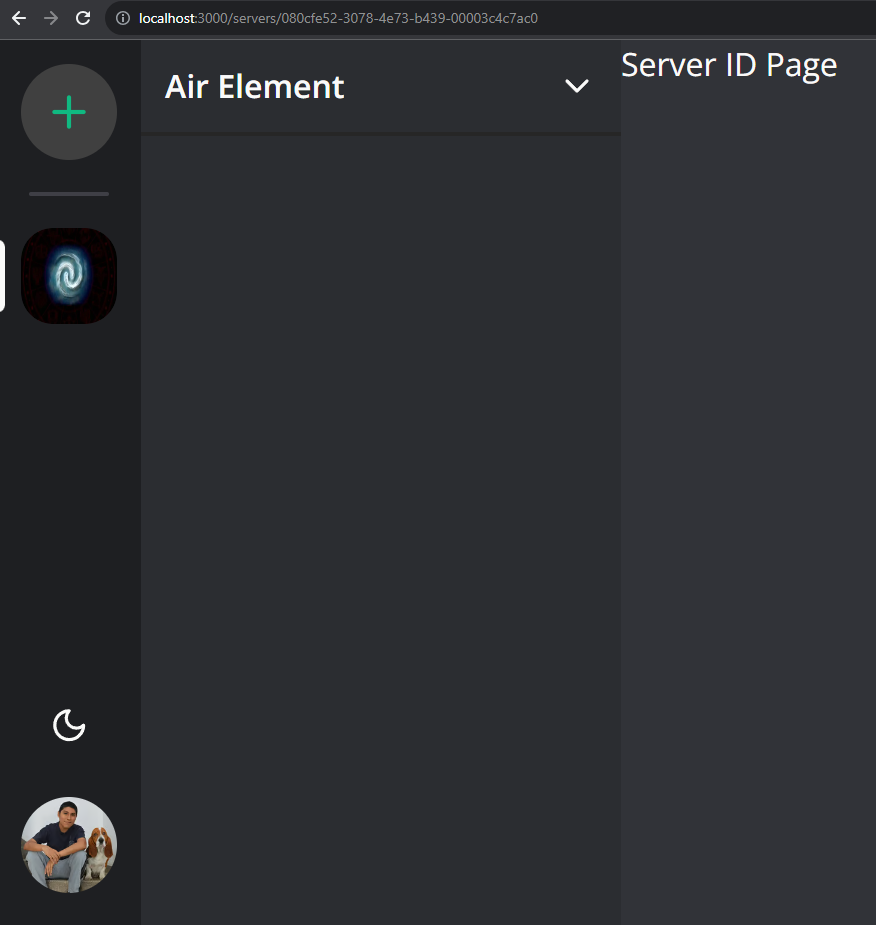

http://localhost:3000/servers/4c21c5ff-9682-4339-9843-35e5f53974df

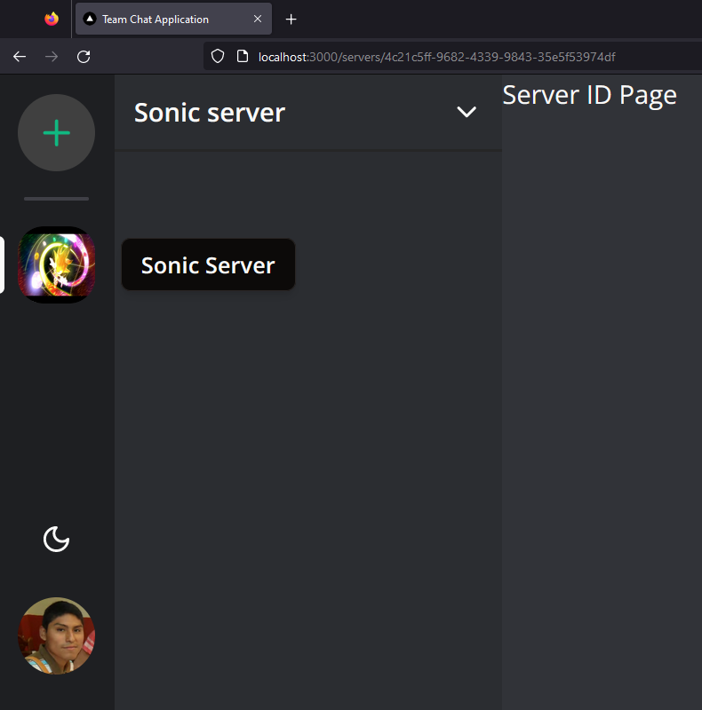

---
