# 8 - Search server modal

`/src/components/server/server-search.tsx`

```TSX
"use client";

import { Search } from "lucide-react";
import { useEffect, useState } from "react";
import { useParams, useRouter } from "next/navigation";

import {
  CommandDialog,
  CommandEmpty,
  CommandGroup,
  CommandInput,
  CommandItem,
  CommandList,
} from "@/components/ui/command";

interface ServerSearchProps {
  data: {
    label: string;
    type: "channel" | "member";
    data:
      | {
          icon: React.ReactNode;
          name: string;
          id: string;
        }[]
      | undefined;
  }[];
}

export const ServerSearch = ({ data }: ServerSearchProps) => {
  const [open, setOpen] = useState(false);
  const router = useRouter();
  const params = useParams();

  useEffect(() => {
    const down = (e: KeyboardEvent) => {
      if (e.key === "k" && (e.metaKey || e.ctrlKey)) {
        e.preventDefault();
        setOpen((open) => !open);
      }
    };

    document.addEventListener("keydown", down);
    return () => document.removeEventListener("keydown", down);
  }, []);

  const onClick = ({
    id,
    type,
  }: {
    id: string;
    type: "channel" | "member";
  }) => {
    setOpen(false);

    if (type === "member") {
      return router.push(`/servers/${params?.serverId}/conversations/${id}`);
    }

    if (type === "channel") {
      return router.push(`/servers/${params?.serverId}/channels/${id}`);
    }
  };

  return (
    <>
      <button
        onClick={() => setOpen(true)}
        className="group px-2 py-2 rounded-md flex items-center gap-x-2 w-full hover:bg-zinc-700/10 dark:hover:bg-zinc-700/50 transition"
      >
        <Search className="w-4 h-4 text-zinc-500 dark:text-zinc-400" />
        <p className="font-semibold text-sm text-zinc-500 dark:text-zinc-400 group-hover:text-zinc-600 dark:group-hover:text-zinc-300 transition">
          Search
        </p>
        <kbd className="pointer-events-none inline-flex h-5 select-none items-center gap-1 rounded border bg-muted px-1.5 font-mono text-[10px] font-medium text-muted-foreground ml-auto">
          <span className="text-xs">⌘</span>K
        </kbd>
      </button>
      <CommandDialog open={open} onOpenChange={setOpen}>
        <CommandInput placeholder="Search all channels and members" />
        <CommandList>
          <CommandEmpty>No Results found</CommandEmpty>
          {data.map(({ label, type, data }) => {
            if (!data?.length) return null;

            return (
              <CommandGroup key={label} heading={label}>
                {data?.map(({ id, icon, name }) => {
                  return (
                    <CommandItem
                      key={id}
                      onSelect={() => onClick({ id, type })}
                    >
                      {icon}
                      <span>{name}</span>
                    </CommandItem>
                  );
                })}
              </CommandGroup>
            );
          })}
        </CommandList>
      </CommandDialog>
    </>
  );
};
```

`/src/components/server/server-sidebar.tsx`

```TSX
import { use } from "react";
import { redirect } from "next/navigation";
import { ChannelType, MemberRole } from "@prisma/client";
import { Hash, Mic, ShieldAlert, ShieldCheck, Video } from "lucide-react";

import { db } from "@/lib/db";
import { currentProfile } from "@/lib/current-profile";

import { ScrollArea } from "@/components/ui/scroll-area";

import { ServerHeader } from "./server-header";
import { ServerSearch } from "./server-search";

interface ServerSidebarProps {
  serverId: string;
}

const iconMap = {
  [ChannelType.TEXT]: <Hash className="mr-2 h-4 w-4" />,
  [ChannelType.AUDIO]: <Mic className="mr-2 h-4 w-4" />,
  [ChannelType.VIDEO]: <Video className="mr-2 h-4 w-4" />,
};

const roleIconMap = {
  [MemberRole.GUEST]: null,
  [MemberRole.MODERATOR]: (
    <ShieldCheck className="h-4 w-4 mr-2 text-indigo-500" />
  ),
  [MemberRole.ADMIN]: <ShieldAlert className="h-4 w-4 mr-2 text-rose-500" />,
};

export const ServerSidebar = ({ serverId }: ServerSidebarProps) => {
  const profile = use(currentProfile());

  if (!profile) {
    return redirect("/");
  }

  const server = use(
    db.server.findUnique({
      where: {
        id: serverId,
      },
      include: {
        channels: {
          orderBy: {
            createdAt: "asc",
          },
        },
        members: {
          include: {
            profile: true,
          },
          orderBy: {
            role: "asc",
          },
        },
      },
    })
  );

  const textChannels = server?.channels.filter(
    (channel) => channel.type === ChannelType.TEXT
  );
  const audioChannels = server?.channels.filter(
    (channel) => channel.type === ChannelType.AUDIO
  );
  const videoChannels = server?.channels.filter(
    (channel) => channel.type === ChannelType.VIDEO
  );
  const members = server?.members.filter(
    (member) => member.profileId !== profile.id
  );

  if (!server) {
    return redirect("/");
  }

  const role = server.members.find(
    (member) => member.profileId === profile.id
  )?.role;

  return (
    <div className="flex flex-col h-full text-primary w-full dark:bg-[#2B2D31] bg-[#F2F3F5]">
      <ServerHeader server={server} role={role} />
      <ScrollArea className="flex-1 px-3">
        <div className="mt-2">
          <ServerSearch
            data={[
              {
                label: "Text Channels",
                type: "channel",
                data: textChannels?.map((channel) => ({
                  id: channel.id,
                  name: channel.name,
                  icon: iconMap[channel.type],
                })),
              },
              {
                label: "Voice Channels",
                type: "channel",
                data: audioChannels?.map((channel) => ({
                  id: channel.id,
                  name: channel.name,
                  icon: iconMap[channel.type],
                })),
              },
              {
                label: "Video Channels",
                type: "channel",
                data: videoChannels?.map((channel) => ({
                  id: channel.id,
                  name: channel.name,
                  icon: iconMap[channel.type],
                })),
              },
              {
                label: "Members",
                type: "member",
                data: members?.map((member) => ({
                  id: member.id,
                  name: member.profile.name,
                  icon: roleIconMap[member.role],
                })),
              },
            ]}
          />
        </div>
      </ScrollArea>
    </div>
  );
};
```

http://localhost:3000/servers/080cfe52-3078-4e73-b439-00003c4c7ac0

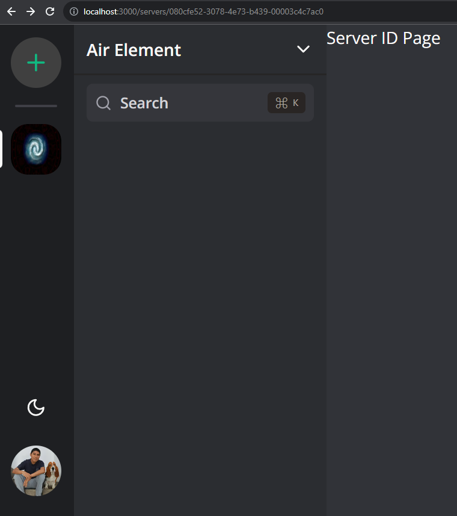

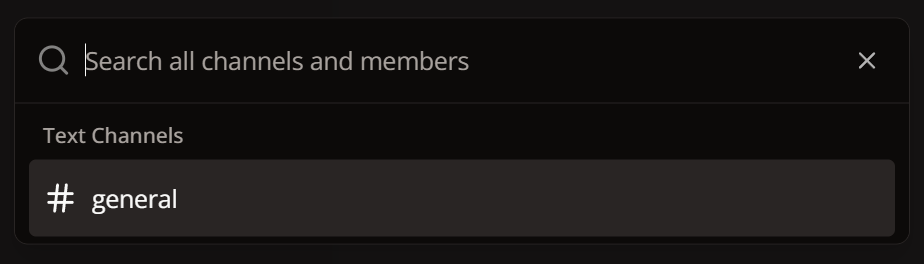

http://localhost:3000/servers/080cfe52-3078-4e73-b439-00003c4c7ac0


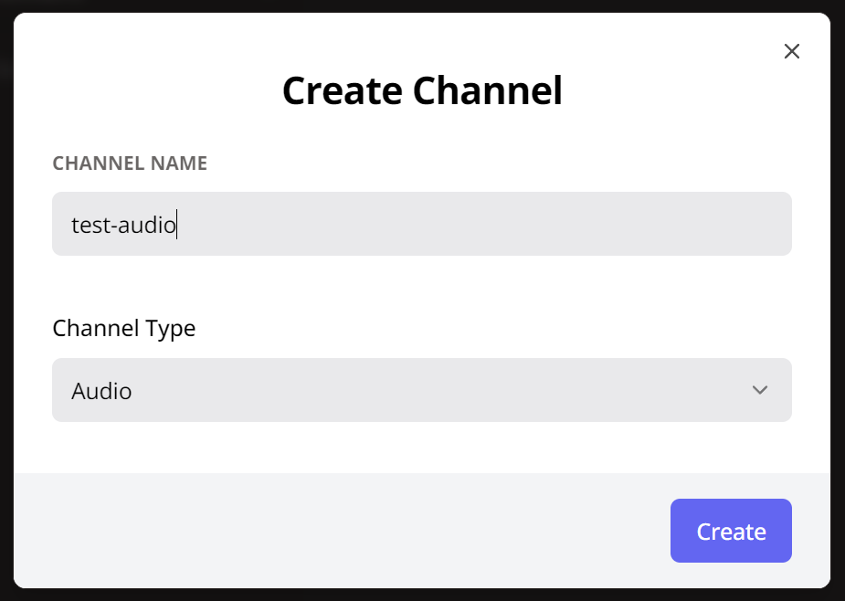

http://localhost:5555/

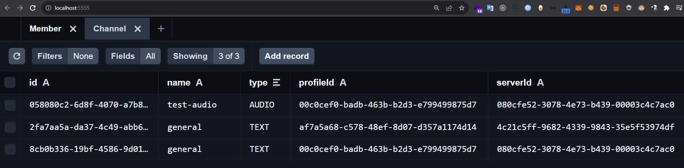

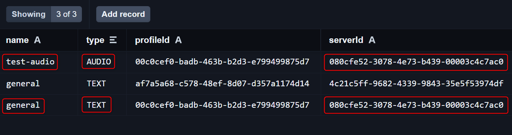

http://localhost:3000/servers/080cfe52-3078-4e73-b439-00003c4c7ac0


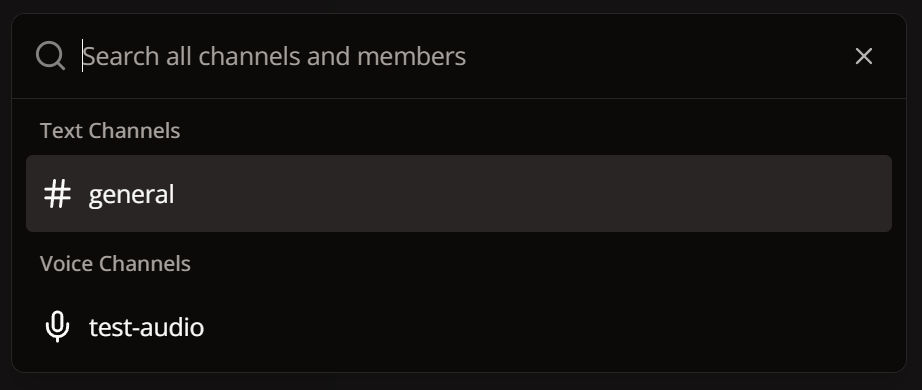

http://localhost:3000/servers/080cfe52-3078-4e73-b439-00003c4c7ac0


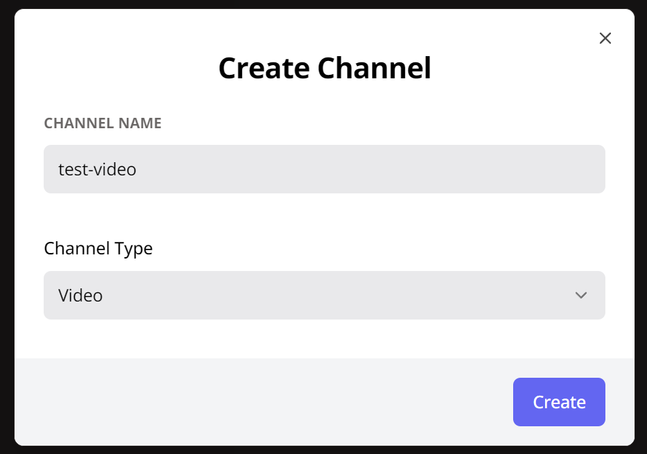

http://localhost:3000/servers/080cfe52-3078-4e73-b439-00003c4c7ac0


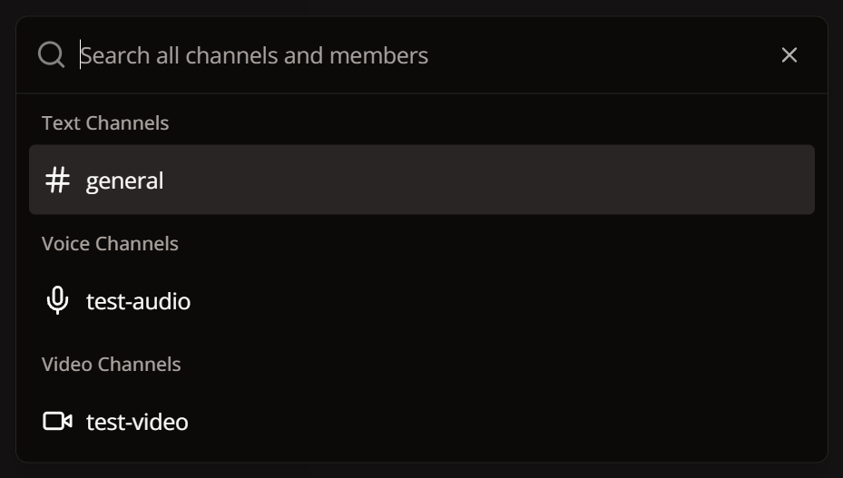

http://localhost:5555/

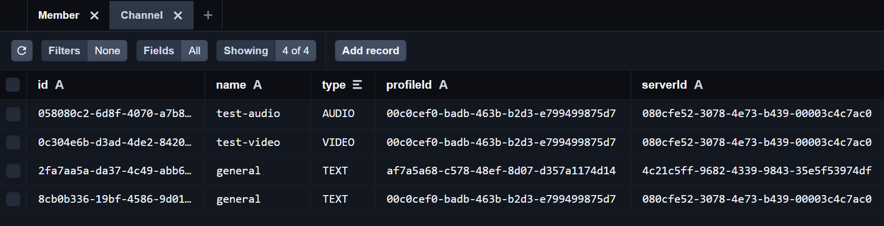

http://localhost:3000/servers/080cfe52-3078-4e73-b439-00003c4c7ac0


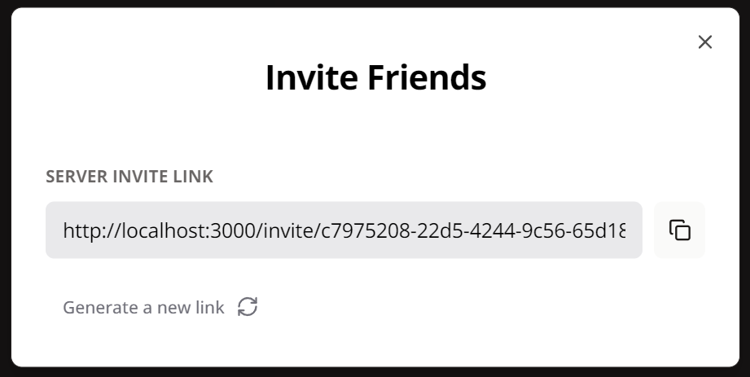

http://localhost:3000/invite/c7975208-22d5-4244-9c56-65d18f7047bf to http://localhost:3000/servers/080cfe52-3078-4e73-b439-00003c4c7ac0

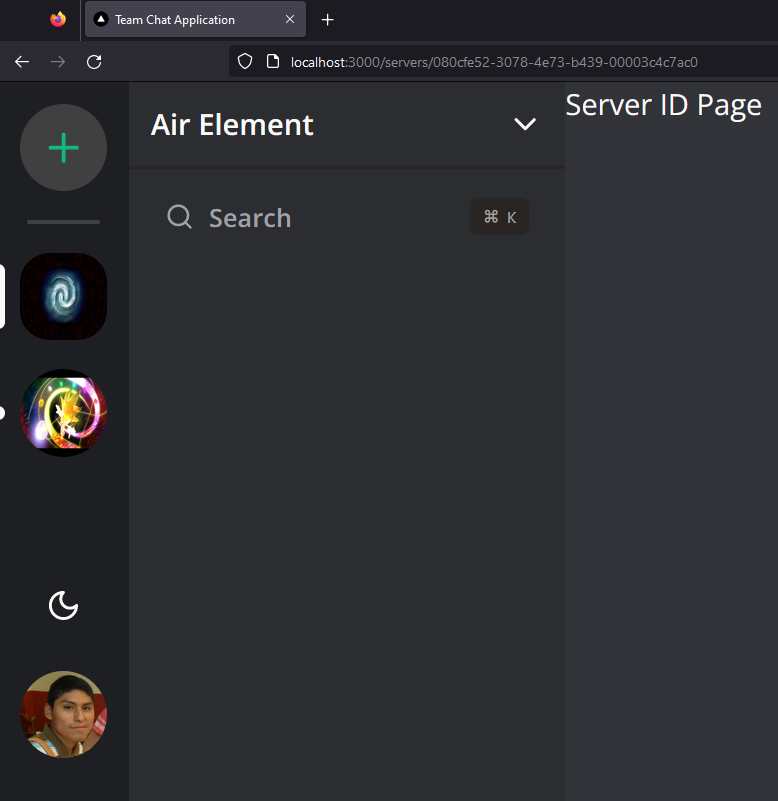

http://localhost:3000/servers/080cfe52-3078-4e73-b439-00003c4c7ac0


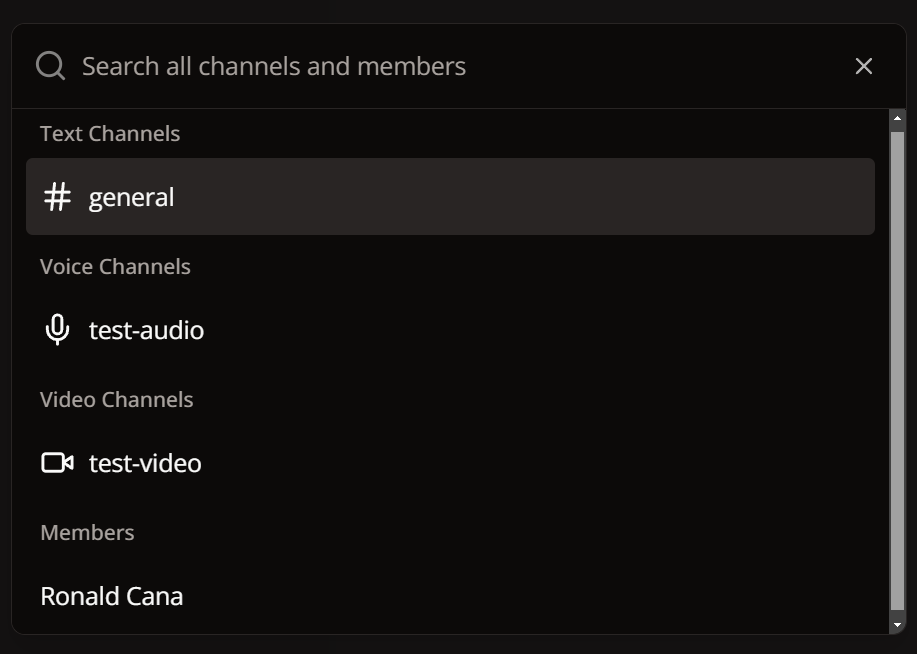

http://localhost:3000/servers/080cfe52-3078-4e73-b439-00003c4c7ac0

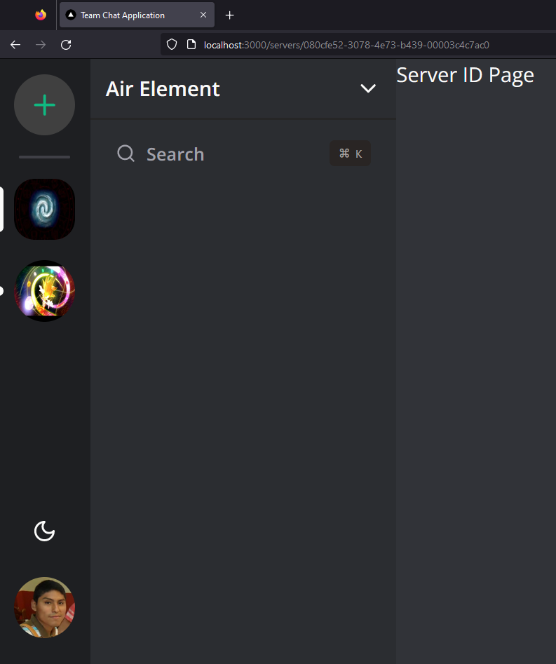

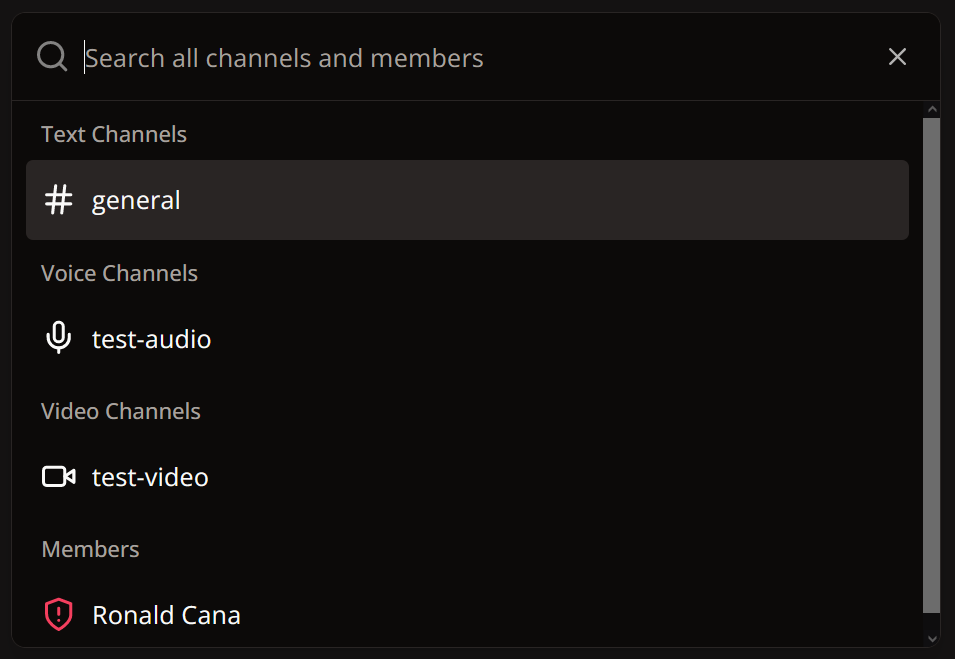

---
