# 9 - Server channels list

`/src/components/modals/create-channel-modal.tsx`

```TSX
"use client";

import * as z from "zod";
import axios from "axios";
import qs from "query-string";
import { useEffect } from "react";
import { useForm } from "react-hook-form";
import { ChannelType } from "@prisma/client";
import { zodResolver } from "@hookform/resolvers/zod";
import { useParams, useRouter } from "next/navigation";

import { useModal } from "@/hooks/use-modal-store";

import {
  Dialog,
  DialogContent,
  DialogFooter,
  DialogHeader,
  DialogTitle,
} from "@/components/ui/dialog";
import {
  Form,
  FormControl,
  FormField,
  FormItem,
  FormLabel,
  FormMessage,
} from "@/components/ui/form";
import {
  Select,
  SelectContent,
  SelectItem,
  SelectTrigger,
  SelectValue,
} from "@/components/ui/select";
import { Input } from "@/components/ui/input";
import { Button } from "@/components/ui/button";

const formSchema = z.object({
  name: z
    .string()
    .min(1, {
      message: "Channel name is required.",
    })
    .refine((name) => name !== "general", {
      message: "Channel name cannot be 'general'",
    }),
  type: z.nativeEnum(ChannelType),
});

export const CreateChannelModal = () => {
  const { isOpen, onClose, type, data } = useModal();
  const router = useRouter();
  const params = useParams();

  const isModalOpen = isOpen && type === "createChannel";
  const { channelType } = data;

  const form = useForm({
    resolver: zodResolver(formSchema),
    defaultValues: {
      name: "",
      type: channelType ?? ChannelType.TEXT,
    },
  });

  useEffect(() => {
    if (channelType) {
      form.setValue("type", channelType);
    } else {
      form.setValue("type", ChannelType.TEXT);
    }
  }, [channelType, form]);

  const isLoading = form.formState.isSubmitting;

  const onSubmit = async (values: z.infer<typeof formSchema>) => {
    try {
      const url = qs.stringifyUrl({
        url: "/api/channels",
        query: {
          serverId: params?.serverId,
        },
      });
      await axios.post(url, values);

      form.reset();
      router.refresh();
      onClose();
    } catch (error) {
      console.log(error);
    }
  };

  const handleClose = () => {
    onClose();
  };

  return (
    <Dialog open={isModalOpen} onOpenChange={handleClose}>
      <DialogContent className="bg-white text-black p-0 overflow-hidden">
        <DialogHeader className="pt-8 px-6">
          <DialogTitle className="text-2xl text-center font-bold">
            Create Channel
          </DialogTitle>
        </DialogHeader>
        <Form {...form}>
          <form onSubmit={form.handleSubmit(onSubmit)} className="space-y-8">
            <div className="space-y-8 px-6">
              <FormField
                control={form.control}
                name="name"
                render={({ field }) => (
                  <FormItem>
                    <FormLabel className="uppercase text-xs font-bold text-zinc-500 dark:text-secondary/70">
                      Channel name
                    </FormLabel>
                    <FormControl>
                      <Input
                        disabled={isLoading}
                        className="bg-zinc-300/50 border-0 focus-visible:ring-0 text-black focus-visible:ring-offset-0"
                        placeholder="Enter channel name"
                        {...field}
                      />
                    </FormControl>
                    <FormMessage />
                  </FormItem>
                )}
              />
              <FormField
                control={form.control}
                name="type"
                render={({ field }) => (
                  <FormItem>
                    <FormLabel>Channel Type</FormLabel>
                    <Select
                      disabled={isLoading}
                      onValueChange={field.onChange}
                      defaultValue={field.value}
                    >
                      <FormControl>
                        <SelectTrigger className="bg-zinc-300/50 border-0 focus:ring-0 text-black ring-offset-0 focus:ring-offset-0 capitalize outline-none">
                          <SelectValue placeholder="Select a channel type" />
                        </SelectTrigger>
                      </FormControl>
                      <SelectContent>
                        {Object.values(ChannelType).map((type) => (
                          <SelectItem
                            key={type}
                            value={type}
                            className="capitalize"
                          >
                            {type.toLowerCase()}
                          </SelectItem>
                        ))}
                      </SelectContent>
                    </Select>
                    <FormMessage />
                  </FormItem>
                )}
              />
            </div>
            <DialogFooter className="bg-gray-100 px-6 py-4">
              <Button variant="primary" disabled={isLoading}>
                Create
              </Button>
            </DialogFooter>
          </form>
        </Form>
      </DialogContent>
    </Dialog>
  );
};
```

`/src/components/server/server-section.tsx`

```TSX
"use client";

import { Plus, Settings } from "lucide-react";
import { ChannelType, MemberRole } from "@prisma/client";

import { useModal } from "@/hooks/use-modal-store";

import { ActionTooltip } from "@/components/tooltip/action-tooltip";

import { ServerWithMembersWithProfiles } from "@/typings/types/server-with-members-with-profiles.type";

interface ServerSectionProps {
  label: string;
  role?: MemberRole;
  sectionType: "channels" | "members";
  channelType?: ChannelType;
  server?: ServerWithMembersWithProfiles;
}

export const ServerSection = ({
  label,
  role,
  sectionType,
  channelType,
  server,
}: ServerSectionProps) => {
  const { onOpen } = useModal();

  return (
    <div className="flex items-center justify-between py-2">
      <p className="text-xs uppercase font-semibold text-zinc-500 dark:text-zinc-400">
        {label}
      </p>
      {role !== MemberRole.GUEST && sectionType === "channels" && (
        <ActionTooltip label="Create Channel" side="top">
          <button
            onClick={() => onOpen("createChannel", { channelType })}
            className="text-zinc-500 hover:text-zinc-600 dark:text-zinc-400 dark:hover:text-zinc-300 transition"
          >
            <Plus className="h-4 w-4" />
          </button>
        </ActionTooltip>
      )}
      {role === MemberRole.ADMIN && sectionType === "members" && (
        <ActionTooltip label="Manage Members" side="top">
          <button
            onClick={() => onOpen("members", { server })}
            className="text-zinc-500 hover:text-zinc-600 dark:text-zinc-400 dark:hover:text-zinc-300 transition"
          >
            <Settings className="h-4 w-4" />
          </button>
        </ActionTooltip>
      )}
    </div>
  );
};
```

`/src/components/server/server-channel.tsx`

```TSX
"use client";

import { useParams, useRouter } from "next/navigation";
import { Edit, Hash, Lock, Mic, Trash, Video } from "lucide-react";
import { Channel, ChannelType, MemberRole, Server } from "@prisma/client";

import { ModalType, useModal } from "@/hooks/use-modal-store";

import { cn } from "@/lib/utils";

import { ActionTooltip } from "@/components/tooltip/action-tooltip";

interface ServerChannelProps {
  channel: Channel;
  server: Server;
  role?: MemberRole;
}

const iconMap = {
  [ChannelType.TEXT]: Hash,
  [ChannelType.AUDIO]: Mic,
  [ChannelType.VIDEO]: Video,
};

export const ServerChannel = ({
  channel,
  server,
  role,
}: ServerChannelProps) => {
  const { onOpen } = useModal();
  const params = useParams();
  const router = useRouter();

  const Icon = iconMap[channel.type];

  const onClick = () => {
    router.push(`/servers/${params?.serverId}/channels/${channel.id}`);
  };

  const onAction = (e: React.MouseEvent, action: ModalType) => {
    e.stopPropagation();
    onOpen(action, { channel, server });
  };

  return (
    <button
      onClick={onClick}
      className={cn(
        "group px-2 py-2 rounded-md flex items-center gap-x-2 w-full hover:bg-zinc-700/10 dark:hover:bg-zinc-700/50 transition mb-1",
        params?.channelId === channel.id && "bg-zinc-700/20 dark:bg-zinc-700"
      )}
    >
      <Icon className="flex-shrink-0 w-5 h-5 text-zinc-500 dark:text-zinc-400" />

      <p
        className={cn(
          "line-clamp-1 text-left flex-1 font-semibold text-sm text-zinc-500 group-hover:text-zinc-600 dark:text-zinc-400 dark:group-hover:text-zinc-300 transition",
          params?.channelId === channel.id &&
            "text-primary dark:text-zinc-200 dark:group-hover:text-white"
        )}
      >
        {channel.name}
      </p>

      {channel.name !== "general" && role !== MemberRole.GUEST && (
        <div className="ml-auto flex items-center gap-x-2">
          <ActionTooltip label="Edit">
            <Edit
              onClick={(e) => onAction(e, "editChannel")}
              className="hidden group-hover:block w-4 h-4 text-zinc-500 hover:text-zinc-600 dark:text-zinc-400 dark:hover:text-zinc-300 transition"
            />
          </ActionTooltip>
          <ActionTooltip label="Delete">
            <Trash
              onClick={(e) => onAction(e, "deleteChannel")}
              className="hidden group-hover:block w-4 h-4 text-zinc-500 hover:text-zinc-600 dark:text-zinc-400 dark:hover:text-zinc-300 transition"
            />
          </ActionTooltip>
        </div>
      )}

      {channel.name === "general" && (
        <Lock className="ml-auto w-4 h-4 text-zinc-500 dark:text-zinc-400" />
      )}
    </button>
  );
};
```

`/src/components/server/server-member.tsx`

```TSX
"use client";

import { useParams, useRouter } from "next/navigation";
import { ShieldAlert, ShieldCheck } from "lucide-react";
import { Member, MemberRole, Profile, Server } from "@prisma/client";

import { cn } from "@/lib/utils";

import { UserAvatar } from "@/components/user/user-avatar";

interface ServerMemberProps {
  member: Member & { profile: Profile };
  server: Server;
}

const roleIconMap = {
  [MemberRole.GUEST]: null,
  [MemberRole.MODERATOR]: (
    <ShieldCheck className="h-4 w-4 ml-2 text-indigo-500" />
  ),
  [MemberRole.ADMIN]: <ShieldAlert className="h-4 w-4 ml-2 text-rose-500" />,
};

export const ServerMember = ({ member, server }: ServerMemberProps) => {
  const params = useParams();
  const router = useRouter();

  const icon = roleIconMap[member.role];

  const onClick = () => {
    router.push(`/servers/${params?.serverId}/conversations/${member.id}`);
  };

  return (
    <button
      onClick={onClick}
      className={cn(
        "group px-2 py-2 rounded-md flex items-center gap-x-2 w-full hover:bg-zinc-700/10 dark:hover:bg-zinc-700/50 transition mb-1",
        params?.memberId === member.id && "bg-zinc-700/20 dark:bg-zinc-700"
      )}
    >
      <UserAvatar
        src={member.profile.imageUrl}
        className="h-8 w-8 md:h-8 md:w-8"
      />
      <p
        className={cn(
          "font-semibold text-sm text-zinc-500 group-hover:text-zinc-600 dark:text-zinc-400 dark:group-hover:text-zinc-300 transition",
          params?.memberId === member.id &&
            "text-primary dark:text-zinc-200 dark:group-hover:text-white"
        )}
      >
        {member.profile.name}
      </p>
      {icon}
    </button>
  );
};
```

`/src/components/server/server-sidebar.tsx`

```TSX
import { use } from "react";
import { redirect } from "next/navigation";
import { ChannelType, MemberRole } from "@prisma/client";
import { Hash, Mic, ShieldAlert, ShieldCheck, Video } from "lucide-react";

import { db } from "@/lib/db";
import { currentProfile } from "@/lib/current-profile";

import { Separator } from "@/components//ui/separator";
import { ScrollArea } from "@/components/ui/scroll-area";

import { ServerHeader } from "./server-header";
import { ServerSearch } from "./server-search";
import { ServerMember } from "./server-member";
import { ServerSection } from "./server-section";
import { ServerChannel } from "./server-channel";

interface ServerSidebarProps {
  serverId: string;
}

const iconMap = {
  [ChannelType.TEXT]: <Hash className="mr-2 h-4 w-4" />,
  [ChannelType.AUDIO]: <Mic className="mr-2 h-4 w-4" />,
  [ChannelType.VIDEO]: <Video className="mr-2 h-4 w-4" />,
};

const roleIconMap = {
  [MemberRole.GUEST]: null,
  [MemberRole.MODERATOR]: (
    <ShieldCheck className="h-4 w-4 mr-2 text-indigo-500" />
  ),
  [MemberRole.ADMIN]: <ShieldAlert className="h-4 w-4 mr-2 text-rose-500" />,
};

export const ServerSidebar = ({ serverId }: ServerSidebarProps) => {
  const profile = use(currentProfile());

  if (!profile) {
    return redirect("/");
  }

  const server = use(
    db.server.findUnique({
      where: {
        id: serverId,
      },
      include: {
        channels: {
          orderBy: {
            createdAt: "asc",
          },
        },
        members: {
          include: {
            profile: true,
          },
          orderBy: {
            role: "asc",
          },
        },
      },
    })
  );

  const textChannels = server?.channels.filter(
    (channel) => channel.type === ChannelType.TEXT
  );
  const audioChannels = server?.channels.filter(
    (channel) => channel.type === ChannelType.AUDIO
  );
  const videoChannels = server?.channels.filter(
    (channel) => channel.type === ChannelType.VIDEO
  );
  const members = server?.members.filter(
    (member) => member.profileId !== profile.id
  );

  if (!server) {
    return redirect("/");
  }

  const role = server.members.find(
    (member) => member.profileId === profile.id
  )?.role;

  return (
    <div className="flex flex-col h-full text-primary w-full dark:bg-[#2B2D31] bg-[#F2F3F5]">
      <ServerHeader server={server} role={role} />
      <ScrollArea className="flex-1 px-3">
        <div className="mt-2">
          <ServerSearch
            data={[
              {
                label: "Text Channels",
                type: "channel",
                data: textChannels?.map((channel) => ({
                  id: channel.id,
                  name: channel.name,
                  icon: iconMap[channel.type],
                })),
              },
              {
                label: "Voice Channels",
                type: "channel",
                data: audioChannels?.map((channel) => ({
                  id: channel.id,
                  name: channel.name,
                  icon: iconMap[channel.type],
                })),
              },
              {
                label: "Video Channels",
                type: "channel",
                data: videoChannels?.map((channel) => ({
                  id: channel.id,
                  name: channel.name,
                  icon: iconMap[channel.type],
                })),
              },
              {
                label: "Members",
                type: "member",
                data: members?.map((member) => ({
                  id: member.id,
                  name: member.profile.name,
                  icon: roleIconMap[member.role],
                })),
              },
            ]}
          />
        </div>

        <Separator className="bg-zinc-200 dark:bg-zinc-700 rounded-md my-2" />

        {!!textChannels?.length && (
          <div className="mb-2">
            <ServerSection
              sectionType="channels"
              channelType={ChannelType.TEXT}
              role={role}
              label="Text Channels"
            />
            <div className="space-y-[2px]">
              {textChannels.map((channel) => (
                <ServerChannel
                  key={channel.id}
                  channel={channel}
                  role={role}
                  server={server}
                />
              ))}
            </div>
          </div>
        )}
        {!!audioChannels?.length && (
          <div className="mb-2">
            <ServerSection
              sectionType="channels"
              channelType={ChannelType.AUDIO}
              role={role}
              label="Voice Channels"
            />
            <div className="space-y-[2px]">
              {audioChannels.map((channel) => (
                <ServerChannel
                  key={channel.id}
                  channel={channel}
                  role={role}
                  server={server}
                />
              ))}
            </div>
          </div>
        )}
        {!!videoChannels?.length && (
          <div className="mb-2">
            <ServerSection
              sectionType="channels"
              channelType={ChannelType.VIDEO}
              role={role}
              label="Video Channels"
            />
            <div className="space-y-[2px]">
              {videoChannels.map((channel) => (
                <ServerChannel
                  key={channel.id}
                  channel={channel}
                  role={role}
                  server={server}
                />
              ))}
            </div>
          </div>
        )}

        {!!members?.length && (
          <div className="mb-2">
            <ServerSection
              sectionType="members"
              role={role}
              label="Members"
              server={server}
            />
            <div className="space-y-[2px]">
              {members.map((member) => (
                <ServerMember key={member.id} member={member} server={server} />
              ))}
            </div>
          </div>
        )}
      </ScrollArea>
    </div>
  );
};
```

http://localhost:3000/servers/080cfe52-3078-4e73-b439-00003c4c7ac0

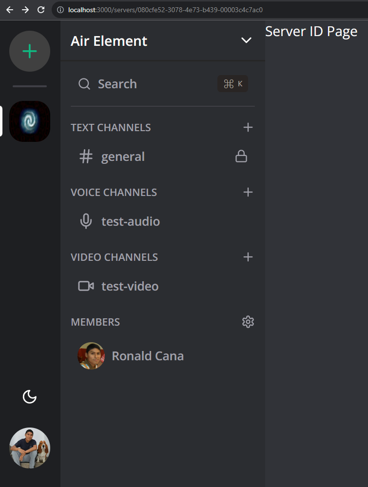

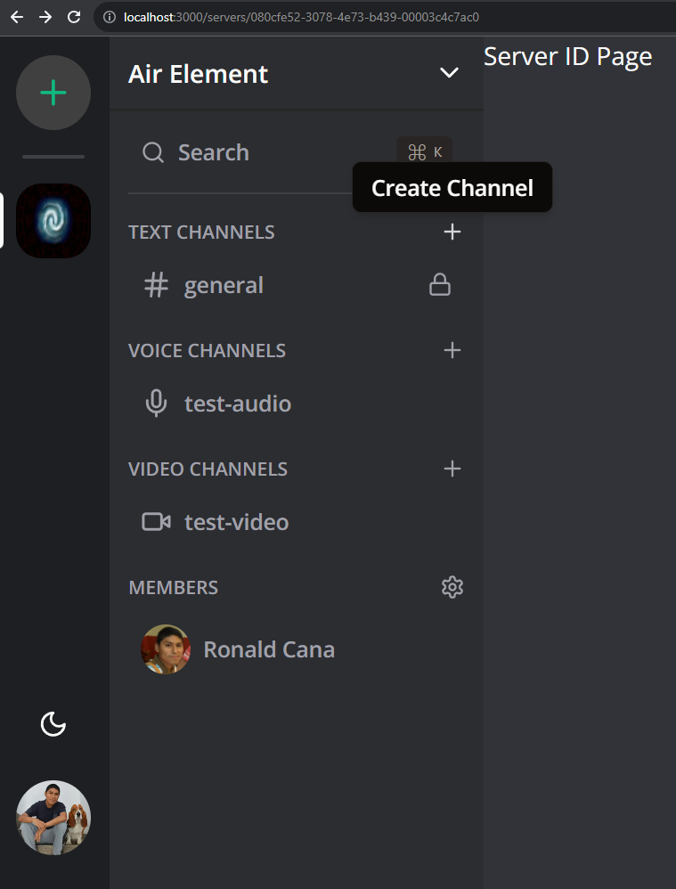

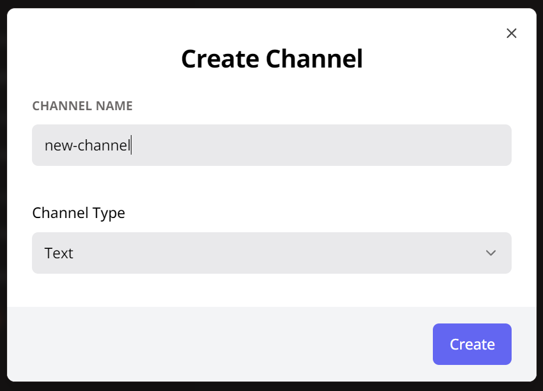

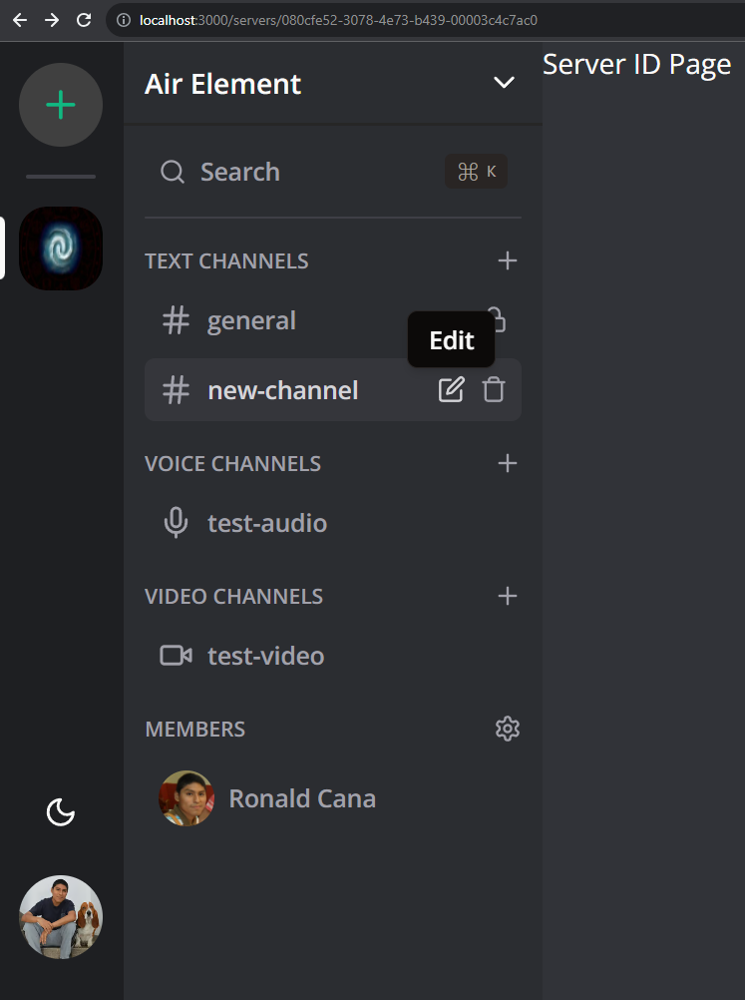

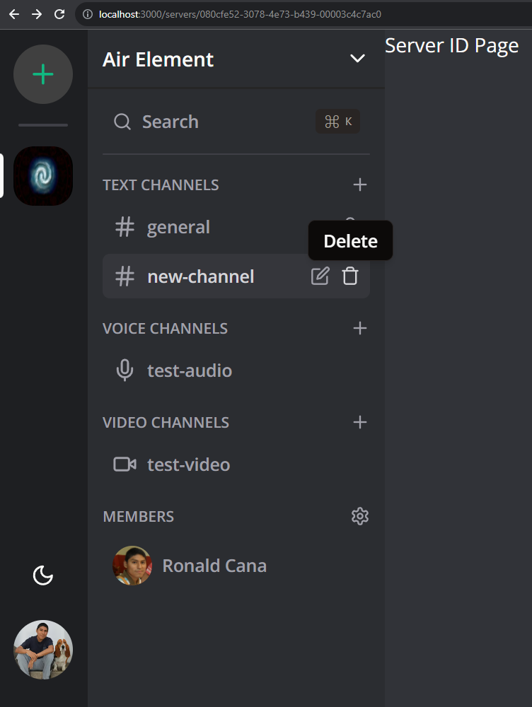

http://localhost:3000/servers/080cfe52-3078-4e73-b439-00003c4c7ac0

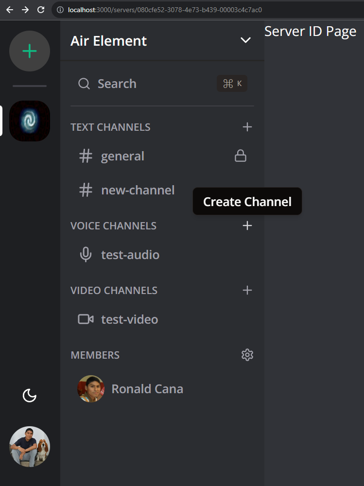


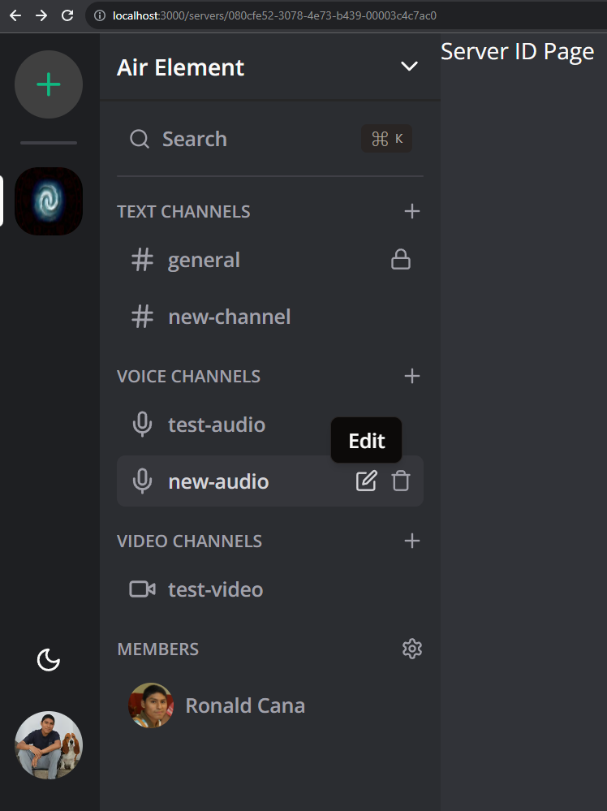


http://localhost:3000/servers/080cfe52-3078-4e73-b439-00003c4c7ac0

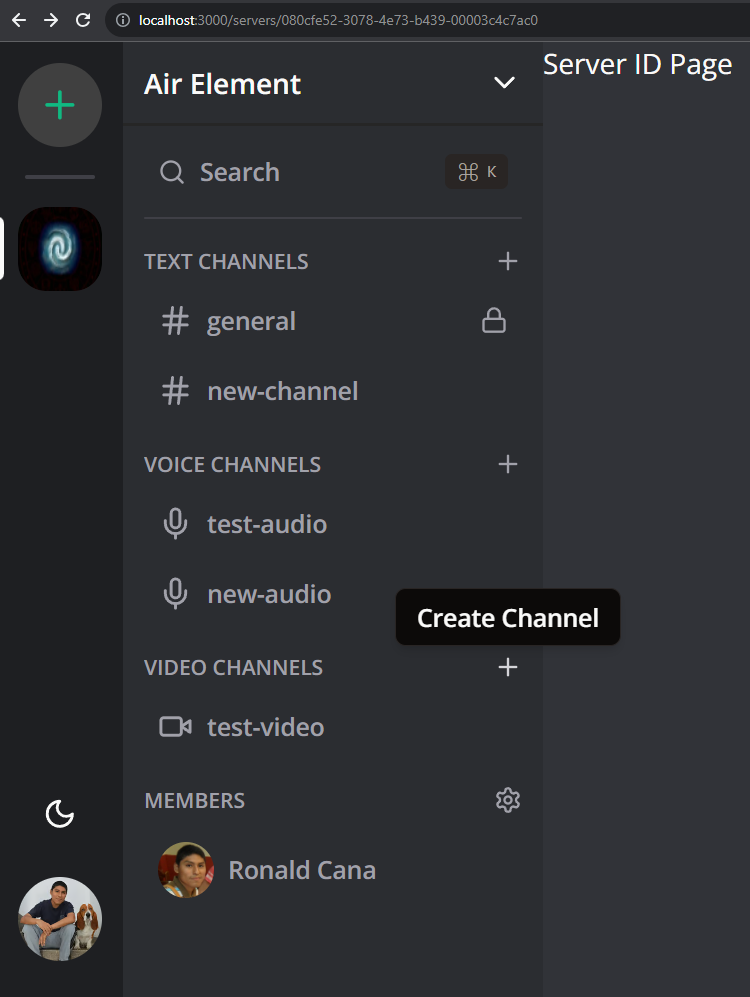


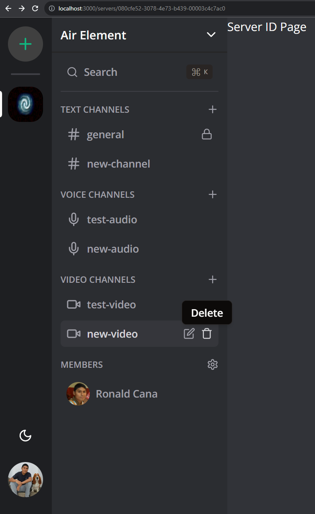

http://localhost:3000/servers/080cfe52-3078-4e73-b439-00003c4c7ac0

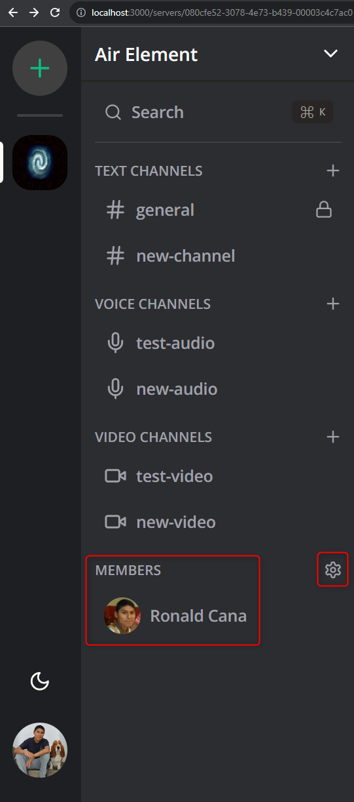

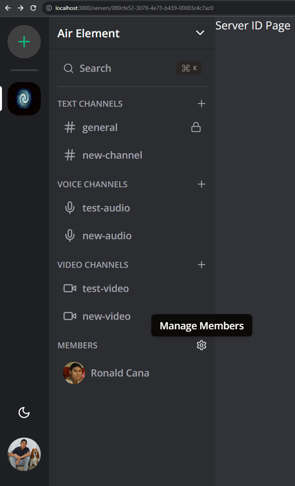

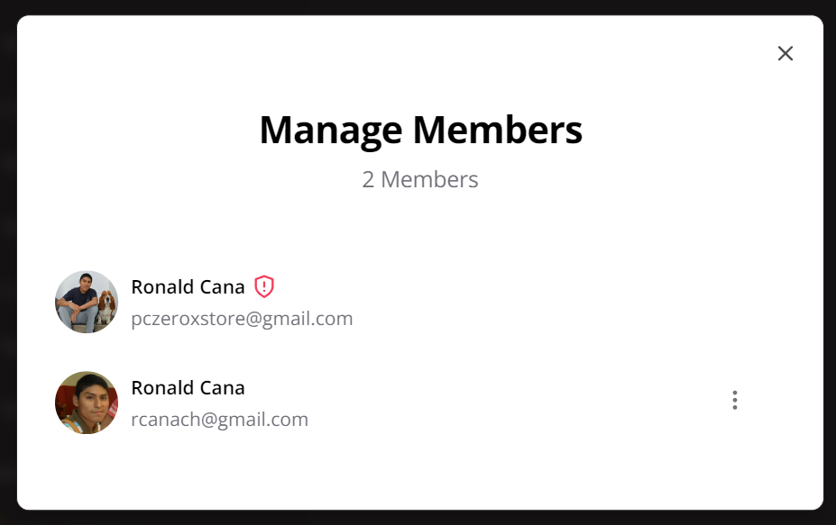

---
