# 10 - Edit channel and Delete channel

`/src/hooks/use-modal-store.ts`

```TSX
import { create } from "zustand";
import { Channel, ChannelType, Server } from "@prisma/client";

export type ModalType =
  | "createServer"
  | "invite"
  | "editServer"
  | "members"
  | "createChannel"
  | "leaveServer"
  | "deleteServer"
  | "deleteChannel"
  | "editChannel"
  | "messageFile"
  | "deleteMessage";

interface ModalData {
  server?: Server;
  channel?: Channel;
  channelType?: ChannelType;
  apiUrl?: string;
  query?: Record<string, any>;
}

interface ModalStore {
  type: ModalType | null;
  data: ModalData;
  isOpen: boolean;
  onOpen: (type: ModalType, data?: ModalData) => void;
  onClose: () => void;
}

export const useModal = create<ModalStore>((set) => ({
  type: null,
  data: {},
  isOpen: false,
  onOpen: (type, data = {}) => set({ isOpen: true, type, data }),
  onClose: () => set({ type: null, isOpen: false }),
}));
```

`/src/app/api/channels/[channelId]/route.ts`

```TSX
import { NextResponse } from "next/server";
import { MemberRole } from "@prisma/client";

import { db } from "@/lib/db";
import { currentProfile } from "@/lib/current-profile";

export async function DELETE(
  req: Request,
  { params }: { params: { channelId: string } }
) {
  try {
    const profile = await currentProfile();
    const { searchParams } = new URL(req.url);

    const serverId = searchParams.get("serverId");

    if (!profile) {
      return new NextResponse("Unauthorized", { status: 401 });
    }

    if (!serverId) {
      return new NextResponse("Server ID missing", { status: 400 });
    }

    if (!params.channelId) {
      return new NextResponse("Channel ID missing", { status: 400 });
    }

    const server = await db.server.update({
      where: {
        id: serverId,
        members: {
          some: {
            profileId: profile.id,
            role: {
              in: [MemberRole.ADMIN, MemberRole.MODERATOR],
            },
          },
        },
      },
      data: {
        channels: {
          delete: {
            id: params.channelId,
            name: {
              not: "general",
            },
          },
        },
      },
    });

    return NextResponse.json(server);
  } catch (error) {
    console.log("[CHANNEL_ID_DELETE]", error);
    return new NextResponse("Internal Error", { status: 500 });
  }
}

export async function PATCH(
  req: Request,
  { params }: { params: { channelId: string } }
) {
  try {
    const profile = await currentProfile();
    const { name, type } = await req.json();
    const { searchParams } = new URL(req.url);

    const serverId = searchParams.get("serverId");

    if (!profile) {
      return new NextResponse("Unauthorized", { status: 401 });
    }

    if (!serverId) {
      return new NextResponse("Server ID missing", { status: 400 });
    }

    if (!params.channelId) {
      return new NextResponse("Channel ID missing", { status: 400 });
    }

    if (name === "general") {
      return new NextResponse("Name cannot be 'general'", { status: 400 });
    }

    const server = await db.server.update({
      where: {
        id: serverId,
        members: {
          some: {
            profileId: profile.id,
            role: {
              in: [MemberRole.ADMIN, MemberRole.MODERATOR],
            },
          },
        },
      },
      data: {
        channels: {
          update: {
            where: {
              id: params.channelId,
              NOT: {
                name: "general",
              },
            },
            data: {
              name,
              type,
            },
          },
        },
      },
    });

    return NextResponse.json(server);
  } catch (error) {
    console.log("[CHANNEL_ID_PATCH]", error);
    return new NextResponse("Internal Error", { status: 500 });
  }
}
```

`/src/components/modals/delete-channel-modal.tsx`

```TSX
"use client";

import axios from "axios";
import qs from "query-string";
import { useState } from "react";
import { useRouter } from "next/navigation";

import { useModal } from "@/hooks/use-modal-store";

import {
  Dialog,
  DialogContent,
  DialogDescription,
  DialogFooter,
  DialogHeader,
  DialogTitle,
} from "@/components/ui/dialog";
import { Button } from "@/components/ui/button";

export const DeleteChannelModal = () => {
  const { isOpen, onClose, type, data } = useModal();
  const router = useRouter();

  const isModalOpen = isOpen && type === "deleteChannel";
  const { server, channel } = data;

  const [isLoading, setIsLoading] = useState(false);

  const onClick = async () => {
    try {
      setIsLoading(true);
      const url = qs.stringifyUrl({
        url: `/api/channels/${channel?.id}`,
        query: {
          serverId: server?.id,
        },
      });

      await axios.delete(url);

      onClose();
      router.refresh();
      router.push(`/servers/${server?.id}`);
    } catch (error) {
      console.log(error);
    } finally {
      setIsLoading(false);
    }
  };

  return (
    <Dialog open={isModalOpen} onOpenChange={onClose}>
      <DialogContent className="bg-white text-black p-0 overflow-hidden">
        <DialogHeader className="pt-8 px-6">
          <DialogTitle className="text-2xl text-center font-bold">
            Delete Channel
          </DialogTitle>
          <DialogDescription className="text-center text-zinc-500">
            Are you sure you want to do this? <br />
            <span className="text-indigo-500 font-semibold">
              #{channel?.name}
            </span>{" "}
            will be permanently deleted.
          </DialogDescription>
        </DialogHeader>
        <DialogFooter className="bg-gray-100 px-6 py-4">
          <div className="flex items-center justify-between w-full">
            <Button disabled={isLoading} onClick={onClose} variant="ghost">
              Cancel
            </Button>
            <Button disabled={isLoading} variant="primary" onClick={onClick}>
              Confirm
            </Button>
          </div>
        </DialogFooter>
      </DialogContent>
    </Dialog>
  );
};
```

`/src/components/modals/edit-channel-modal.tsx`

```TSX
"use client";

import * as z from "zod";
import axios from "axios";
import qs from "query-string";
import { useEffect } from "react";
import { useForm } from "react-hook-form";
import { useRouter } from "next/navigation";
import { ChannelType } from "@prisma/client";
import { zodResolver } from "@hookform/resolvers/zod";

import { useModal } from "@/hooks/use-modal-store";

import {
  Dialog,
  DialogContent,
  DialogFooter,
  DialogHeader,
  DialogTitle,
} from "@/components/ui/dialog";
import {
  Form,
  FormControl,
  FormField,
  FormItem,
  FormLabel,
  FormMessage,
} from "@/components/ui/form";
import {
  Select,
  SelectContent,
  SelectItem,
  SelectTrigger,
  SelectValue,
} from "@/components/ui/select";
import { Input } from "@/components/ui/input";
import { Button } from "@/components/ui/button";

const formSchema = z.object({
  name: z
    .string()
    .min(1, {
      message: "Channel name is required.",
    })
    .refine((name) => name !== "general", {
      message: "Channel name cannot be 'general'",
    }),
  type: z.nativeEnum(ChannelType),
});

export const EditChannelModal = () => {
  const { isOpen, onClose, type, data } = useModal();
  const router = useRouter();

  const isModalOpen = isOpen && type === "editChannel";
  const { channel, server } = data;

  const form = useForm({
    resolver: zodResolver(formSchema),
    defaultValues: {
      name: "",
      type: channel?.type ?? ChannelType.TEXT,
    },
  });

  useEffect(() => {
    if (channel) {
      form.setValue("name", channel.name);
      form.setValue("type", channel.type);
    }
  }, [form, channel]);

  const isLoading = form.formState.isSubmitting;

  const onSubmit = async (values: z.infer<typeof formSchema>) => {
    try {
      const url = qs.stringifyUrl({
        url: `/api/channels/${channel?.id}`,
        query: {
          serverId: server?.id,
        },
      });
      await axios.patch(url, values);

      form.reset();
      router.refresh();
      onClose();
    } catch (error) {
      console.log(error);
    }
  };

  const handleClose = () => {
    onClose();
  };

  return (
    <Dialog open={isModalOpen} onOpenChange={handleClose}>
      <DialogContent className="bg-white text-black p-0 overflow-hidden">
        <DialogHeader className="pt-8 px-6">
          <DialogTitle className="text-2xl text-center font-bold">
            Edit Channel
          </DialogTitle>
        </DialogHeader>
        <Form {...form}>
          <form onSubmit={form.handleSubmit(onSubmit)} className="space-y-8">
            <div className="space-y-8 px-6">
              <FormField
                control={form.control}
                name="name"
                render={({ field }) => (
                  <FormItem>
                    <FormLabel className="uppercase text-xs font-bold text-zinc-500 dark:text-secondary/70">
                      Channel name
                    </FormLabel>
                    <FormControl>
                      <Input
                        disabled={isLoading}
                        className="bg-zinc-300/50 border-0 focus-visible:ring-0 text-black focus-visible:ring-offset-0"
                        placeholder="Enter channel name"
                        {...field}
                      />
                    </FormControl>
                    <FormMessage />
                  </FormItem>
                )}
              />
              <FormField
                control={form.control}
                name="type"
                render={({ field }) => (
                  <FormItem>
                    <FormLabel>Channel Type</FormLabel>
                    <Select
                      disabled={isLoading}
                      onValueChange={field.onChange}
                      defaultValue={field.value}
                    >
                      <FormControl>
                        <SelectTrigger className="bg-zinc-300/50 border-0 focus:ring-0 text-black ring-offset-0 focus:ring-offset-0 capitalize outline-none">
                          <SelectValue placeholder="Select a channel type" />
                        </SelectTrigger>
                      </FormControl>
                      <SelectContent>
                        {Object.values(ChannelType).map((type) => (
                          <SelectItem
                            key={type}
                            value={type}
                            className="capitalize"
                          >
                            {type.toLowerCase()}
                          </SelectItem>
                        ))}
                      </SelectContent>
                    </Select>
                    <FormMessage />
                  </FormItem>
                )}
              />
            </div>
            <DialogFooter className="bg-gray-100 px-6 py-4">
              <Button variant="primary" disabled={isLoading}>
                Save
              </Button>
            </DialogFooter>
          </form>
        </Form>
      </DialogContent>
    </Dialog>
  );
};
```

``

```TSX

```

``

```TSX

```

``

```TSX

```

`/src/providers/modal-provider.tsx`

```TSX
"use client";

import { useEffect, useState } from "react";

import { InviteModal } from "@/components/modals/invite-modal";
import { MembersModal } from "@/components/modals/members-modal";

import { EditServerModal } from "@/components/modals/edit-server-modal";
import { EditChannelModal } from "@/components/modals/edit-channel-modal";
import { LeaveServerModal } from "@/components/modals/leave-server-modal";
import { CreateServerModal } from "@/components/modals/create-server-modal";
import { DeleteServerModal } from "@/components/modals/delete-server-modal";
import { CreateChannelModal } from "@/components/modals/create-channel-modal";
import { DeleteChannelModal } from "@/components/modals/delete-channel-modal";

export const ModalProvider = () => {
  const [isMounted, setIsMounted] = useState(false);

  useEffect(() => {
    setIsMounted(true);
  }, []);

  if (!isMounted) {
    return null;
  }

  return (
    <>
      <CreateServerModal />
      <InviteModal />
      <EditServerModal />
      <MembersModal />
      <CreateChannelModal />
      <LeaveServerModal />
      <DeleteServerModal />
      <DeleteChannelModal />
      <EditChannelModal />
    </>
  );
};
```

http://localhost:3000/servers/080cfe52-3078-4e73-b439-00003c4c7ac0

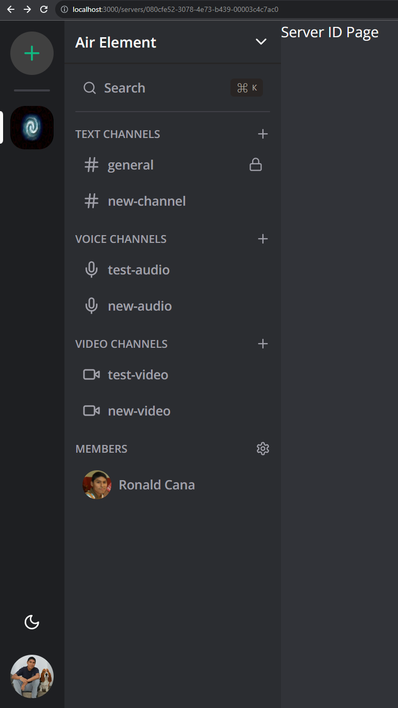

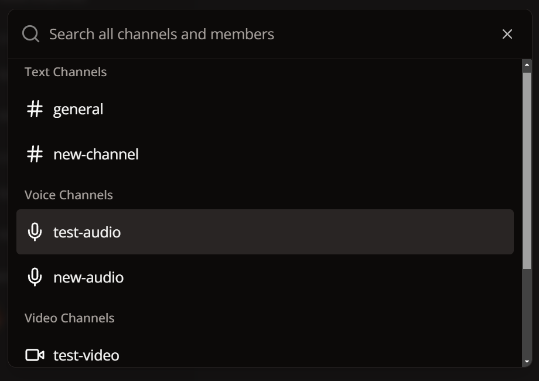

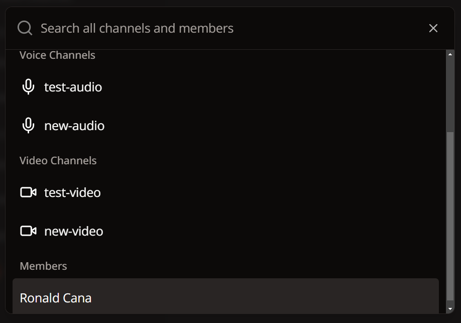

http://localhost:3000/servers/080cfe52-3078-4e73-b439-00003c4c7ac0

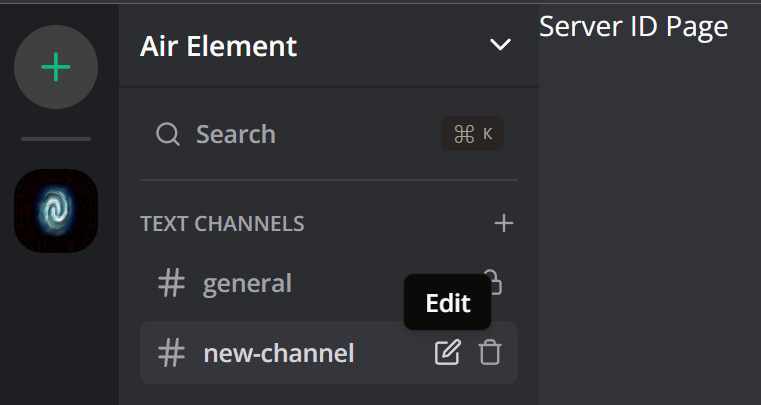


http://localhost:3000/servers/080cfe52-3078-4e73-b439-00003c4c7ac0

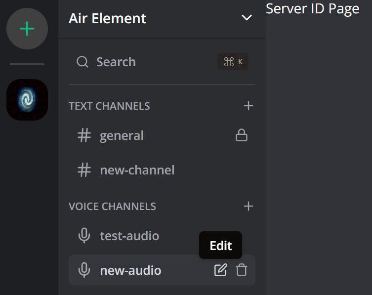


http://localhost:3000/servers/080cfe52-3078-4e73-b439-00003c4c7ac0

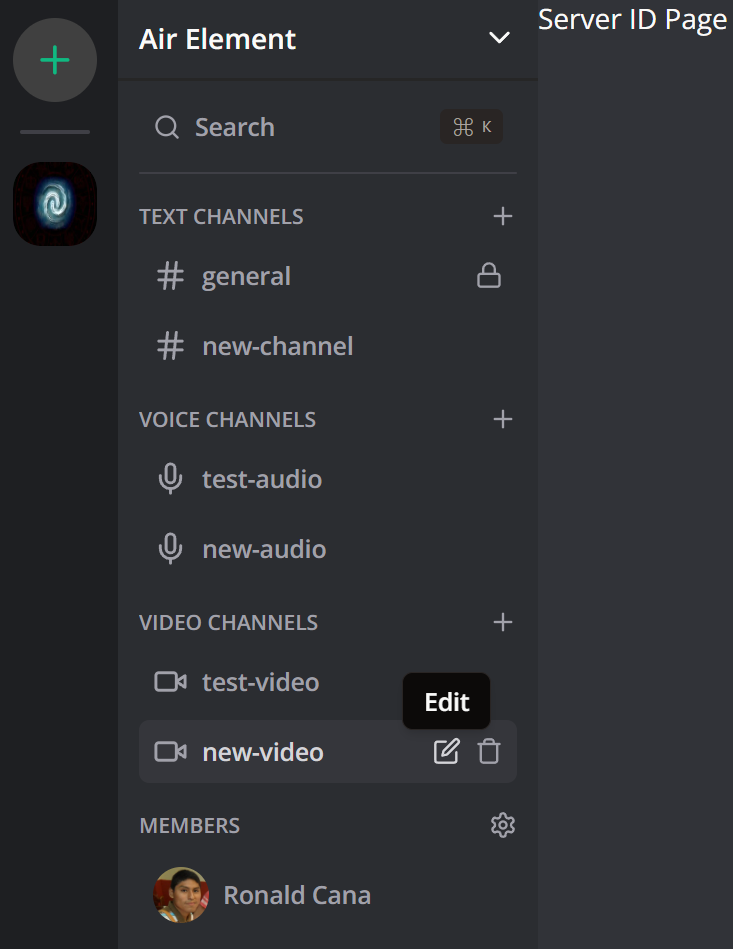

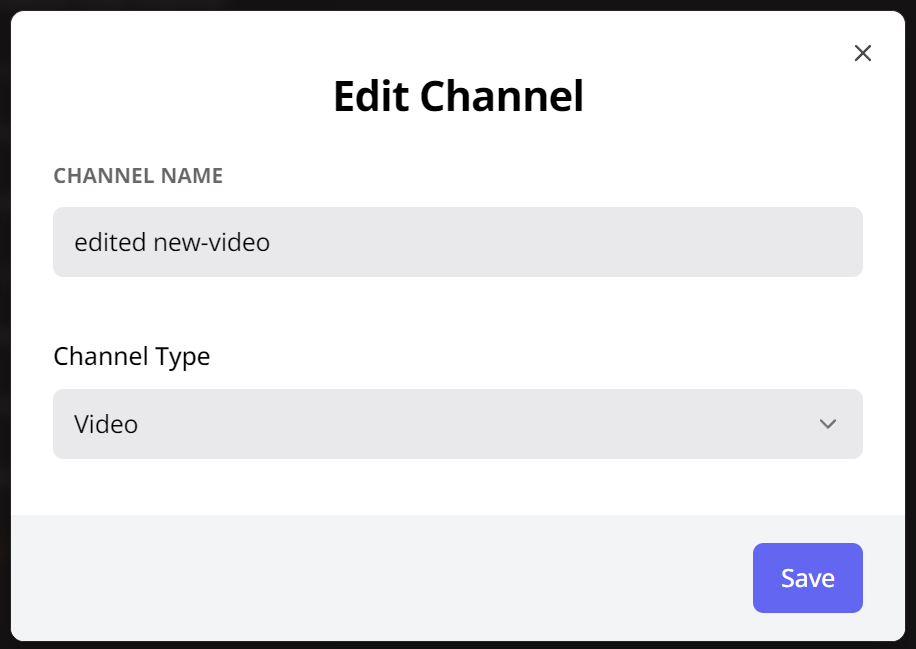

http://localhost:3000/servers/080cfe52-3078-4e73-b439-00003c4c7ac0

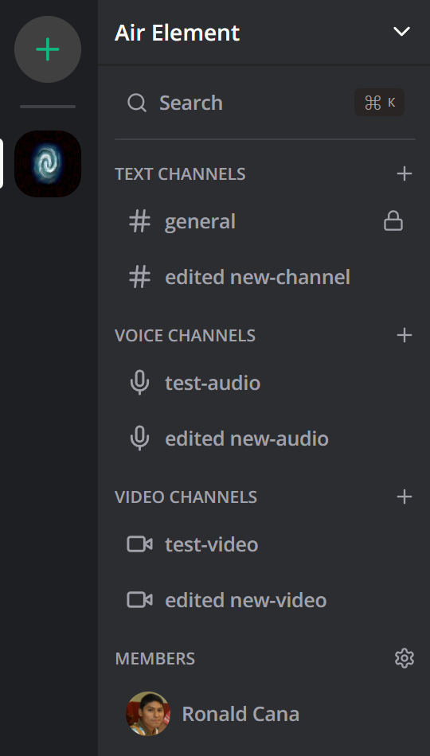

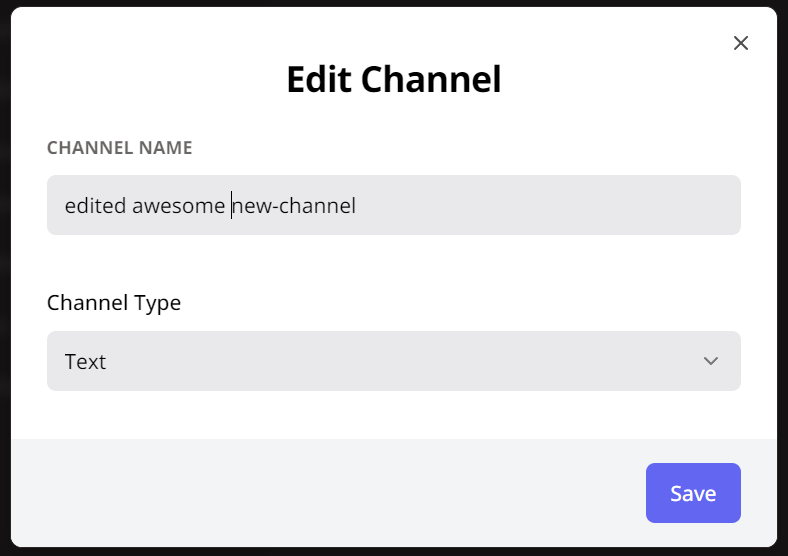

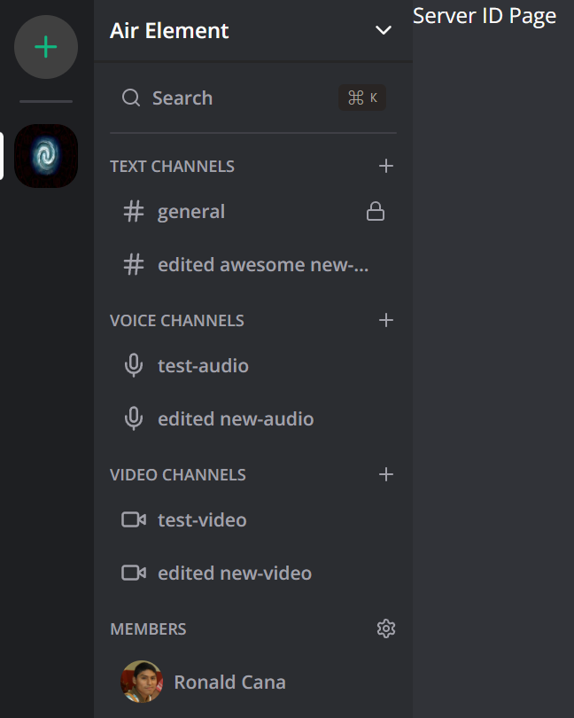

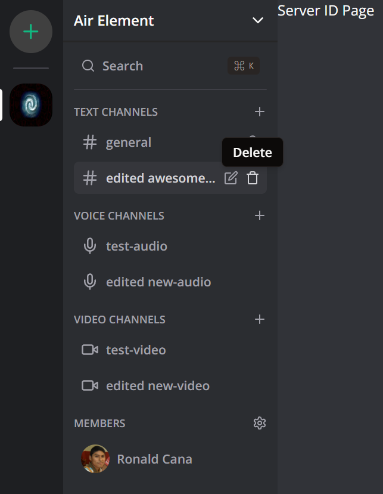

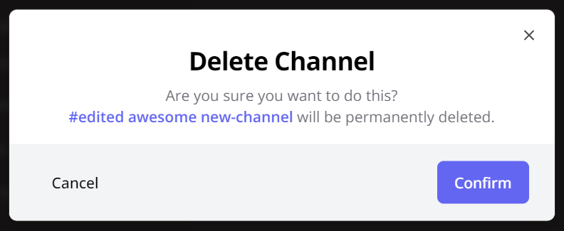

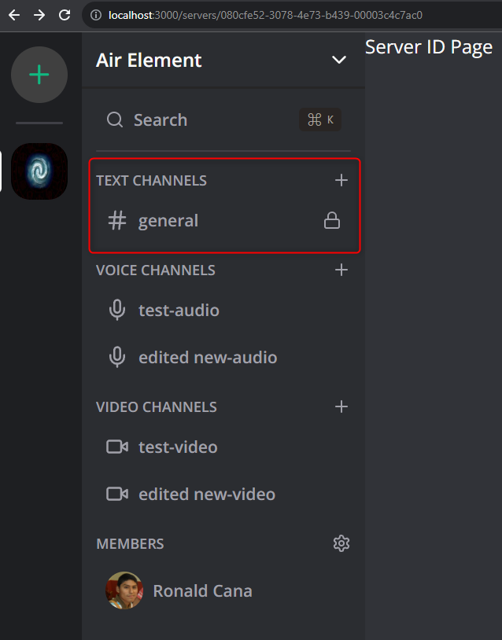

http://localhost:3000/servers/080cfe52-3078-4e73-b439-00003c4c7ac0

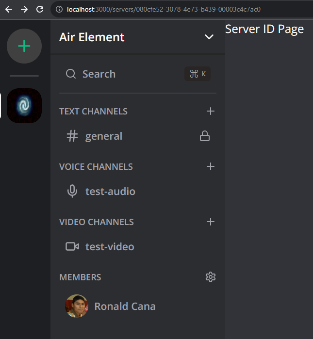

http://localhost:3000/servers/080cfe52-3078-4e73-b439-00003c4c7ac0

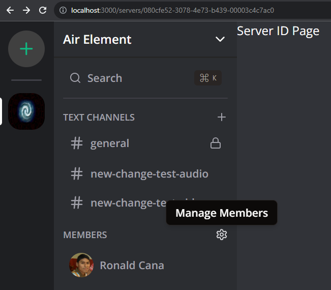


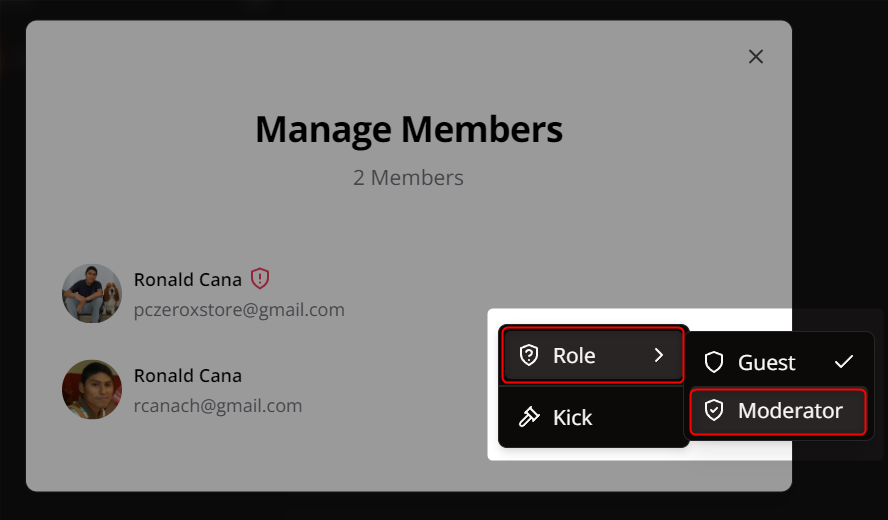

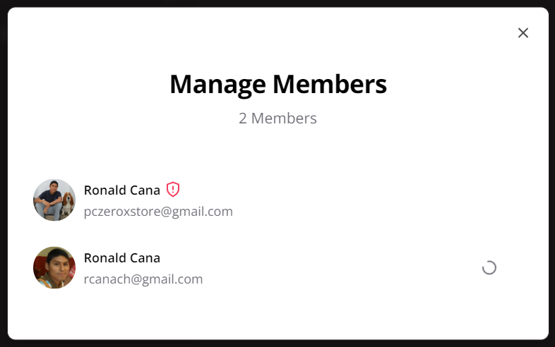

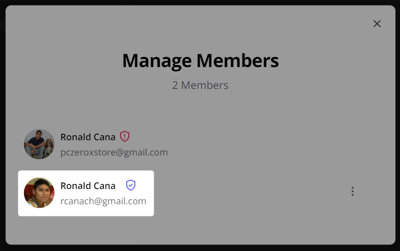

http://localhost:3000/servers/080cfe52-3078-4e73-b439-00003c4c7ac0


http://localhost:3000/servers/080cfe52-3078-4e73-b439-00003c4c7ac0

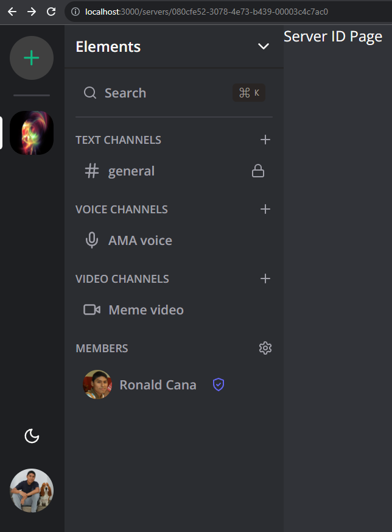

---
