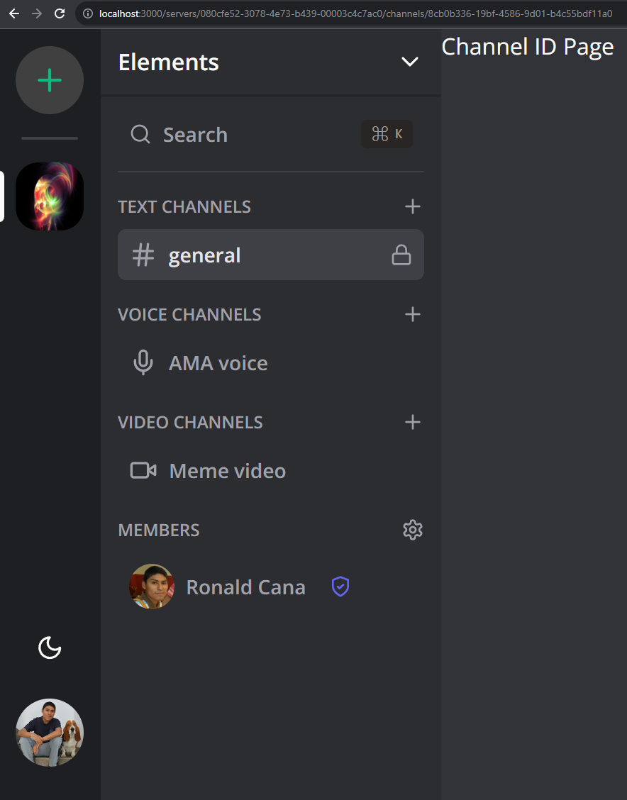
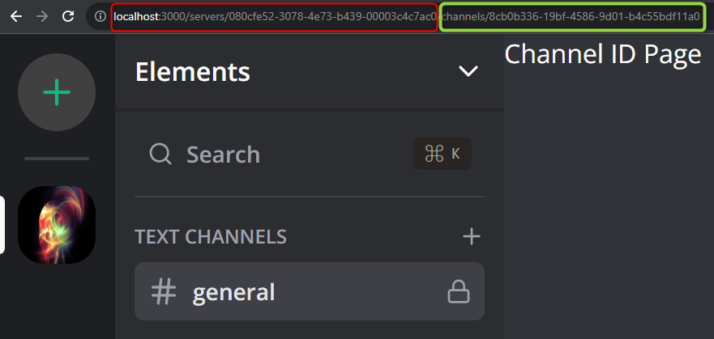
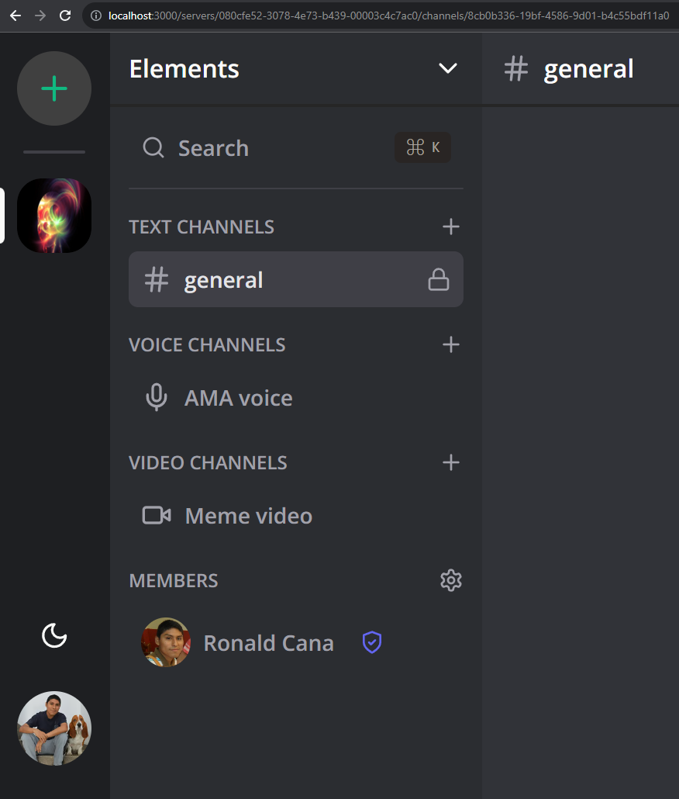
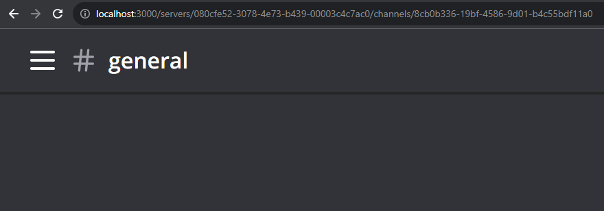
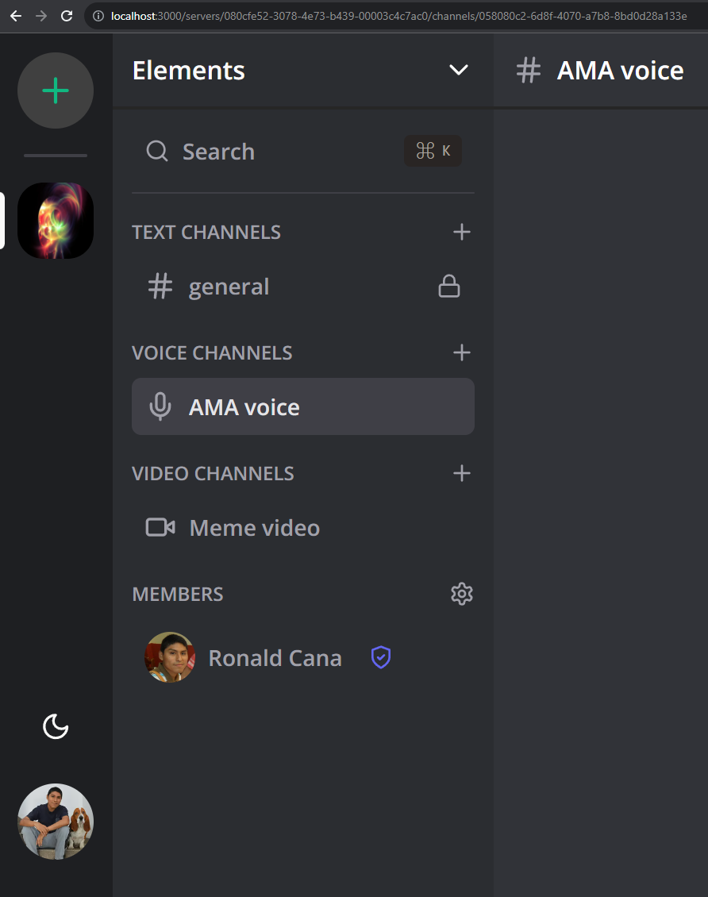
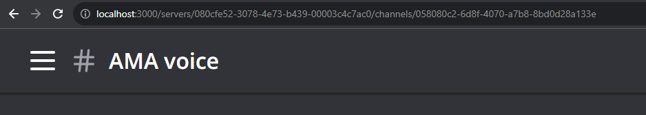
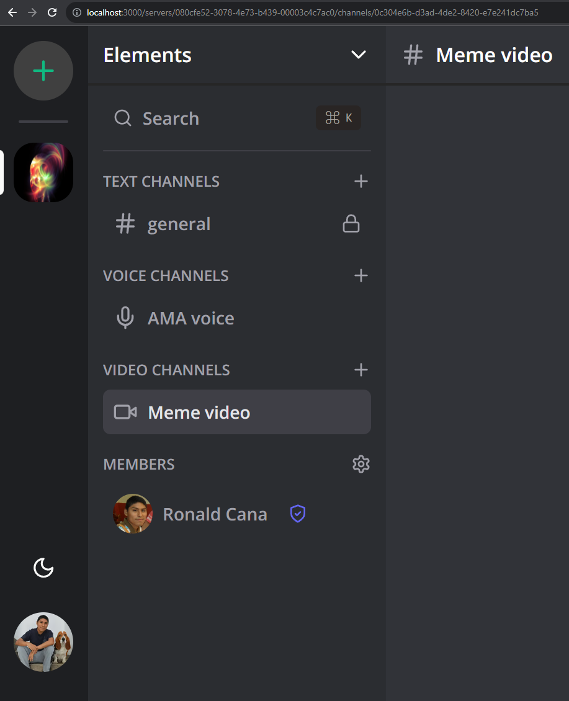

# 11 - Channel ID Page - Chat header

## Channel Id Page

`/src/app/(main)/(routes)/servers/[serverId]/page.tsx`

```TSX
import { use } from "react";
import { redirect } from "next/navigation";
import { redirectToSignIn } from "@clerk/nextjs";

import { db } from "@/lib/db";
import { currentProfile } from "@/lib/current-profile";

interface ServerIdPageProps {
  params: {
    serverId: string;
  };
}

const ServerIdPage = ({ params }: ServerIdPageProps) => {
  const profile = use(currentProfile());
  console.log("profile:", profile);

  if (!profile) {
    return redirectToSignIn();
  }

  const server = use(
    db.server.findUnique({
      where: {
        id: params.serverId,
        members: {
          some: {
            profileId: profile?.id,
          },
        },
      },
      include: {
        channels: {
          where: {
            name: "general",
          },
          orderBy: {
            createdAt: "asc",
          },
        },
      },
    })
  );

  const initialChannel = server?.channels[0];

  if (initialChannel?.name !== "general") {
    return null;
  }

  return redirect(`/servers/${params.serverId}/channels/${initialChannel?.id}`);
};

export default ServerIdPage;
```

`/src/app/(main)/(routes)/servers/[serverId]/channels/[channelId]/page.tsx`

```TSX
import { redirect } from "next/navigation";
import { redirectToSignIn } from "@clerk/nextjs";

import { db } from "@/lib/db";
import { currentProfile } from "@/lib/current-profile";


interface ChannelIdPageProps {
  params: {
    serverId: string;
    channelId: string;
  };
}

const ChannelIdPage = async ({ params }: ChannelIdPageProps) => {
  const profile = await currentProfile();

  if (!profile) {
    return redirectToSignIn();
  }

  const channel = await db.channel.findUnique({
    where: {
      id: params.channelId,
    },
  });

  const member = await db.member.findFirst({
    where: {
      serverId: params.serverId,
      profileId: profile.id,
    },
  });

  if (!channel || !member) {
    redirect("/");
  }

  return (
    <div className="bg-white dark:bg-[#313338] flex flex-col h-full">
      <p>Channel ID Page</p>
    </div>
  );
};

export default ChannelIdPage;
```

http://localhost:3000/servers/080cfe52-3078-4e73-b439-00003c4c7ac0/ to http://localhost:3000/servers/080cfe52-3078-4e73-b439-00003c4c7ac0/channels/8cb0b336-19bf-4586-9d01-b4c55bdf11a0





## Chat header

`/src/components/server/server-channel.tsx`

```TSX
"use client";

import { useParams, useRouter } from "next/navigation";
import { Edit, Hash, Lock, Mic, Trash, Video } from "lucide-react";
import { Channel, ChannelType, MemberRole, Server } from "@prisma/client";

import { ModalType, useModal } from "@/hooks/use-modal-store";

import { cn } from "@/lib/utils";

import { ActionTooltip } from "@/components/tooltip/action-tooltip";

interface ServerChannelProps {
  channel: Channel;
  server: Server;
  role?: MemberRole;
}

const iconMap = {
  [ChannelType.TEXT]: Hash,
  [ChannelType.AUDIO]: Mic,
  [ChannelType.VIDEO]: Video,
};

export const ServerChannel = ({
  channel,
  server,
  role,
}: ServerChannelProps) => {
  const { onOpen } = useModal();
  const params = useParams();
  const router = useRouter();

  const Icon = iconMap[channel.type];

  const onClick = () => {
    router.push(`/servers/${params?.serverId}/channels/${channel.id}`);
  };

  const onAction = (e: React.MouseEvent, action: ModalType) => {
    e.stopPropagation();
    onOpen(action, { channel, server });
  };

  return (
    <button
      onClick={onClick}
      className={cn(
        "group px-2 py-2 rounded-md flex items-center gap-x-2 w-full hover:bg-zinc-700/10 dark:hover:bg-zinc-700/50 transition mb-1",
        params?.channelId === channel.id && "bg-zinc-700/20 dark:bg-zinc-700"
      )}
    >
      <Icon className="flex-shrink-0 w-5 h-5 text-zinc-500 dark:text-zinc-400" />

      <p
        className={cn(
          "line-clamp-1 text-left font-semibold text-sm text-zinc-500 group-hover:text-zinc-600 dark:text-zinc-400 dark:group-hover:text-zinc-300 transition",
          params?.channelId === channel.id &&
            "text-primary dark:text-zinc-200 dark:group-hover:text-white",
          "flex-1"
        )}
      >
        {channel.name}
      </p>

      {channel.name !== "general" && role !== MemberRole.GUEST && (
        <div className="hidden group-hover:flex items-center gap-x-2">
          <ActionTooltip label="Edit">
            <Edit
              onClick={(e) => onAction(e, "editChannel")}
              className="invisible group-hover:visible w-4 h-4 text-zinc-500 hover:text-zinc-600 dark:text-zinc-400 dark:hover:text-zinc-300 transition"
            />
          </ActionTooltip>
          <ActionTooltip label="Delete">
            <Trash
              onClick={(e) => onAction(e, "deleteChannel")}
              className="invisible group-hover:visible w-4 h-4 text-zinc-500 hover:text-zinc-600 dark:text-zinc-400 dark:hover:text-zinc-300 transition"
            />
          </ActionTooltip>
        </div>
      )}

      {channel.name === "general" && (
        <Lock className="ml-auto w-4 h-4 text-zinc-500 dark:text-zinc-400" />
      )}
    </button>
  );
};
```

`/src/components/toggles/mobile-toggle.tsx`

```TSX
import { Menu } from "lucide-react";

import { ServerSidebar } from "@/components/server/server-sidebar";

import { NavigationSidebar } from "@/components/navigation/navigation-sidebar";

import { Button } from "@/components/ui/button";
import { Sheet, SheetContent, SheetTrigger } from "@/components/ui/sheet";

export const MobileToggle = ({ serverId }: { serverId: string }) => {
  return (
    <Sheet>
      <SheetTrigger asChild>
        <Button variant="ghost" size="icon" className="md:hidden">
          <Menu />
        </Button>
      </SheetTrigger>
      <SheetContent side="left" className="p-0 flex gap-0">
        <div className="w-[72px]">
          <NavigationSidebar />
        </div>
        <ServerSidebar serverId={serverId} />
      </SheetContent>
    </Sheet>
  );
};
```

`/src/components/chat/chat-header.tsx`

```TSX
import { Hash } from "lucide-react";

import { MobileToggle } from "@/components/toggles/mobile-toggle";

import { UserAvatar } from "@/components/user/user-avatar";

interface ChatHeaderProps {
  serverId: string;
  name: string;
  type: "channel" | "conversation";
  imageUrl?: string;
}

export const ChatHeader = ({
  serverId,
  name,
  type,
  imageUrl,
}: ChatHeaderProps) => {
  return (
    <div className="text-md font-semibold px-3 flex items-center h-12 border-neutral-200 dark:border-neutral-800 border-b-2">
      <MobileToggle serverId={serverId} />
      {type === "channel" && (
        <Hash className="w-5 h-5 text-zinc-500 dark:text-zinc-400 mr-2" />
      )}
      {type === "conversation" && (
        <UserAvatar src={imageUrl} className="h-8 w-8 md:h-8 md:w-8 mr-2" />
      )}
      <p className="font-semibold text-md text-black dark:text-white">{name}</p>
    </div>
  );
};
```

http://localhost:3000/servers/080cfe52-3078-4e73-b439-00003c4c7ac0/channels/8cb0b336-19bf-4586-9d01-b4c55bdf11a0





http://localhost:3000/servers/080cfe52-3078-4e73-b439-00003c4c7ac0/channels/058080c2-6d8f-4070-a7b8-8bd0d28a133e





http://localhost:3000/servers/080cfe52-3078-4e73-b439-00003c4c7ac0/channels/0c304e6b-d3ad-4de2-8420-e7e241dc7ba5




``

```TSX

```

`/src/app/(main)/(routes)/servers/[serverId]/channels/[channelId]/page.tsx`

```TSX

```

``

```TSX

```

``

```TSX

```

``

```TSX

```

`/src/components/server/server-member.tsx`

```TSX
"use client";

import { useParams, useRouter } from "next/navigation";
import { ShieldAlert, ShieldCheck } from "lucide-react";
import { Member, MemberRole, Profile, Server } from "@prisma/client";

import { cn } from "@/lib/utils";

import { UserAvatar } from "@/components/user/user-avatar";

interface ServerMemberProps {
  member: Member & { profile: Profile };
  server: Server;
}

const roleIconMap = {
  [MemberRole.GUEST]: null,
  [MemberRole.MODERATOR]: (
    <ShieldCheck className="h-4 w-4 ml-2 text-indigo-500" />
  ),
  [MemberRole.ADMIN]: <ShieldAlert className="h-4 w-4 ml-2 text-rose-500" />,
};

export const ServerMember = ({ member, server }: ServerMemberProps) => {
  const params = useParams();
  const router = useRouter();

  const icon = roleIconMap[member.role];

  const onClick = () => {
    router.push(`/servers/${params?.serverId}/conversations/${member.id}`);
  };

  return (
    <button
      onClick={onClick}
      className={cn(
        "group px-2 py-2 rounded-md flex items-center gap-x-2 w-full hover:bg-zinc-700/10 dark:hover:bg-zinc-700/50 transition mb-1",
        params?.memberId === member.id && "bg-zinc-700/20 dark:bg-zinc-700"
      )}
    >
      <UserAvatar
        src={member.profile.imageUrl}
        className="h-8 w-8 md:h-8 md:w-8"
      />
      <p
        className={cn(
          "font-semibold text-sm text-zinc-500 group-hover:text-zinc-600 dark:text-zinc-400 dark:group-hover:text-zinc-300 transition",
          params?.memberId === member.id &&
            "text-primary dark:text-zinc-200 dark:group-hover:text-white"
        )}
      >
        {member.profile.name}
      </p>
      {icon}
    </button>
  );
};
```

`/src/components/server/server-channel.tsx`

```TSX
"use client";

import { useParams, useRouter } from "next/navigation";
import { Edit, Hash, Lock, Mic, Trash, Video } from "lucide-react";
import { Channel, ChannelType, MemberRole, Server } from "@prisma/client";

import { ModalType, useModal } from "@/hooks/use-modal-store";

import { cn } from "@/lib/utils";

import { ActionTooltip } from "@/components/tooltip/action-tooltip";

interface ServerChannelProps {
  channel: Channel;
  server: Server;
  role?: MemberRole;
}

const iconMap = {
  [ChannelType.TEXT]: Hash,
  [ChannelType.AUDIO]: Mic,
  [ChannelType.VIDEO]: Video,
};

export const ServerChannel = ({
  channel,
  server,
  role,
}: ServerChannelProps) => {
  const { onOpen } = useModal();
  const params = useParams();
  const router = useRouter();

  const Icon = iconMap[channel.type];

  const onClick = () => {
    router.push(`/servers/${params?.serverId}/channels/${channel.id}`);
  };

  const onAction = (e: React.MouseEvent, action: ModalType) => {
    e.stopPropagation();
    onOpen(action, { channel, server });
  };

  return (
    <button
      onClick={onClick}
      className={cn(
        "group px-2 py-2 rounded-md flex items-center gap-x-2 w-full hover:bg-zinc-700/10 dark:hover:bg-zinc-700/50 transition mb-1",
        params?.channelId === channel.id && "bg-zinc-700/20 dark:bg-zinc-700"
      )}
    >
      <Icon className="flex-shrink-0 w-5 h-5 text-zinc-500 dark:text-zinc-400" />

      <p
        className={cn(
          "line-clamp-1 text-left font-semibold text-sm text-zinc-500 group-hover:text-zinc-600 dark:text-zinc-400 dark:group-hover:text-zinc-300 transition",
          params?.channelId === channel.id &&
            "text-primary dark:text-zinc-200 dark:group-hover:text-white"
        )}
      >
        {channel.name}
      </p>

      {channel.name !== "general" && role !== MemberRole.GUEST && (
        <div className="ml-auto flex items-center gap-x-2">
          <ActionTooltip label="Edit">
            <Edit
              onClick={(e) => onAction(e, "editChannel")}
              className="hidden group-hover:block w-4 h-4 text-zinc-500 hover:text-zinc-600 dark:text-zinc-400 dark:hover:text-zinc-300 transition"
            />
          </ActionTooltip>
          <ActionTooltip label="Delete">
            <Trash
              onClick={(e) => onAction(e, "deleteChannel")}
              className="hidden group-hover:block w-4 h-4 text-zinc-500 hover:text-zinc-600 dark:text-zinc-400 dark:hover:text-zinc-300 transition"
            />
          </ActionTooltip>
        </div>
      )}

      {channel.name === "general" && (
        <Lock className="ml-auto w-4 h-4 text-zinc-500 dark:text-zinc-400" />
      )}
    </button>
  );
};
```

`/src/app/(main)/(routes)/servers/[serverId]/channels/[channelId]/page.tsx`

```TSX
import { redirect } from "next/navigation";
// import { ChannelType } from "@prisma/client";
import { redirectToSignIn } from "@clerk/nextjs";

import { db } from "@/lib/db";
import { currentProfile } from "@/lib/current-profile";

import { ChatHeader } from "@/components/chat/chat-header";

// import { ChatHeader } from "@/components/chat/chat-header";
// import { ChatInput } from "@/components/chat/chat-input";
// import { ChatMessages } from "@/components/chat/chat-messages";
// import { MediaRoom } from "@/components/media-room";

interface ChannelIdPageProps {
  params: {
    serverId: string;
    channelId: string;
  };
}

const ChannelIdPage = async ({ params }: ChannelIdPageProps) => {
  const profile = await currentProfile();

  if (!profile) {
    return redirectToSignIn();
  }

  const channel = await db.channel.findUnique({
    where: {
      id: params.channelId,
    },
  });

  const member = await db.member.findFirst({
    where: {
      serverId: params.serverId,
      profileId: profile.id,
    },
  });

  if (!channel || !member) {
    redirect("/");
  }

  return (
    <div className="bg-white dark:bg-[#313338] flex flex-col h-full">
      <ChatHeader
        name={channel.name}
        serverId={channel.serverId}
        type="channel"
      />
    </div>
  );
};

export default ChannelIdPage;

```

``

```TSX

```

``

```TSX

```

`/src/app/(main)/(routes)/servers/[serverId]/page.tsx`

```TSX
import { use } from "react";
import { redirect } from "next/navigation";

import { db } from "@/lib/db";
import { currentProfile } from "@/lib/current-profile";

interface ServerIdPageProps {
  params: {
    serverId: string;
  };
}

const ServerIdPage = ({ params }: ServerIdPageProps) => {
  const profile = use(currentProfile());
  console.log("profile:", profile);

  const server = use(
    db.server.findUnique({
      where: {
        id: params.serverId,
        members: {
          some: {
            profileId: profile?.id,
          },
        },
      },
      include: {
        channels: {
          where: {
            name: "general",
          },
          orderBy: {
            createdAt: "asc",
          },
        },
      },
    })
  );

  const initialChannel = server?.channels[0];

  if (initialChannel?.name !== "general") {
    return null;
  }

  return redirect(`/servers/${params.serverId}/channels/${initialChannel?.id}`);
};

export default ServerIdPage;
```

``

```TSX

```

``

```TSX

```

``

```TSX

```

``

```TSX

```

``

```TSX

```

``

```TSX

```

``

```TSX

```

``

```TSX

```

`/src/app/(main)/(routes)/servers/[serverId]/channels/[channelId]/page.tsx`

```TSX

```

`/src/app/(main)/(routes)/servers/[serverId]/conversations/[memberId]/page.tsx`

```TSX

```

---
