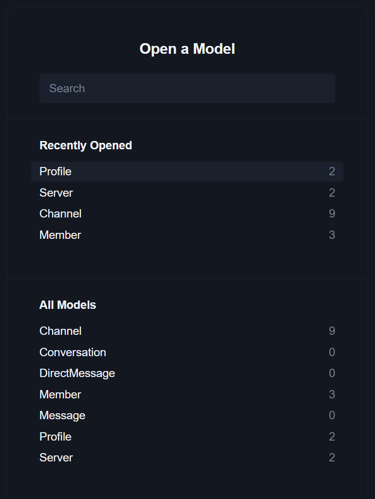
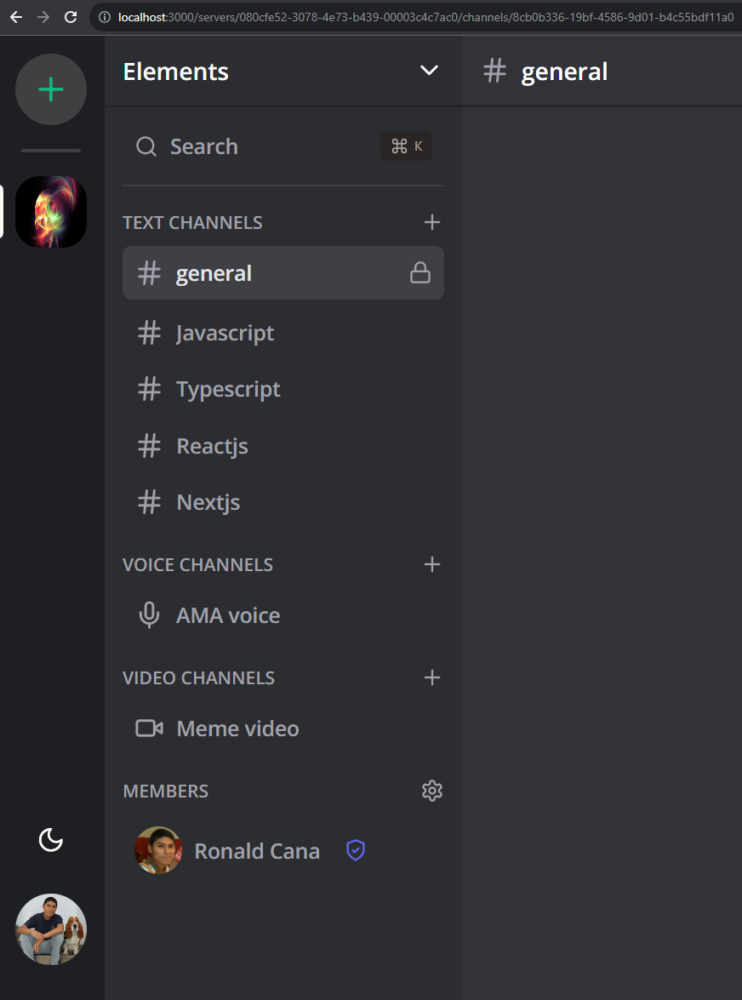
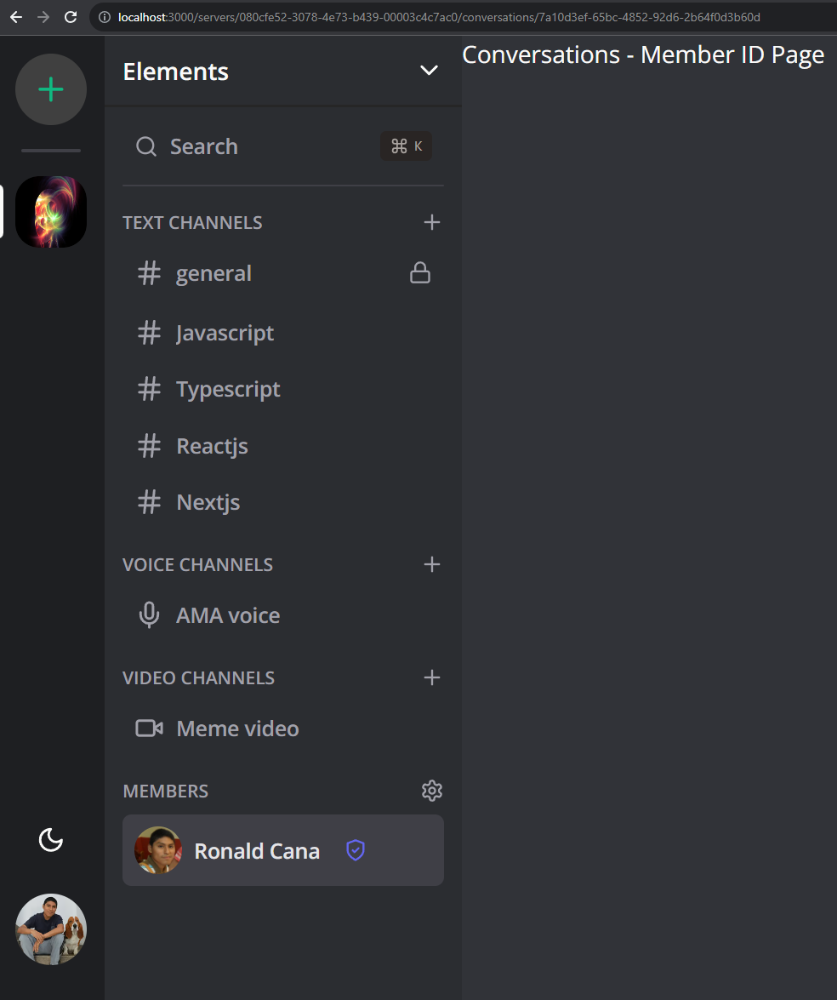

# 12 - Prisma schema completion

`/prisma/schema.prisma`

```PRISMA
generator client {
  provider = "prisma-client-js"
}

datasource db {
  provider = "mysql"
  url = env("DATABASE_URL")
  relationMode = "prisma"
}

model Profile {
  id String @id @default(uuid())
  userId String @unique
  name String
  imageUrl String @db.Text
  email String @db.Text

  servers Server[]
  members Member[]
  channels Channel[]

  createdAt DateTime @default(now())
  updatedAt DateTime @updatedAt
}

model Server {
  id String @id @default(uuid())
  name String
  imageUrl String @db.Text
  inviteCode String @unique

  profileId String
  profile Profile @relation(fields: [profileId], references: [id], onDelete: Cascade)

  members Member[]
  channels Channel[]

  createdAt DateTime @default(now())
  updatedAt DateTime @updatedAt

  @@index([profileId])
}

enum MemberRole {
  ADMIN
  MODERATOR
  GUEST
}

model Member {
  id String @id @default(uuid())
  role MemberRole @default(GUEST)

  profileId String
  profile Profile @relation(fields: [profileId], references: [id], onDelete: Cascade)

  serverId String
  server Server @relation(fields: [serverId], references: [id], onDelete: Cascade)

  messages Message[]
  directMessages DirectMessage[]

  conversationsInitiated Conversation[] @relation("MemberOne")
  conversationsReceived Conversation[] @relation("MemberTwo")

  createdAt DateTime @default(now())
  updatedAt DateTime @updatedAt

  @@index([profileId])
  @@index([serverId])
}

enum ChannelType {
  TEXT
  AUDIO
  VIDEO
}

model Channel {
  id String @id @default(uuid())
  name String
  type ChannelType @default(TEXT)

  profileId String
  profile Profile @relation(fields: [profileId], references: [id], onDelete: Cascade)

  serverId String
  server Server @relation(fields: [serverId], references: [id], onDelete: Cascade)

  messages Message[]

  createdAt DateTime @default(now())
  updatedAt DateTime @updatedAt

  @@index([profileId])
  @@index([serverId])
}

model Message {
  id String @id @default(uuid())
  content String @db.Text

  fileUrl String? @db.Text

  memberId String
  member Member @relation(fields: [memberId], references: [id], onDelete: Cascade)

  channelId String
  channel Channel @relation(fields: [channelId], references: [id], onDelete: Cascade)

  deleted Boolean @default(false)

  createdAt DateTime @default(now())
  updatedAt DateTime @updatedAt

  @@index([channelId])
  @@index([memberId])
}

model Conversation {
  id String @id @default(uuid())

  memberOneId String
  memberOne Member @relation("MemberOne", fields: [memberOneId], references: [id], onDelete: Cascade)

  memberTwoId String
  memberTwo Member @relation("MemberTwo", fields: [memberTwoId], references: [id], onDelete: Cascade)

  directMessages DirectMessage[]

  // @@index([memberOneId])
  @@index([memberTwoId])

  @@unique([memberOneId, memberTwoId])
}

model DirectMessage {
  id String @id @default(uuid())
  content String @db.Text
  fileUrl String? @db.Text

  memberId String
  member Member @relation(fields: [memberId], references: [id], onDelete: Cascade)

  conversationId String
  conversation Conversation @relation(fields: [conversationId], references: [id], onDelete: Cascade)

  deleted Boolean @default(false)

  createdAt DateTime @default(now())
  updatedAt DateTime @updatedAt

  @@index([memberId])
  @@index([conversationId])
}
```

```BASH
npx prisma generate
```

```BASH
npx prisma db push
```

```BASH
npx prisma studio
```

http://localhost:5555/



http://localhost:3000/servers/080cfe52-3078-4e73-b439-00003c4c7ac0/channels/8cb0b336-19bf-4586-9d01-b4c55bdf11a0



`/src/app/(main)/(routes)/servers/[serverId]/conversations/[memberId]/page.tsx`

```TSX
import { redirect } from "next/navigation";
import { redirectToSignIn } from "@clerk/nextjs";

import { db } from "@/lib/db";
import { currentProfile } from "@/lib/current-profile";

interface MemberIdPageProps {
  params: {
    memberId: string;
    serverId: string;
  };
  searchParams: {
    video?: boolean;
  };
}

const MemberIdPage = async ({ params, searchParams }: MemberIdPageProps) => {
  const profile = await currentProfile();

  if (!profile) {
    return redirectToSignIn();
  }

  const currentMember = await db.member.findFirst({
    where: {
      serverId: params.serverId,
      profileId: profile.id,
    },
    include: {
      profile: true,
    },
  });

  if (!currentMember) {
    return redirect("/");
  }

  return (
    <div className="bg-white dark:bg-[#313338] flex flex-col h-full">
      Conversations - Member ID Page
    </div>
  );
};

export default MemberIdPage;
```



---
