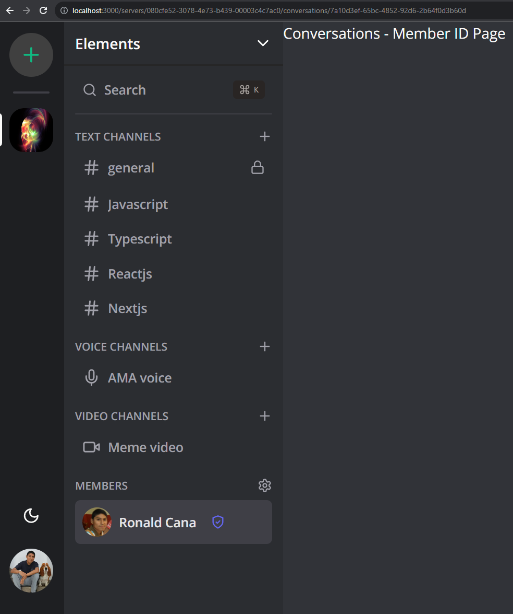

# 13 - Conversations setup

`/src/app/(main)/(routes)/servers/[serverId]/conversations/[memberId]/page.tsx`

```TSX
import { redirect } from "next/navigation";
import { redirectToSignIn } from "@clerk/nextjs";

import { db } from "@/lib/db";
import { currentProfile } from "@/lib/current-profile";

interface MemberIdPageProps {
  params: {
    memberId: string;
    serverId: string;
  };
  searchParams: {
    video?: boolean;
  };
}

const MemberIdPage = async ({ params, searchParams }: MemberIdPageProps) => {
  const profile = await currentProfile();

  if (!profile) {
    return redirectToSignIn();
  }

  const currentMember = await db.member.findFirst({
    where: {
      serverId: params.serverId,
      profileId: profile.id,
    },
    include: {
      profile: true,
    },
  });

  if (!currentMember) {
    return redirect("/");
  }

  return (
    <div className="bg-white dark:bg-[#313338] flex flex-col h-full">
      Conversations - Member ID Page
    </div>
  );
};

export default MemberIdPage;
```



`/src/lib/conversation.ts`

```TSX
import { db } from "@/lib/db";

const findConversation = async (memberOneId: string, memberTwoId: string) => {
  try {
    return await db.conversation.findFirst({
      where: {
        AND: [
          { memberOneId: memberOneId },
          { memberTwoId: memberTwoId },
        ]
      },
      include: {
        memberOne: {
          include: {
            profile: true,
          }
        },
        memberTwo: {
          include: {
            profile: true,
          }
        }
      }
    });
  } catch {
    return null;
  }
}

const createNewConversation = async (memberOneId: string, memberTwoId: string) => {
  try {
    return await db.conversation.create({
      data: {
        memberOneId,
        memberTwoId,
      },
      include: {
        memberOne: {
          include: {
            profile: true,
          }
        },
        memberTwo: {
          include: {
            profile: true,
          }
        }
      }
    })
  } catch {
    return null;
  }
}


export const getOrCreateConversation = async (memberOneId: string, memberTwoId: string) => {
  let conversation = await findConversation(memberOneId, memberTwoId) || await findConversation(memberTwoId, memberOneId);

  if (!conversation) {
    conversation = await createNewConversation(memberOneId, memberTwoId);
  }

  return conversation;
}
```

`/src/app/(main)/(routes)/servers/[serverId]/conversations/[memberId]/page.tsx`

```TSX
import { redirect } from "next/navigation";
import { redirectToSignIn } from "@clerk/nextjs";

import { db } from "@/lib/db";
import { currentProfile } from "@/lib/current-profile";
import { getOrCreateConversation } from "@/lib/conversation";

import { ChatHeader } from "@/components/chat/chat-header";

interface MemberIdPageProps {
  params: {
    memberId: string;
    serverId: string;
  };
  searchParams: {
    video?: boolean;
  };
}

const MemberIdPage = async ({ params, searchParams }: MemberIdPageProps) => {
  const profile = await currentProfile();

  if (!profile) {
    return redirectToSignIn();
  }

  const currentMember = await db.member.findFirst({
    where: {
      serverId: params.serverId,
      profileId: profile.id,
    },
    include: {
      profile: true,
    },
  });

  if (!currentMember) {
    return redirect("/");
  }

  const conversation = await getOrCreateConversation(
    currentMember.id,
    params.memberId
  );

  if (!conversation) {
    return redirect(`/servers/${params.serverId}`);
  }

  const { memberOne, memberTwo } = conversation;

  const otherMember =
    memberOne.profileId === profile.id ? memberTwo : memberOne;

  return (
    <div className="bg-white dark:bg-[#313338] flex flex-col h-full">
      <ChatHeader
        imageUrl={otherMember.profile.imageUrl}
        name={otherMember.profile.name}
        serverId={params.serverId}
        type="conversation"
      />
    </div>
  );
};

export default MemberIdPage;
```

`/src/components/chat/chat-header.tsx`

```TSX
import { Hash } from "lucide-react";

import { MobileToggle } from "@/components/toggles/mobile-toggle";

import { UserAvatar } from "@/components/user/user-avatar";

interface ChatHeaderProps {
  serverId: string;
  name: string;
  type: "channel" | "conversation";
  imageUrl?: string;
}

export const ChatHeader = ({
  serverId,
  name,
  type,
  imageUrl,
}: ChatHeaderProps) => {
  return (
    <div className="text-md font-semibold px-3 flex items-center h-12 border-neutral-200 dark:border-neutral-800 border-b-2">
      <MobileToggle serverId={serverId} />

      {type === "channel" && (
        <Hash className="w-5 h-5 text-zinc-500 dark:text-zinc-400 mr-2" />
      )}

      {type === "conversation" && (
        <UserAvatar src={imageUrl} className="h-8 w-8 md:h-8 md:w-8 mr-2" />
      )}

      <p className="font-semibold text-md text-black dark:text-white">{name}</p>
    </div>
  );
};
```

http://localhost:3000/servers/080cfe52-3078-4e73-b439-00003c4c7ac0/conversations/7a10d3ef-65bc-4852-92d6-2b64f0d3b60d


``

```TSX

```

``

```TSX

```

``

```TSX

```

``

```TSX

```

``

```TSX

```

``

```TSX

```

``

```TSX

```

``

```TSX

```

``

```TSX

```

``

```TSX

```

`/src/app/(main)/(routes)/servers/[serverId]/conversations/[memberId]/page.tsx`

```TSX

```

``

```TSX

```

``

```TSX
import { redirect } from "next/navigation";
import { redirectToSignIn } from "@clerk/nextjs";

import { db } from "@/lib/db";
import { currentProfile } from "@/lib/current-profile";

// import { getOrCreateConversation } from "@/lib/conversation";
// import { ChatHeader } from "@/components/chat/chat-header";
// import { ChatMessages } from "@/components/chat/chat-messages";
// import { ChatInput } from "@/components/chat/chat-input";
// import { MediaRoom } from "@/components/media-room";

interface MemberIdPageProps {
  params: {
    memberId: string;
    serverId: string;
  };
  searchParams: {
    video?: boolean;
  };
}

const MemberIdPage = async ({ params, searchParams }: MemberIdPageProps) => {
  const profile = await currentProfile();

  if (!profile) {
    return redirectToSignIn();
  }

  const currentMember = await db.member.findFirst({
    where: {
      serverId: params.serverId,
      profileId: profile.id,
    },
    include: {
      profile: true,
    },
  });

  if (!currentMember) {
    return redirect("/");
  }

  // const conversation = await getOrCreateConversation(
  //   currentMember.id,
  //   params.memberId
  // );

  // if (!conversation) {
  //   return redirect(`/servers/${params.serverId}`);
  // }

  // const { memberOne, memberTwo } = conversation;

  // const otherMember =
  //   memberOne.profileId === profile.id ? memberTwo : memberOne;

  return (
    <div className="bg-white dark:bg-[#313338] flex flex-col h-full">
      {/* <ChatHeader
        imageUrl={otherMember.profile.imageUrl}
        name={otherMember.profile.name}
        serverId={params.serverId}
        type="conversation"
      />
      {searchParams.video && (
        <MediaRoom chatId={conversation.id} video={true} audio={true} />
      )}
      {!searchParams.video && (
        <>
          <ChatMessages
            member={currentMember}
            name={otherMember.profile.name}
            chatId={conversation.id}
            type="conversation"
            apiUrl="/api/direct-messages"
            paramKey="conversationId"
            paramValue={conversation.id}
            socketUrl="/api/socket/direct-messages"
            socketQuery={{
              conversationId: conversation.id,
            }}
          />
          <ChatInput
            name={otherMember.profile.name}
            type="conversation"
            apiUrl="/api/socket/direct-messages"
            query={{
              conversationId: conversation.id,
            }}
          />
        </>
      )} */}
      Conversations - Member ID Page
    </div>
  );
};

export default MemberIdPage;

```

``

```TSX

```

``

```TSX
import { redirect } from "next/navigation";
// import { ChannelType } from "@prisma/client";
import { redirectToSignIn } from "@clerk/nextjs";

import { db } from "@/lib/db";
import { currentProfile } from "@/lib/current-profile";

import { ChatHeader } from "@/components/chat/chat-header";

// import { ChatHeader } from "@/components/chat/chat-header";
// import { ChatInput } from "@/components/chat/chat-input";
// import { ChatMessages } from "@/components/chat/chat-messages";
// import { MediaRoom } from "@/components/media-room";

interface ChannelIdPageProps {
  params: {
    serverId: string;
    channelId: string;
  };
}

const ChannelIdPage = async ({ params }: ChannelIdPageProps) => {
  const profile = await currentProfile();

  if (!profile) {
    return redirectToSignIn();
  }

  const channel = await db.channel.findUnique({
    where: {
      id: params.channelId,
    },
  });

  const member = await db.member.findFirst({
    where: {
      serverId: params.serverId,
      profileId: profile.id,
    },
  });

  if (!channel || !member) {
    redirect("/");
  }

  return (
    <div className="bg-white dark:bg-[#313338] flex flex-col h-full">
      <ChatHeader
        name={channel.name}
        serverId={channel.serverId}
        type="channel"
      />
      {/*
      {channel.type === ChannelType.TEXT && (
        <>
          <ChatMessages
            member={member}
            name={channel.name}
            chatId={channel.id}
            type="channel"
            apiUrl="/api/messages"
            socketUrl="/api/socket/messages"
            socketQuery={{
              channelId: channel.id,
              serverId: channel.serverId,
            }}
            paramKey="channelId"
            paramValue={channel.id}
          />
          <ChatInput
            name={channel.name}
            type="channel"
            apiUrl="/api/socket/messages"
            query={{
              channelId: channel.id,
              serverId: channel.serverId,
            }}
          />
        </>
      )}
      {channel.type === ChannelType.AUDIO && (
        <MediaRoom chatId={channel.id} video={false} audio={true} />
      )}
      {channel.type === ChannelType.VIDEO && (
        <MediaRoom chatId={channel.id} video={true} audio={true} />
      )} */}
    </div>
  );
};

export default ChannelIdPage;

```

``

```TSX

```

---
